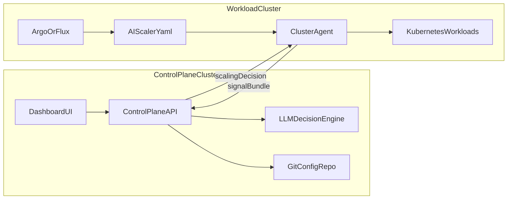

# kube-scaling-agent — Master Plan

> Comprehensive roadmap for LLM-driven Kubernetes autoscaling and cost optimization.
> Generated from full codebase analysis, expert consultation, and industry research.

> Implementation status note: the current repository already includes plugin-based signal collection, precedence resolution, rollback checks, approval holds, feedback summaries, KEDA advisory input, and process-local coordination gates. Treat this document as the broader roadmap; use the README and /examples for the current live operator surface.

---

## Table of Contents

1. [Current State Analysis](#1-current-state-analysis)
2. [Codebase Gaps and Bug Fixes](#2-codebase-gaps-and-bug-fixes)
3. [Architecture Evolution — LLM-First Decision Engine](#3-architecture-evolution--llm-first-decision-engine)
4. [Phase 1 — Extended Signal Sources](#4-phase-1--extended-signal-sources)
5. [Phase 2 — Natural Language Scheduling](#5-phase-2--natural-language-scheduling)
    - [5.1 Natural-Language Reactive Rules](#51-natural-language-reactive-rules)
6. [Phase 3 — Vertical Scaling and In-Place Resize](#6-phase-3--vertical-scaling-and-in-place-resize)
7. [Phase 4 — Cost Optimization Engine](#7-phase-4--cost-optimization-engine)
8. [Phase 5 — SLO-First Multi-Signal Scaling](#8-phase-5--slo-first-multi-signal-scaling)
9. [Phase 6 — Predictive and Seasonal Scaling](#9-phase-6--predictive-and-seasonal-scaling)
10. [Phase 7 — Node-Aware and Cluster-Level Intelligence](#10-phase-7--node-aware-and-cluster-level-intelligence)
11. [Phase 8 — KEDA Integration and Composability](#11-phase-8--keda-integration-and-composability)
12. [Phase 9 — Safety, Guardrails, and Production Hardening](#12-phase-9--safety-guardrails-and-production-hardening)
13. [Phase 10 — Observability, Audit, and Replay](#13-phase-10--observability-audit-and-replay)
14. [Phase 11 — Multi-Workload and Cluster-Wide Reasoning](#14-phase-11--multi-workload-and-cluster-wide-reasoning)
15. [Phase 12 — LLM Reliability and Provider Routing](#15-phase-12--llm-reliability-and-provider-routing)
16. [25 Feature Ideas — Improvement and Cost Optimization](#16-25-feature-ideas--improvement-and-cost-optimization)
17. [New CRD Designs](#17-new-crd-designs)
18. [Implementation Priority Matrix](#18-implementation-priority-matrix)
19. [Technical Appendix — What Frontier Models Enable](#19-technical-appendix--what-frontier-models-enable)
20. [Unified Precedence Model](#20-unified-precedence-model)
21. [Decision Feedback Loop and Continuous Learning](#21-decision-feedback-loop-and-continuous-learning)
22. [Human-in-the-Loop Approval Workflow](#22-human-in-the-loop-approval-workflow)
23. [Notification and Alerting System](#23-notification-and-alerting-system)
24. [Extended Workload Type Support](#24-extended-workload-type-support)
25. [Multi-Cluster and GitOps Integration](#25-multi-cluster-and-gitops-integration)
26. [Central Dashboard — Multi-Cluster Management UI](#26-central-dashboard--multi-cluster-management-ui)
    - [26.1 Dashboard Pages](#261-dashboard-pages--detailed-design)
    - [26.2 Central API Server](#262-central-api-server--detailed-design)
    - [26.3 Authentication and Authorization](#263-authentication-and-authorization)
    - [26.4 Real-Time Updates](#264-real-time-updates)
    - [26.5 EKS and GKE Specific Support](#265-eks-and-gke-specific-support)
    - [26.6 Frontend Project Structure](#266-frontend-project-structure)
    - [26.7 Backend Project Structure](#267-backend-project-structure)
    - [26.8 Deployment Architecture](#268-deployment-architecture)
    - [26.9 Implementation Priority](#269-implementation-priority-for-dashboard)
27. [Scope Clarification, Canonical Architecture, and Remaining Gaps](#27-scope-clarification-canonical-architecture-and-remaining-gaps)
    - [27.1 Versioned Delivery Scope](#271-versioned-delivery-scope)
    - [27.2 Canonical Multi-Cluster Connectivity Model](#272-canonical-multi-cluster-connectivity-model)
    - [27.3 Global Traffic Plane Contract](#273-global-traffic-plane-contract)
    - [27.4 Global Workload Identity Model](#274-global-workload-identity-model)
    - [27.5 Security, Compliance, and Operations Hardening](#275-security-compliance-and-operations-hardening)
    - [27.6 Provider Capability Matrix](#276-provider-capability-matrix)
    - [27.7 Pending Items Before Buildout](#277-pending-items-before-buildout)
    - [27.8 Unbiased Viability Assessment](#278-unbiased-viability-assessment)
28. [High-Impact Customer Demo Scenarios](#28-high-impact-customer-demo-scenarios)
29. [FinOps Resource Analysis and Right-Sizing](#29-finops-resource-analysis-and-right-sizing)

---

## 1. Current State Analysis

### What exists today

The project is a Kubernetes operator built with kubebuilder (Go 1.25, controller-runtime) that uses an LLM to decide replica counts for Deployments.

**Architecture (current):**

```
AIScaler CR → Reconcile Loop → Signal Collection → LLM Decision → Validation → SSA Actuation
```

**Components:**

| Component | File | Responsibility |
|-----------|------|----------------|
| CRD types | `api/v1/aiscaler_types.go` | `AIScaler` spec/status, `ValidateSpec()` |
| Controller | `internal/controller/aiscaler_controller.go` | Step-chain reconciler (7 steps) |
| Signal collector | `internal/signals/collector.go` | Orchestrates metrics, prometheus, annotations |
| Metrics collector | `internal/signals/metrics.go` | Deployment replicas, CPU/mem via metrics-server |
| Prometheus collector | `internal/signals/prometheus.go` | p95 latency, error rate via PromQL |
| Annotation collector | `internal/signals/annotations.go` | Human intent (traffic, freeze, notes, peak hours) |
| LLM router | `internal/llm/router.go` | Primary/fallback provider via OpenAI-compatible API |
| Prompt builder | `internal/llm/prompt.go` | System + user prompt construction |
| Validator | `internal/decision/validator.go` | MaxScaleStep + min/max bounds clamping |
| Actuator | `internal/actuator/actuator.go` | SSA patch for Deployment replicas |
| Config | `internal/config/config.go` | YAML config with env var expansion |

**Reconcile pipeline (step chain):**

1. `ensureFinalizer` — deletion handling, spec validation, finalizer management
2. `checkCooldown` — enforce cooldown period between scaling events
3. `collectSignals` — gather metrics, prometheus, annotation signals into Bundle
4. `fetchDecision` — build ScalingRequest, call LLM via Router
5. `validateDecision` — clamp LLM output to safe bounds
6. `actuate` — SSA patch replicas on target Deployment
7. `updateStatus` — persist phase, replicas, reasoning, conditions

**Signals collected today:**

- CPU utilization (% of requests, from metrics-server)
- Memory utilization (% of requests, from metrics-server)
- p95 latency (Prometheus PromQL)
- Error rate (Prometheus PromQL)
- Deployment health (replicas, ready replicas)
- Human intent annotations (expected-traffic, scale-conservatively, freeze-until, note, peak-hours)

**LLM output format:**

```json
{
  "target_replicas": 4,
  "reasoning": "...",
  "confidence": 0.85
}
```

**Safety guardrails:**
- MaxScaleStep caps per-cycle replica delta
- Min/max replicas hard bounds
- Cooldown period between scaling events
- Freeze annotation stops all scaling
- Dry-run mode computes but doesn't apply
- Spec validation (min <= max, step <= max, primary != fallback)

**What works well:**
- Step-chain reconciler pattern — clean, extensible, observable
- SSA with field ownership — coexists with other controllers
- Provider-agnostic LLM via OpenAI-compatible API
- Non-fatal prometheus collection — graceful degradation
- Human intent as first-class signal

---

## 2. Codebase Gaps and Bug Fixes

Issues identified during analysis that should be fixed before new features:

### Critical

1. **`ScalingRequest.CurrentReplicas` uses `obj.Status.CurrentReplicas` instead of `bundle.CurrentReplicas`** — On the first reconcile cycle, status hasn't been populated yet, so the LLM receives `0` as current replicas. Fix: use `bundle.CurrentReplicas` in `fetchDecision` (line 264 of controller).

2. **Metrics collection returns error despite "non-fatal" comment** — `metricsCollector.collect` sets CPU/mem to 0 when `podUtilization` fails, but still returns the error (line 56 of `metrics.go`). This causes `Collector.Collect` to fail entirely, contradicting the non-fatal intent. Fix: log the error but return nil.

3. **RBAC rules missing for Deployments and PodMetrics** — Generated `config/rbac/role.yaml` only has rules for `aiscaler.io` resources. The controller GET/Patch Deployments and lists PodMetrics, but these permissions aren't declared via kubebuilder markers. Fix: add RBAC markers to the controller.

### Important

4. **`apiKeySecret` field in CRD is never read** — The CR schema defines `spec.llm.apiKeySecret` but `buildClient` in `router.go` only reads from the central config file. Either remove the field or implement per-CR secret loading.

5. **CPU utilization calculation bug** — `podUtilization` uses `container.Usage.Cpu().Value()` which returns whole cores (integer), but divides by `MilliValue()` of requests. This produces incorrect percentages. Fix: use `MilliValue()` for both usage and requests.

6. **Duplicate CRD file** — `config/crd/bases/` contains both `aiscaler.io_aiscalers.yaml` and `aiscaler.aiscaler.io_aiscalers.yaml` (byte-identical). Only the former is referenced in kustomization. Remove the duplicate.

7. **`PROJECT` file says `namespaced: true` but CRD markers say `scope=Cluster`** — Metadata drift; fix the PROJECT file.

8. **Dockerfile uses Go 1.24 but go.mod requires 1.25** — Potential build failure.

9. **ConfigMap YAML keys don't match Go struct tags** — `operator-config.yaml` uses `baseURL`/`apiKey` but config structs use `base_url`/`api_key` YAML tags. This silently fails to unmarshal.

### Nice to have

10. **Controller test is scaffold-only** — Creates minimal AIScaler but reconciler dependencies (Collector, Router, Validator, Actuator) are nil. Would panic on real reconcile.

11. **`fmt.Printf` for non-fatal errors** — `collector.go` uses `fmt.Printf` instead of structured logging. Replace with `logf.FromContext`.

---

## 3. Architecture Evolution — LLM-First Decision Engine

### Problem

A deterministic fast path based on CPU, memory, request rate, or queue depth would change the product philosophy. In this system, those are context signals, not automatic triggers. If latency and SLOs are healthy, high utilization alone should not force a scale-up.

### Solution — Central control-plane decision architecture

```
┌────────────────────────────────────────────────────────────────────┐
│              CENTRAL CONTROL-PLANE DECISION ENGINE                │
│                                                                    │
│  Every reconcile cycle                                             │
│  ┌──────────────────┐   ┌────────────────────┐   ┌──────────────┐ │
│  │ Cluster agent    │──▶│ Control-plane LLM  │──▶│ Agent-side   │ │
│  │ collects signals │   │ latency-first      │   │ validation + │ │
│  │ + config rev     │   │ SLO-aware          │   │ safe apply   │ │
│  └──────────────────┘   └────────────────────┘   └──────────────┘ │
│                │                                   ▲               │
│                └──── no valid response / expired ──┘               │
│                               => FREEZE                            │
└────────────────────────────────────────────────────────────────────┘
```

**Decision paths:**

| Path | Trigger | Decision source | Role |
|------|---------|-----------------|------|
| Primary control plane | Every reconcile cycle | Central control plane LLM | Sole production decision-maker |
| Freeze on outage | Control plane unavailable, decision expired, invalid response, or timeout | None | Hold current replicas; agent makes no new scaling decisions locally |

Provider failover and schema retries happen **inside the control plane**. The cluster agent should only see either a valid, unexpired decision or a freeze outcome.

**Implementation: replace local `fetchDecision` with central decision requests:**

```go
type StepFunc struct { ... }

// Production target step chain:
steps := []StepFunc{
    {Name: "ensureFinalizer", Run: r.ensureFinalizer},
    {Name: "checkCooldown",   Run: r.checkCooldown},
    {Name: "collectSignals",  Run: r.collectSignals},
    {Name: "requestDecision", Run: r.requestDecision},    // always calls central control plane
    {Name: "estimateCost",    Run: r.estimateCost},       // optional: workload cost visibility
    {Name: "validateDecision",Run: r.validateDecision},
    {Name: "actuate",         Run: r.actuate},
    {Name: "updateStatus",    Run: r.updateStatus},
}
```

`requestDecision` sends the signal bundle, timestamps, and Git config revision to the control plane. If no valid response arrives before timeout, or the returned decision is stale, the agent records `freeze-on-outage` and skips new scaling actions. CPU, memory, request volume, queue depth, and human intent remain prompt inputs by default, but Git-backed compiled reactive rules can promote specific signals into deterministic floors or deltas before the LLM runs. The LLM decides whether latency is already compromised or close enough to breach that pre-scaling is justified; utilization alone never guarantees a scale-up.

---

## 4. Phase 1 — Extended Signal Sources

### Goal

Support all signal types the user listed while letting each workload explicitly choose which signals the LLM sees. YAML remains the standard configuration surface; the dashboard is a GitOps-backed editor for the same config.

### Design — signal catalog + explicit workload selection

The system should separate two concerns:

1. **Collector availability** — what the platform is capable of collecting
2. **Workload signal contract** — what a specific service actually exposes to the LLM

This matters because different workloads need different reasoning context:

- `auth-service`: `httpRPS`, `cpu`, `memory`, `p95Latency`, `errorRate`, human intent
- `profile-picture-worker`: `cpu`, `memory`, `p95Latency`, `upload-queue-depth`, queue drain rate

YAML is canonical. UI edits create or update the same `AIScaler`, `ScalingPolicy`, or `ClusterRegistration` YAML through GitOps pull requests or direct commits, then the cluster agent reports the applied revision back to the control plane.

### Built-in signal catalog

| Signal | Typical use |
|--------|-------------|
| `cpu`, `memory`, `readyReplicas` | Baseline health for nearly every workload |
| `httpRPS`, `p95Latency`, `errorRate` | User-facing APIs such as auth, checkout, profile reads |
| `humanIntent`, `schedules` | Operator context, freeze windows, planned events |
| `queueDepth`, `consumerLag`, `drainRate` | Async workers, batch jobs, media pipelines |

### Required signal templates by workload class

Even with fully explicit signal selection, the config should be rejected if a workload omits the minimum signals needed to reason safely.

| Workload class | Minimum required signals | Why |
|----------------|--------------------------|-----|
| `api` | `readyReplicas`, `p95Latency`, `errorRate` | User-facing services need direct SLO visibility |
| `async-worker` | `readyReplicas` plus at least one backlog/drain signal such as `queueDepth`, `consumerLag`, or `drainRate` | Queue growth is often the earliest sign of failure |
| `batch` | `readyReplicas` plus at least one progress/backlog signal | Batch jobs need throughput/completion context, not just CPU |

Recommended but not mandatory context:
- `api`: `httpRPS`, `cpu`, `memory`, `humanIntent`
- `async-worker`: `cpu`, `memory`, backlog age, job latency
- `batch`: `cpu`, `memory`, schedule context, cost constraints

### Design — Pluggable collector architecture

```
internal/signals/
├── collector.go              # Orchestrator (existing, extended)
├── metrics.go                # K8s metrics-server (existing)
├── prometheus.go             # Prometheus PromQL (existing)
├── annotations.go            # Human intent (existing)
├── external/
│   ├── registry.go           # Collector registry + interface
│   ├── aws_sqs.go            # AWS SQS queue depth
│   ├── aws_dynamodb.go       # DynamoDB consumed capacity
│   ├── kafka.go              # Kafka consumer group lag
│   ├── redis.go              # Redis streams pending, list length
│   ├── rabbitmq.go           # RabbitMQ queue depth
│   ├── elasticsearch.go      # ES query latency, indexing rate
│   ├── pubsub.go             # GCP Pub/Sub subscription backlog
│   ├── postgres.go           # Postgres active connections, replication lag
│   ├── datadog.go            # Datadog metric query API
│   ├── newrelic.go           # New Relic NRQL query
│   └── http.go               # HTTP endpoint (generic webhook/metrics)
```

Collector types planned here cover the user's requested sources: AWS SQS, DynamoDB, Kafka, Redis, RabbitMQ, Elasticsearch, Pub/Sub, Postgres, Datadog, New Relic, custom Prometheus, and generic HTTP/webhook signals.

### Interface

```go
type ExternalCollector interface {
    Name() string
    Collect(ctx context.Context, config ExternalSignalConfig) (*ExternalSignal, error)
    HealthCheck(ctx context.Context) error
}

type ExternalSignal struct {
    Name      string
    Value     float64
    Unit      string
    Timestamp time.Time
    Metadata  map[string]string
}
```

### CRD extension

```yaml
# auth-service
spec:
  signals:
    selectionMode: explicit
    enabledBuiltIns:
      - cpu
      - memory
      - httpRPS
      - p95Latency
      - errorRate
      - humanIntent
    enabledExternalSignals:
      - auth-request-rate

  externalSignals:
    - name: "auth-request-rate"
      type: prometheus
      config:
        baseURL: "http://prometheus:9090"
        query: 'sum(rate(http_requests_total{job="auth-service"}[5m]))'
```

```yaml
# profile-picture-worker
spec:
  signals:
    selectionMode: explicit
    enabledBuiltIns:
      - cpu
      - memory
      - p95Latency
    enabledExternalSignals:
      - upload-queue-depth
      - upload-drain-rate

  externalSignals:
    - name: "upload-queue-depth"
      type: aws-sqs
      config:
        queueURL: "https://sqs.us-east-1.amazonaws.com/123456/uploads"
        region: "us-east-1"
    - name: "upload-drain-rate"
      type: prometheus
      config:
        baseURL: "http://prometheus:9090"
        query: 'sum(rate(image_upload_jobs_processed_total[5m]))'
```

Built-in signals are off unless selected directly or inherited from a `ScalingPolicy` default. External signals must be both defined and enabled to reach the prompt. This keeps the LLM context specific to the workload instead of spraying every available metric into every decision.

### Prompt extension

Only the enabled signals for that workload get injected into the LLM prompt:

```
Enabled signal contract:
- built-in: cpu, memory, p95Latency
- external: upload-queue-depth, upload-drain-rate

Observed values:
- cpu: 61%
- memory: 48%
- p95 latency: 180ms
- upload-queue-depth (aws-sqs): 1,523 messages
- upload-drain-rate (prometheus): 220 jobs/min
```

### Signal health tracking

The system should distinguish between:

- enabled and healthy
- enabled but unavailable
- disabled by workload config or namespace policy

Missing signals are explicitly called out in the prompt so the LLM knows what data is absent and what was intentionally excluded:

```
Signal contract:
- enabled: cpu, memory, p95Latency, upload-queue-depth
- disabled: errorRate, kafka-lag

Signal availability:
- cpu: available
- memory: available
- p95 latency: available
- upload-queue-depth: unavailable (sqs timeout)
```

---

## 5. Phase 2 — Natural Language Scheduling

### Goal

Users express scaling schedules in natural language. The LLM compiles these into typed schedule objects that are committed to Git/YAML. At runtime, schedules are policy inputs to the central control plane; they are not a separate local scaling engine inside the cluster.

### Two schedule types

**Recurring schedules** (compiled to Git-backed schedule manifests):

```
"Every Friday keep min pods count to 10"
"Every Friday and Sunday at 7 PM, keep pod count to 20 for 2 hours"
"During business hours (9am-6pm IST weekdays), keep minimum 5 replicas"
"On weekends, scale to zero"
```

**One-shot schedules** (with TTL):

```
"On April 15 at 6 PM, keep min pods count to 30"
"Tomorrow at 14:00, scale to 15 replicas for the release"
"From March 20 to March 25, keep at least 20 replicas (conference)"
```

### New CRD — `ScheduledScaling`

```yaml
apiVersion: aiscaler.io/v1
kind: ScheduledScaling
metadata:
  name: friday-scale-up
spec:
  targetRef:
    name: my-service
    namespace: production

  # Human intent — compiled by LLM into the schedule below
  intent: "Every Friday keep min pods count to 10"

  schedule:
    type: recurring           # recurring | one-shot
    timezone: "Asia/Kolkata"

    # For recurring schedules
    recurrence:
      dayOfWeek: [friday]
      startTime: "00:00"
      endTime: "23:59"         # or duration-based

    # For one-shot schedules
    oneShot:
      startTime: "2026-04-15T18:00:00+05:30"
      duration: 2h             # default 2h if not specified

  policy:
    minReplicas: 10
    maxReplicas: 50            # optional cap
    verticalPolicy:            # optional
      cpuRequest: "500m"
      memoryRequest: "512Mi"

  # TTL for one-shot — auto-cleanup after expiry + buffer
  ttlAfterExpiry: 24h

status:
  active: true
  nextActivation: "2026-04-04T00:00:00+05:30"
  lastActivation: "2026-03-28T00:00:00+05:30"
  compiledFrom: "Every Friday keep min pods count to 10"
  compilationConfidence: 0.95
```

### LLM as intent compiler

```
┌────────────────────┐     ┌──────────────────┐     ┌──────────────────┐
│  Human language    │────▶│  LLM compiler    │────▶│  Typed schedule  │
│  "Every Friday..." │     │  (one-time call) │     │  YAML manifest   │
└────────────────────┘     └──────────────────┘     └──────────────────┘
                                                            │
                                                            ▼
                                                    ┌──────────────────┐
                                                    │  Git / GitOps    │
                                                    │  sync to cluster │
                                                    └──────────────────┘
                                                            │
                                                            ▼
                                                    ┌──────────────────┐
                                                    │  Central control │
                                                    │  plane uses      │
                                                    │  active schedule │
                                                    │  as decision     │
                                                    │  input           │
                                                    └──────────────────┘
```

The LLM is called once at schedule creation time. It outputs a structured schedule manifest. The dashboard/API then creates a Git change. At runtime, the control plane reads the active schedule policy and includes it in the live decision. If the control plane is unavailable, the cluster agent freezes; schedule windows do not trigger new local scaling decisions by themselves.

### Conflict resolution

When multiple schedules overlap, the system resolves conflicts deterministically:

1. One-shot schedules take priority over recurring schedules
2. Higher `minReplicas` wins when schedules overlap
3. Explicit user priority field for advanced cases
4. Conflicts are logged and surfaced in status

### Implementation plan

1. New `ScheduledScaling` CRD + types
2. `compiler.go` — LLM call to convert NL → schedule struct
3. Git-backed schedule workflow — PR in production, direct commit allowed in non-production
4. Central control-plane schedule evaluator — determines which schedules are active at decision time
5. Agent reports applied Git revision; control plane uses only synced schedule state for decisions

### 5.1 Natural-Language Reactive Rules

#### Goal

Users should also be able to express metric-triggered scaling policy in natural language:

```
"If requests are more than 100 requests per second, scale aggressively by 2 pods"
"If SQS backlog stays above 500 for 5 minutes, keep at least 10 replicas"
"If login-rps exceeds 200 req/s, enter aggressive mode and add 3 replicas"
```

Unlike schedules, these rules are driven by live signals rather than time windows. The LLM compiles them once into typed Git-backed policy. At runtime, the control plane evaluates the typed rule deterministically; the live autoscaling prompt does not re-interpret the raw sentence on every reconcile.

#### Why this is a separate concept

- `Natural-language schedules` are time-based intent compiled once.
- `Natural-language reactive rules` are metric-triggered intent compiled once.
- `Live LLM reasoning` is the runtime multi-signal decision engine used when no hard reactive rule is active, or after a hard rule has already established a minimum required action.

This separation keeps the system auditable. It avoids two opaque decision engines fighting each other at runtime.

#### Typed Git-backed rule shape

The durable home for these rules should be Git/YAML policy, not ephemeral annotations. `ScalingPolicy` supplies cluster-wide compiler defaults and allowed actions, while workload YAML carries the compiled rules that actually apply to a service.

```yaml
reactiveRules:
  - name: login-rps-burst
    intent: "If requests are more than 100 requests per second, scale aggressively by 2 pods"
    match:
      metricRef: builtin:httpRPS     # builtin:httpRPS | custom:login-rps | external:order-queue-depth
      operator: ">"
      threshold: 100
      unit: "req/s"
      window: 2m
      aggregation: avg
    action:
      type: scaleUpBy                # scaleUpBy | scaleDownBy | setMinReplicas | setDesiredReplicas | enterMode
      value: 2
      mode: aggressive
    behavior:
      priority: 80
      cooldownBehavior: use-scale-up-policy
      allowLLMToExceed: true
      requireSLOHeadroomForScaleDown: true
status:
  compiledFrom: "If requests are more than 100 requests per second, scale aggressively by 2 pods"
  compiledConfidence: 0.96
  manifestPath: "clusters/prod-us-east/namespaces/production/reactive-rules/login-rps-burst.yaml"
```

#### Runtime semantics

1. The dashboard/API asks the LLM to compile natural language into a typed preview.
2. The user reviews the preview and creates a Git change. Production still goes through PR/GitOps.
3. The control plane evaluates compiled rules against live signals on every decision cycle.
4. When a rule matches, it creates a deterministic scaling obligation:
   - `scaleUpBy: 2` means `ruleTarget = currentReplicas + 2`
   - `setMinReplicas: 10` means `10` becomes an active floor
   - `setDesiredReplicas: 12` means `12` becomes the provisional target
   - `enterMode: aggressive` switches to the fast scale-up safety profile for that decision
5. Safety controls still apply after the rule fires: hard min/max, max-step, cooldown, approval gates, freeze/manual override, and hard budget enforcement if enabled.
6. The LLM may recommend more replicas than an active reactive rule if SLO pressure or multi-signal context justifies it, but it may not weaken an active compiled rule.

#### Rule target model

Reactive rules should only compile against signals that are first-class policy inputs:

- `builtin:` signals such as `httpRPS`, `p95Latency`, `errorRate`, `cpu`, `memory`, and `readyReplicas`
- `custom:` named PromQL queries from workload `customQueries`
- `external:` named signals from workload `externalSignals` such as SQS depth, Kafka lag, or Redis backlog

Rules that reference disabled, unknown, or unit-mismatched signals should be rejected at compile time or marked inactive until the signal contract is fixed.

#### Conflict resolution

When reactive rules coexist with schedules, SLO rules, and the live LLM, precedence should be explicit:

1. Safety invariants, freezes, and manual Git overrides still win over everything else.
2. Scheduled scaling establishes floors and caps before reactive rules are applied.
3. SLO enforcement can still push above a reactive rule if service protection requires more capacity.
4. When multiple reactive rules match, higher `priority` wins for conflicting direct targets; floors combine by taking the highest floor.
5. Scale-down reactive rules require explicit SLO headroom and should be stricter than scale-up rules by default.
6. The LLM sees the active obligations in its prompt and can only add headroom, never undercut them.

#### Ambiguity, validation, and auditability

Accepted examples:

```
"If login-rps exceeds 100 req/s for 2 minutes, scale up by 2 pods"
"If order-queue-depth stays above 500 for 5m, keep at least 12 replicas"
"If p95 latency exceeds 250ms, set desired replicas to 8"
```

Require confirmation before commit:

```
"If traffic gets high, scale more"
"If latency is bad, add enough pods"
"When the queue looks large, scale aggressively"
```

Compiler responsibilities:

- Normalize units such as `RPS`, `req/s`, `requests per second`
- Resolve metric names to `builtin`, `custom`, or `external` references
- Reject incompatible actions such as "scale aggressively" without an explicit numeric or named mode mapping
- Persist compilation confidence, normalized rule output, source revision, and reviewer identity for audit

#### Implementation plan

1. Extend Git-backed policy objects with workload-scoped `reactiveRules`
2. Add a rule compiler alongside the existing schedule compiler
3. Validate `metricRef` against the workload signal contract before allowing merge
4. Add a runtime rule evaluator that produces floors, targets, or mode changes before live LLM reasoning
5. Surface matched rules, computed obligations, and compilation metadata in workload status and audit logs

---

## 6. Phase 3 — Vertical Scaling and In-Place Resize

### Goal

Go beyond replica count. Adjust pod CPU/memory requests and limits to maximize node utilization and reduce waste. Leverage Kubernetes 1.35+ in-place pod resize for non-disruptive changes.

### Design

```
┌──────────────────────────────────────────────────────────┐
│                 SCALING DECISION (expanded)                │
│                                                           │
│  Horizontal: target_replicas = 5                          │
│  Vertical:                                                │
│    cpu_request: "250m" → "500m"  (in-place if possible)   │
│    memory_request: "256Mi" → "512Mi"                      │
│    cpu_limit: "1000m" → "1000m" (unchanged)               │
│    memory_limit: "1Gi" → "1Gi" (unchanged)                │
│                                                           │
│  Strategy: in-place-resize | recreate | vpa-recommend     │
└──────────────────────────────────────────────────────────┘
```

### LLM decision format (expanded)

```json
{
  "target_replicas": 5,
  "vertical_changes": {
    "cpu_request": "500m",
    "memory_request": "512Mi",
    "cpu_limit": "1000m",
    "memory_limit": "1Gi",
    "resize_strategy": "in-place"
  },
  "reasoning": "CPU throttling detected at current 250m request with 89% utilization. In-place resize to 500m avoids pod restart. Combined with scaling to 5 replicas for p95 latency.",
  "confidence": 0.88
}
```

### New components

```
internal/
├── actuator/
│   ├── actuator.go             # Existing horizontal actuator
│   ├── vertical_actuator.go    # NEW: patch container resources
│   └── resize_strategy.go      # NEW: choose in-place vs recreate
```

### In-place resize support (K8s 1.35+)

```go
type ResizeStrategy string

const (
    ResizeInPlace    ResizeStrategy = "in-place"
    ResizeRecreate   ResizeStrategy = "recreate"
    ResizeVPAManaged ResizeStrategy = "vpa-managed"
)

func (a *VerticalActuator) Apply(ctx context.Context, ...) error {
    // Check if cluster supports in-place resize
    if a.supportsInPlaceResize() {
        // Patch container resources directly on running pod
        // K8s 1.35: spec.containers[].resources is mutable
        return a.applyInPlace(ctx, ...)
    }
    // Fallback: rolling restart
    return a.applyRecreate(ctx, ...)
}
```

### CRD extension for vertical scaling

```yaml
spec:
  verticalScaling:
    enabled: true
    resizePolicy: InPlaceOrRecreate  # InPlace | Recreate | InPlaceOrRecreate | RecommendOnly
    constraints:
      minCPURequest: "100m"
      maxCPURequest: "4000m"
      minMemoryRequest: "128Mi"
      maxMemoryRequest: "8Gi"
      maxCPUStepPercent: 100    # max % change per cycle
      maxMemoryStepPercent: 50
    containers:
      - name: "app"             # target specific containers
        enabled: true
      - name: "sidecar"
        enabled: false          # don't touch sidecar resources
```

### Decision flow for vertical changes

```
Collect signals:
  - Current requests/limits per container
  - Actual usage (CPU millis, memory bytes)
  - Throttling events (CFS throttling from /sys/fs/cgroup)
  - OOMKilled events from pod status
  - VPA recommendations (if VPA is running)

LLM reasons about:
  - "CPU at 95% of request but only 30% of limit → raise request"
  - "Memory steady at 40% of request → lower request to improve bin packing"
  - "OOMKilled 3 times in last hour → increase memory limit"
  - "Short spike pattern → in-place resize up, then revert after 15min"

Validator checks:
  - Within min/max resource bounds
  - Step size within percentage limits
  - Node has capacity for in-place resize
  - QoS class won't change unexpectedly (Guaranteed → Burstable)
```

### VPA integration

When VPA is running alongside, the operator can:
1. Read VPA recommendations as an additional signal
2. Let LLM reconcile VPA recommendations with other context
3. Use `RecommendOnly` mode where LLM decides but doesn't conflict with VPA

---

## 7. Phase 4 — Cost Optimization Engine

### Goal

Make cost a first-class metric. Every scaling decision should have a cost impact estimate. Optimize for "meet SLO at minimum cost."

### Cost attribution via OpenCost

```
internal/cost/
├── client.go           # OpenCost API client
├── estimator.go        # Pre-decision cost estimation
├── tracker.go          # Post-decision cost tracking
└── budget.go           # Budget enforcement
```

### OpenCost integration

```go
type CostEstimate struct {
    CurrentHourlyCost   float64
    ProposedHourlyCost  float64
    DeltaHourlyCost     float64
    DeltaMonthlyCost    float64
    CostPerReplica      float64
    NodeCostImpact      float64   // will this trigger new node? how much?
    WasteReduction      float64   // how much waste does this eliminate?
}

func (e *CostEstimator) Estimate(
    current State,
    proposed ScalingDecision,
) (*CostEstimate, error) { ... }
```

### Cost-aware LLM prompt

```
Cost context:
- Current cost: $4.20/hour ($3,024/month) for 5 replicas
- Proposed (8 replicas): $6.72/hour ($4,838/month)
- Delta: +$2.52/hour (+$1,814/month)
- Cost per replica: $0.84/hour
- Waste (requests vs usage): 35% CPU, 42% memory ($1,260/month wasted)
- Node impact: current node has capacity for 2 more pods, scaling to 8 would trigger new node ($150/month)
- Budget remaining: $2,500/month (namespace "production"), $1,662 remaining this month
```

### Cost optimization strategies

**Strategy 1 — Right-size requests based on historical usage**

```
┌──────────────┐     ┌─────────────────┐     ┌──────────────────┐
│ Historical   │────▶│ Pattern         │────▶│ Request profile  │
│ metrics      │     │ analysis        │     │ recommendation   │
│ (7/30 days)  │     │ (p99 + buffer)  │     │                  │
└──────────────┘     └─────────────────┘     └──────────────────┘
```

**Strategy 2 — Time-based resource profiles**

```yaml
spec:
  resourceProfiles:
    - name: "peak"
      schedule: "weekdays 08:00-20:00 IST"
      resources:
        cpuRequest: "500m"
        memoryRequest: "512Mi"
    - name: "off-peak"
      schedule: "weekdays 20:00-08:00 IST, weekends"
      resources:
        cpuRequest: "200m"
        memoryRequest: "256Mi"
```

**Strategy 3 — Scale-to-zero for non-critical workloads**

```yaml
spec:
  scaleToZero:
    enabled: true
    conditions:
      - noTrafficFor: 15m
      - schedule: "weekends"
    wakeUpTrigger:
      type: http    # first request wakes up the service
      gracePeriod: 30s
```

**Strategy 4 — Spot/preemptible instance awareness**

The LLM can reason about node types:
```
Node context:
- Current pods on: 3x on-demand (m5.xlarge), 2x spot (m5.xlarge, 65% savings)
- Spot interruption rate: 5% this week
- Recommendation: move non-critical replicas to spot-tolerant node pool
```

**Strategy 5 — Budgeted scaling with spend ceilings**

```yaml
spec:
  costConstraints:
    maxHourlyCost: 10.00       # per-workload cap
    maxMonthlyCost: 5000.00
    currency: USD
    enforcement: hard          # hard = block scaling, soft = warn only
    overridableBy:
      - annotation: "aiscaler.io/budget-override=true"
```

### CRD extension for cost

```yaml
status:
  cost:
    currentHourlyCost: 4.20
    currentMonthlyCost: 3024.00
    wastePercent: 38.5
    lastOptimizationSaving: 1.20  # $/hour saved by last vertical change
    budgetUtilization: 0.67        # 67% of monthly budget used
```

---

## 8. Phase 5 — SLO-First Multi-Signal Scaling

### Goal

Replace threshold-based scaling ("CPU > 70%") with SLO-envelope scaling ("keep p95 < 200ms AND error rate < 0.1% AND queue drain < 5min").

### SLO definition in CRD

```yaml
spec:
  slo:
    targets:
      - name: "latency"
        metric: p95Latency
        threshold: 200           # ms
        direction: below         # must stay below
        weight: 1.0

      - name: "error-rate"
        metric: errorRate
        threshold: 0.001         # 0.1%
        direction: below
        weight: 1.5              # errors weighted higher

      - name: "queue-drain"
        metric: "external:order-queue-depth"
        threshold: 100           # messages
        direction: below
        weight: 1.0
        drainTimeTarget: 5m      # should drain within 5 minutes

      - name: "availability"
        metric: readyRatio
        threshold: 0.99          # 99% of replicas ready
        direction: above
        weight: 2.0

    violationBudget:
      window: 1h
      maxViolationPercent: 5     # allow 5% violation in any 1h window

    costObjective: minimize      # minimize | fixed-budget | none
```

### SLO envelope evaluation

```go
type SLOStatus struct {
    Name              string
    CurrentValue      float64
    Threshold         float64
    InCompliance      bool
    ViolationDuration time.Duration
    BudgetRemaining   float64      // % of violation budget left
    Trend             string        // improving | stable | degrading
}

type SLOEnvelope struct {
    AllMet           bool
    Violations       []SLOStatus
    Headroom         map[string]float64  // how far from violation
    OverallHealth    float64              // 0-1 composite score
}
```

### LLM prompt with SLO context

```
SLO Status:
- latency: IN COMPLIANCE (p95=145ms, threshold=200ms, headroom=27.5%)
- error-rate: VIOLATION (0.15%, threshold=0.1%, violation for 3m12s)
- queue-drain: IN COMPLIANCE (queue=45, threshold=100, drain ETA=2m)
- availability: IN COMPLIANCE (ready=10/10=100%, threshold=99%)

Overall: 1 violation active, violation budget 92% remaining (5% allowed in 1h)

Decision guidance:
- Error rate violation suggests scaling up (more capacity to handle errors)
- Latency has 27.5% headroom — don't scale up for latency alone
- Queue is healthy — no backlog pressure
- Cost: currently $4.20/hr, scaling up 1 replica adds $0.84/hr

What should the scaling action be?
```

### Scale-up vs scale-down asymmetry

```
Scale-up triggers (any of):
- Active SLO violation
- Approaching violation (headroom < 10%)
- Queue backlog growing faster than drain rate
- Human intent: expected traffic = high/critical

Scale-down requires (all of):
- All SLOs met with headroom > 25%
- No active human intent overrides
- Headroom stable or improving for > 10 minutes
- Cost savings would be meaningful (> threshold)
- No upcoming scheduled events within lookahead window
```

---

## 9. Phase 6 — Predictive and Seasonal Scaling

### Goal

Don't just react to current metrics. Predict future load using historical patterns and pre-scale proactively.

### Approaches

**Approach 1 — Simple seasonal baselines (no ML required)**

```go
type SeasonalPredictor struct {
    // Store hourly averages per day-of-week for each metric
    // 7 days × 24 hours = 168 data points per metric
    Baselines map[string][168]float64
}

func (s *SeasonalPredictor) Predict(metric string, lookahead time.Duration) float64 {
    futureSlot := timeToSlot(time.Now().Add(lookahead))
    return s.Baselines[metric][futureSlot]
}
```

**Approach 2 — LLM-assisted pattern recognition**

Feed the LLM historical data and ask it to identify patterns:

```
Historical CPU utilization (hourly averages, last 4 weeks):
Monday:    [15, 12, 10, 8, 8, 12, 25, 55, 72, 78, 75, 70, 68, 72, 75, 78, 80, 75, 65, 45, 30, 20, 15, 12]
Tuesday:   [14, 11, 9, 7, 7, 11, 24, 58, 74, 80, 77, 72, 70, 74, 77, 80, 82, 77, 67, 47, 32, 22, 17, 14]
...
Saturday:  [10, 8, 7, 6, 6, 7, 8, 12, 18, 22, 25, 28, 30, 28, 25, 22, 18, 15, 12, 10, 9, 8, 7, 6]

Current time: Tuesday 07:45 IST
Current CPU: 24%

Questions:
1. What CPU utilization do you predict for the next 2 hours?
2. Should we pre-scale now to handle the expected 08:00-10:00 morning ramp?
3. How many replicas would you recommend for the predicted load?
```

**Approach 3 — Event-driven pre-scaling**

Known future events (releases, marketing campaigns, conferences) trigger pre-scaling:

```yaml
spec:
  predictiveScaling:
    enabled: true
    lookaheadWindow: 30m
    seasonalBaseline:
      enabled: true
      historyDays: 28
      confidenceThreshold: 0.7
    events:
      - name: "black-friday"
        start: "2026-11-27T00:00:00Z"
        end: "2026-11-30T23:59:59Z"
        expectedLoadMultiplier: 5.0
        preScaleMinutes: 60
```

### Pre-scaling flow

```
T-30min: Seasonal model predicts 3x load increase at T+0
         → LLM evaluates: "Historical pattern shows reliable 3x spike at this time"
         → Decision: scale from 5 → 12 replicas proactively
         → Apply with lower confidence threshold (predictive, not reactive)

T+0:     Actual traffic arrives
         → Already at 12 replicas, no latency spike
         → Normal reconcile maintains or adjusts

T+2h:    Seasonal model predicts load returning to baseline
         → LLM evaluates: "Traffic declining as expected"
         → Gradual scale-down: 12 → 8 → 5 over 15 minutes
```

### Warm-up awareness

The LLM should factor in application warm-up time:

```yaml
spec:
  applicationProfile:
    coldStartDuration: 45s        # time for new pod to become ready
    warmUpDuration: 120s          # time to reach full performance
    warmUpCPUMultiplier: 1.5      # pods use 50% more CPU during warm-up
    gracefulShutdownDuration: 30s
```

---

## 10. Phase 7 — Node-Aware and Cluster-Level Intelligence

### Goal

The LLM should understand cluster topology, node capacity, and scheduling constraints. Don't recommend adding replicas if nodes can't schedule them.

### Node context signals

```go
type NodeContext struct {
    TotalNodes          int
    NodesByPool         map[string]NodePoolInfo
    ClusterCPURequested float64     // % of total allocatable
    ClusterMemRequested float64
    PendingPods         int          // pods that can't be scheduled
    ScaleUpPending      bool         // cluster autoscaler scaling up?
    ConsolidationActive bool         // Karpenter consolidating?
}

type NodePoolInfo struct {
    Name             string
    InstanceType     string
    CurrentNodes     int
    MinNodes         int
    MaxNodes         int
    CPUAllocatable   resource.Quantity
    MemAllocatable   resource.Quantity
    CPURequested     float64     // % utilization by requests
    MemRequested     float64
    IsSpot           bool
    CostPerHour      float64
}
```

### LLM prompt with node context

```
Cluster context:
- Nodes: 5 total (3x m5.xlarge on-demand @ $0.192/hr, 2x m5.xlarge spot @ $0.067/hr)
- Cluster CPU requested: 72% of allocatable
- Cluster memory requested: 58% of allocatable
- Pending pods: 0
- Node pool "on-demand": 3 nodes, room for ~6 more pods (based on requests)
- Node pool "spot": 2 nodes, room for ~3 more pods
- Karpenter consolidation: idle (no underutilized nodes)

If you recommend scaling from 5 → 8 replicas:
- 3 new pods need ~750m CPU, 768Mi memory each
- On-demand pool has capacity for all 3
- No new node needed (saves ~$138/month vs triggering new node)
```

### Node-aware validation

```go
func (v *Validator) ValidateWithNodeContext(
    decision *ScalingDecision,
    nodeCtx *NodeContext,
    policy *AIScaler,
) *ValidationResult {
    // Can the cluster schedule the requested replicas?
    additionalPods := decision.TargetReplicas - current
    if additionalPods > 0 && !nodeCtx.CanSchedule(additionalPods, podResources) {
        if nodeCtx.ScaleUpPending {
            // Cluster autoscaler is already adding nodes — allow but warn
            result.Warning = "new replicas may be pending until node scales up"
        } else {
            // Can't schedule — either trigger node scale-up or cap replicas
            result.Warning = "insufficient node capacity"
            // Option: cap to what can be scheduled now
        }
    }
    ...
}
```

### Consolidation-aware scale-down

When the LLM recommends scaling down, check if this enables node consolidation:

```
Scale-down impact analysis:
- Removing 3 replicas from node pool "on-demand"
- After removal: node-3 would have only 1 pod (15% utilization)
- Karpenter could consolidate node-3 → save $0.192/hr ($138/month)
- Recommendation: scale down AND hint Karpenter to consolidate
```

---

## 11. Phase 8 — KEDA Integration and Composability

### Goal

Don't compete with KEDA — compose with its trigger ecosystem without giving up final replica authority. Use KEDA trigger state as a rich signal source, while the AIScaler LLM remains the only component that decides desired replicas.

### Architecture

```
┌──────────────────────────────────────────────────────────────┐
│          KEDA trigger ecosystem / external scalers           │
│  (SQS, Kafka, Cron, Prometheus trigger state and metrics)    │
│  → Exposes backlog, activation, and schedule context         │
└──────────────────────┬───────────────────────────────────────┘
                       │
                       │ Signals, not final replica decisions
                       │
┌──────────────────────▼───────────────────────────────────────┐
│          Cluster agent + central control plane                │
│  → Agent reads KEDA/queue/cron state as input signal         │
│  → Control plane produces final desired replicas             │
│  → Agent validates and applies locally                       │
│  → Schedules and safety rules remain higher-order policies   │
└──────────────────────────────────────────────────────────────┘
```

### How they compose

| Concern | KEDA handles | AIScaler control plane handles |
|---------|-------------|-------------------------------|
| Queue depth scaling | Trigger-specific metric collection and activation semantics | Final replica decision using backlog + latency/SLO context |
| Cron-derived demand signals | Cron trigger primitives if desired | Reads Git-backed schedule policy into the final decision |
| Vertical scaling | No | Yes |
| Multi-signal reasoning | No (max of triggers) | Yes (LLM correlates) |
| Cost optimization | No | Yes |
| Human intent | No | Yes |
| Predictive pre-scaling | Limited (predictkube) | Yes (seasonal + LLM) |

### CRD extension for KEDA awareness

```yaml
spec:
  kedaIntegration:
    enabled: true
    scaledObjectRef:
      name: "my-service-keda"
      namespace: "production"
    mode: advisory             # advisory only; KEDA never owns final replicas
    # advisory: AIScaler reads KEDA state but doesn't modify ScaledObject
```

---

## 12. Phase 9 — Safety, Guardrails, and Production Hardening

### Goal

Make the system production-credible. The LLM is a non-deterministic component in a safety-critical control loop. Defense in depth is mandatory.

### Expanded guardrails

```yaml
spec:
  safety:
    # Existing
    maxScaleStep: 3
    cooldownPeriod: 300s

    # New — per-direction asymmetry
    scaleUp:
      maxStep: 5               # more aggressive scale-up
      cooldown: 60s            # shorter cooldown for scale-up
      requireConfidence: 0.7    # lower confidence OK for scale-up
    scaleDown:
      maxStep: 2               # conservative scale-down
      cooldown: 600s           # longer cooldown for scale-down
      requireConfidence: 0.85   # higher confidence needed
      requireSLOHeadroom: 25    # % headroom required before scale-down

    # Blast radius
    maxReplicaChangePerMinute: 10    # across all AIScaler-managed workloads
    maxWorkloadsChangedPerMinute: 3  # don't change too many things at once

    # Circuit breaker
    circuitBreaker:
      enabled: true
      tripAfter: 3              # consecutive bad decisions
      resetAfter: 15m
      tripConditions:
        - sloViolationAfterScaleDown
        - oomKilledAfterVerticalChange
        - replicaOscillation       # rapid up-down-up-down

    # Confidence gating
    confidenceThresholds:
      apply: 0.7                # below this, don't apply
      warn: 0.5                 # below this, log warning
      escalate: 0.3             # below this, page on-call

    # LLM provider protection
    llmRateLimit:
      maxCallsPerMinute: 10
      maxCallsPerHour: 100
      maxConcurrentCalls: 5

    # Rollback
    autoRollback:
      enabled: true
      conditions:
        - sloViolationWithin: 5m
        - crashLoopDetected: true
      rollbackTo: previousStable
```

### Anti-oscillation detection

```go
type OscillationDetector struct {
    History []ScalingEvent   // circular buffer, last N events
}

func (d *OscillationDetector) IsOscillating() bool {
    // Pattern: up-down-up-down within short window
    // E.g., 5→8→5→8→5 in 30 minutes = oscillation
    if len(d.History) < 4 {
        return false
    }
    // Check if direction alternates 3+ times in evaluation window
    ...
}
```

### Chaos/failure injection for testing

```yaml
spec:
  testing:
    # Simulate various failure modes to validate guardrails
    faultInjection:
      llmLatency: 5s           # add artificial LLM latency
      llmErrorRate: 0.1        # 10% of LLM calls fail
      signalDropRate: 0.05     # 5% chance a signal source is unavailable
      llmHallucinate: false    # return wildly wrong replica counts
```

---

## 13. Phase 10 — Observability, Audit, and Replay

### Goal

Every scaling decision is a "commit" that should be auditable, replayable, and analyzable.

### Decision log (structured, persistent)

```go
type DecisionRecord struct {
    ID              string
    Timestamp       time.Time
    AIScalerName    string
    Namespace       string

    // Input snapshot
    Signals         Bundle
    NodeContext     NodeContext
    ActiveSchedules []ScheduledScaling
    CostEstimate    CostEstimate
    SLOStatus       SLOEnvelope

    // Decision
    DecisionSource  string          // control-plane-llm | freeze-on-outage | safety-freeze
    LLMProvider     string
    LLMModel        string
    RawResponse     string          // full LLM response
    ParsedDecision  ScalingDecision
    PromptUsed      string

    // Validation
    PreValidation   ScalingDecision // what LLM said
    PostValidation  ValidationResult // what we applied
    WasClamped      bool
    ClampReason     string

    // Outcome (filled in later)
    Applied         bool
    DryRun          bool
    PreviousState   WorkloadState
    NewState        WorkloadState
    CostDelta       float64
    SLOImpact       map[string]float64
}
```

### Storage backends

```yaml
operator:
  audit:
    backends:
      - type: cr-status           # existing — limited to last decision
      - type: configmap           # store last N decisions per workload
        maxRecords: 100
      - type: prometheus          # metrics for dashboards
        endpoint: "http://prometheus:9090"
      - type: s3                  # long-term archival
        bucket: "scaling-decisions"
        prefix: "audit/"
      - type: elasticsearch
        endpoint: "http://elasticsearch:9200"
        index: "scaling-decisions"
```

### Prometheus metrics

```
# Scaling events
aiscaler_scaling_events_total{workload, namespace, direction, tier}
aiscaler_scaling_events_clamped_total{workload, namespace, reason}

# LLM performance
aiscaler_llm_call_duration_seconds{provider, model}
aiscaler_llm_call_errors_total{provider, error_type}
aiscaler_llm_call_cost_dollars{provider, model}
aiscaler_llm_confidence{workload, namespace}

# SLO
aiscaler_slo_compliance{workload, namespace, slo_name}
aiscaler_slo_violation_duration_seconds{workload, namespace, slo_name}
aiscaler_slo_headroom_percent{workload, namespace, slo_name}

# Cost
aiscaler_workload_cost_hourly{workload, namespace}
aiscaler_workload_waste_percent{workload, namespace}
aiscaler_cost_savings_hourly{workload, namespace}

# Operational
aiscaler_reconcile_duration_seconds{workload, step}
aiscaler_circuit_breaker_state{workload}  # 0=closed, 1=open
aiscaler_oscillation_detected{workload}
```

### Replay evaluation harness

Before deploying changes live, replay historical signals through the decision engine:

```go
type ReplayHarness struct {
    DecisionEngine  DecisionEngine
    HistoricalData  []DecisionRecord
}

func (h *ReplayHarness) Replay() *ReplayReport {
    for _, record := range h.HistoricalData {
        // Feed historical signals to new decision engine
        newDecision := h.DecisionEngine.Decide(record.Signals, record.NodeContext, ...)

        // Compare: would new engine have done better?
        comparison := Compare(record.ParsedDecision, newDecision, record.Outcome)
        ...
    }
}

type ReplayReport struct {
    TotalDecisions      int
    BetterDecisions     int     // new engine would have done better
    WorseDecisions      int
    SLOViolationsAvoided int
    CostSavings         float64
    RiskIncreases       int
}
```

### Grafana dashboard template

Provide pre-built Grafana dashboards:
- **Overview**: all AIScaler-managed workloads, current state, cost
- **Decision drill-down**: per-workload decision history, LLM reasoning, confidence
- **SLO compliance**: violation trends, budget consumption
- **Cost analytics**: spend trends, waste reduction, savings from optimization
- **LLM performance**: latency, error rate, fallback rate, model distribution

---

## 14. Phase 11 — Multi-Workload and Cluster-Wide Reasoning

### Goal

Today each AIScaler operates independently. The system should reason about the cluster as a whole.

### Cross-workload coordinator

```go
type ClusterCoordinator struct {
    // Prevents too many workloads from scaling simultaneously
    ScalingBudget    int          // max concurrent scaling operations
    ActiveOperations map[string]time.Time

    // Cluster-wide cost tracking
    TotalBudget      float64
    CurrentSpend     float64

    // Priority queue for scaling decisions
    PendingDecisions PriorityQueue
}
```

### Workload tiering

```yaml
spec:
  tier: critical              # critical | standard | best-effort

  # Tier behaviors:
  # critical: conservative scale-down, aggressive scale-up, never scale-to-zero
  # standard: balanced scale-up/down, normal cooldowns
  # best-effort: aggressive scale-down, can scale-to-zero, lower priority for node capacity
```

### Cluster-wide LLM reasoning

Periodically (every 5-15 minutes), do a cluster-wide analysis:

```
Cluster-wide analysis prompt:

Currently managing 12 workloads across 3 namespaces:

| Workload        | NS     | Tier     | Replicas | CPU% | SLO    | Cost/hr |
|-----------------|--------|----------|----------|------|--------|---------|
| api-gateway     | prod   | critical | 8        | 72%  | OK     | $6.72   |
| order-service   | prod   | critical | 5        | 45%  | OK     | $4.20   |
| recommendation  | prod   | standard | 3        | 88%  | WARN   | $2.52   |
| batch-processor | prod   | best-eff | 10       | 15%  | OK     | $8.40   |
| staging-api     | stage  | best-eff | 3        | 5%   | OK     | $2.52   |

Total cluster cost: $45.60/hr ($32,832/month)
Total waste: $12.30/hr (27%)

Cluster nodes: 8 (5 on-demand, 3 spot)
Node utilization (requests): CPU 68%, Memory 52%

Questions:
1. Are any workloads over-provisioned given their SLO status?
2. Can we consolidate any workloads to free up a node?
3. What is the optimal resource allocation across workloads?
4. Are there any dependency risks (e.g., scaling down order-service while recommendation is under pressure)?
```

### Dependency awareness

```yaml
spec:
  dependencies:
    upstreamOf:
      - name: frontend
        namespace: production
    downstreamOf:
      - name: database
        namespace: production
    coscalesWith:
      - name: cache-service
        namespace: production
        ratio: 0.5              # 1 cache pod per 2 app pods
```

---

## 15. Phase 12 — LLM Reliability and Provider Routing

### Goal

If the LLM stays in the hot path on every reconcile cycle, the priority is reliability, predictable latency, and schema-safe outputs. Provider routing exists to preserve availability and decision quality, not to avoid calling the model.

### Provider routing strategy

| Situation | Policy | Why |
|-----------|--------|-----|
| Standard workload reconcile | Call the default production model every cycle | One consistent reasoning path |
| Critical workloads / high blast radius | Route to the strongest model or run a second opinion | Higher confidence for important decisions |
| Schedule compilation / offline analysis | Use the preferred structured-output model | Better extraction quality |
| Provider timeout / schema failure | Retry once, then route to the fallback provider | Keep the control loop alive |

### Fresh-call policy

Do not cache or replay prior decisions to suppress LLM usage. Each reconcile gets a fresh model call. Deduplication is limited to retry protection within the same reconcile attempt so idempotent retries do not create duplicate records.

### Structured outputs

Force JSON schema compliance on every LLM call. This eliminates parsing failures and reduces retries:

```go
func (r *Router) callProvider(...) (*ScalingDecision, error) {
    res, err := client.CreateChatCompletion(ctx, openai.ChatCompletionRequest{
        Model: model,
        Messages: messages,
        ResponseFormat: &openai.ChatCompletionResponseFormat{
            Type: openai.ChatCompletionResponseFormatTypeJSONSchema,
            JSONSchema: &openai.ChatCompletionResponseFormatJSONSchema{
                Name: "scaling_decision",
                Schema: scalingDecisionSchema,
                Strict: true,
            },
        },
    })
    ...
}
```

### LLM telemetry

```yaml
status:
  llmTelemetry:
    totalCallsToday: 1420
    averageLatencyMs: 1250
    p95LatencyMs: 1820
    errorRate: 0.02
    fallbackRate: 0.01
    modelDistribution:
      claude-sonnet-4-5: 1340
      gpt-5.4: 80
```

---

## 16. 25 Feature Ideas — Improvement and Cost Optimization

### Autoscaling Improvements

**1. Multi-signal SLO envelope scaling**
Replace "CPU > 70% → scale" with SLO-based reasoning. The LLM evaluates whether the system is within an acceptable operating envelope across all signals simultaneously. Scale decisions target SLO compliance, not individual metric thresholds.

**2. Separate horizontal and vertical decision outputs**
The LLM outputs two independent recommendations: replica count AND resource requests/limits. This enables in-place resize for CPU/memory adjustments while independently managing replica count. The validator clamps each independently.

**3. In-place resize for short spikes**
When demand spikes are short and predictable (10-15 minutes), vertical in-place resize is cheaper and faster than adding replicas (avoids cold start, pod scheduling, image pull). The LLM learns spike patterns and chooses resize strategy accordingly.

**4. Dynamic minimum replicas via Git-backed schedules**
Natural language schedules compile to `ScheduledScaling` manifests in Git. During scheduled windows, the control plane treats the active schedule as a floor or override input. Cluster agents do not independently execute schedules if the control plane is unavailable.

**5. One-shot scaling windows with TTL-based auto-revert**
A dedicated CRD for one-off events ("Apr 15, 18:00 for 2h"). Sets a floor automatically, reverts after TTL. Cron handles recurring; this handles exceptional events. Default TTL of 2 hours, configurable.

**6. Decision staging: dry-run → canary → enforce**
Progressive rollout of LLM decisions. Start in dry-run mode (compute and log, don't apply). Graduate to canary (apply to 1 workload, compare outcomes). Finally enforce broadly. Reduces risk of bad LLM behavior.

**7. Cost estimator step in the reconcile chain**
Insert a `estimateCost` step after `fetchDecision` that computes delta cost using OpenCost. The cost estimate is included in the decision record and optionally blocks expensive changes that exceed budget.

**8. Asymmetric scale-up/scale-down policies**
Scale-up should be fast when an SLO breach is active or imminent. For async workloads, backlog or drain signals can establish that imminent breach; for user-facing APIs, high CPU or request rate alone should not. Scale-down should be slow (requires demonstrated SLO headroom over a window). Different max steps, cooldowns, and confidence thresholds for each direction.

**9. KEDA-backed signal ingestion for backlog-heavy workloads**
Use KEDA's trigger ecosystem as a convenient way to surface backlog and event pressure from SQS, Kafka, Pub/Sub, Redis, and RabbitMQ. The control-plane LLM consumes those signals, but KEDA itself remains advisory and never owns final replicas.

**10. Per-pod capacity models**
Maintain learned "work per pod" metrics (RPS/pod, messages/pod). KEDA scalers need implicit capacity mapping. The LLM selects which model applies based on release notes, time of day, and deployment version.

**11. OOM/throttle reactive scaling**
Tighten VPA integration: the LLM sees OOMKilled events, CFS throttling metrics, and QoS class. Chooses vertical (increase requests) vs horizontal (add replicas) mitigation based on pattern analysis.

**12. Node-aware replica scheduling feasibility**
Before recommending replicas, check if the cluster can schedule them. Use requested-vs-allocatable utilization. If insufficient capacity, either trigger node autoscaler or delay scale-up. Prevents creating unschedulable pods.

**13. Workload tiering with risk budgets**
Annotate workloads as critical/standard/best-effort. Critical gets conservative scale-down, higher floors, priority for node capacity. Best-effort can scale-to-zero during off-hours.

**14. Predictive warm-up from historical patterns**
Simple seasonal baselines (hourly averages per day-of-week) propose likely high-load windows. The LLM incorporates operator context ("marketing event tomorrow") to decide whether to pre-scale. Pre-scaling happens gradually before predicted load increase.

**15. Graceful signal degradation**
When a signal source is unavailable, represent missingness explicitly in the prompt. The LLM degrades to safe behavior using available signals. Never treats missing data as zero — that's dangerously different from "value is actually zero."

### Cost Optimization Ideas

**16. External controller integration without split-brain**
If HPA or KEDA are present, they should contribute metrics or advisory bounds only; AIScaler remains the sole writer of desired replicas. This prevents controller fights while preserving access to external scaler ecosystems.

**17. Elastic request shaping during predictable peaks**
Higher requests during peak hours, lower during off-hours. Implemented as scheduled vertical policy changes via in-place resize. This maximizes bin packing during quiet hours (nodes serve more pods) and provides headroom during busy hours.

**18. Seasonal right-sizing profiles**
Maintain two or more request profiles per workload (baseline, peak, off-peak). The LLM decides when to switch profiles based on seasonality, schedules, and real-time signals. Changes applied via in-place resize.

**19. Node consolidation-aware scale-down**
When scaling down, check if removing replicas would make a node underutilized enough for Karpenter/CA to consolidate it. If yes, be more aggressive about scale-down — the node-level savings exceed the marginal risk.

**20. Budgeted scaling with spend ceilings**
Per-namespace or per-workload cost ceilings. The system keeps SLOs within bounds but caps max replicas or resource bloat to stay within budget. Override mechanism via annotation for emergencies.

**21. Replay evaluation harness**
Before enabling live control, replay historical signals through the decision engine. Compare against what HPA/KEDA/VPA would have done. Measure: latency, errors, queue drain time, cost. This proves the system improves outcomes before risking production.

**22. Schema-constrained LLM outputs**
Force JSON schema structured outputs for every model response. Eliminates parsing failures, reduces retry logic, and makes validation deterministic. Both OpenAI and Anthropic support this.

**23. Scale-to-zero with HTTP wake-up**
For non-critical workloads during off-hours, scale to zero. Use a lightweight proxy (or KEDA HTTP scaler) to detect first incoming request and wake up the service. Saves 100% of off-hours compute for batch/dev workloads.

**24. Right-sizing from historical percentiles**
Analyze 7/30-day metrics history. Set requests at p95 of actual usage + 20% buffer instead of developer guesses. The LLM explains the recommendation and flags workloads with high variance (where static requests are inappropriate).

**25. Multi-cloud cost arbitrage**
For multi-cloud deployments, the LLM can recommend which cloud to scale in based on current spot pricing, reserved capacity availability, and data locality. "Scale up in AWS (spot available at $0.03/hr) rather than GCP (on-demand at $0.12/hr)."

---

## 17. New CRD Designs

### ScheduledScaling CRD

```yaml
apiVersion: aiscaler.io/v1
kind: ScheduledScaling
metadata:
  name: friday-scale-up
spec:
  targetRef:
    name: my-service
    namespace: production
  intent: "Every Friday keep min pods count to 10"
  schedule:
    type: recurring
    timezone: "Asia/Kolkata"
    recurrence:
      dayOfWeek: [friday]
      startTime: "00:00"
      endTime: "23:59"
    oneShot:
      startTime: "2026-04-15T18:00:00+05:30"
      duration: 2h
  policy:
    minReplicas: 10
    maxReplicas: 50
    verticalPolicy:
      cpuRequest: "500m"
      memoryRequest: "512Mi"
  sourceOfTruth: git
  ttlAfterExpiry: 24h
  priority: 100
status:
  active: true
  phase: Active | Pending | Expired | Compiled | Error
  nextActivation: "..."
  lastActivation: "..."
  compiledFrom: "Every Friday keep min pods count to 10"
  compiledSchedule: { ... }
  compilationConfidence: 0.95
  manifestPath: "clusters/prod-us-east/schedules/friday-scale-up.yaml"
  appliedRevision: "main@a1b2c3d"
  conflictsWith: []
```

### ScalingPolicy CRD (cluster-wide defaults)

```yaml
apiVersion: aiscaler.io/v1
kind: ScalingPolicy
metadata:
  name: production-defaults
spec:
  namespaceSelector:
    matchLabels:
      env: production
  defaults:
    safety:
      maxScaleStep: 3
      cooldownPeriod: 300s
      circuitBreaker:
        enabled: true
    cost:
      maxHourlyCostPerWorkload: 20.00
      maxMonthlyCostPerNamespace: 50000.00
    slo:
      defaultLatencyThreshold: 200
      defaultErrorRateThreshold: 0.001
    signals:
      selectionMode: explicit
      workloadTemplates:
        api:
          requiredBuiltIns: [readyReplicas, p95Latency, errorRate]
          recommendedBuiltIns: [httpRPS, cpu, memory, humanIntent]
        async-worker:
          requiredBuiltIns: [readyReplicas]
          requireOneExternalSignal: [queueDepth, consumerLag, drainRate]
          recommendedBuiltIns: [cpu, memory]
        batch:
          requiredBuiltIns: [readyReplicas]
          requireOneSignal: [queueDepth, drainRate, completionRate]
          recommendedBuiltIns: [cpu, memory, schedules]
      allowPerWorkloadOverrides: true
    reactiveRules:
      compiler:
        requireExplicitMetricRef: true
        requireExplicitAction: true
        defaultWindow: 2m
        normalizeUnits: true
      allowedActions: [scaleUpBy, scaleDownBy, setMinReplicas, setDesiredReplicas, enterMode]
      maxScaleUpBy: 5
      requireSignalContractMatch: true
    gitops:
      productionChangePolicy: pull-request
      nonProductionChangePolicy: direct-commit
    llm:
      defaultProvider: anthropic
      defaultModel: claude-sonnet-4-5
      requestTimeout: 5s
      fallbackOnTimeout: true
```

### Extended AIScaler CRD (full spec)

```yaml
apiVersion: aiscaler.io/v1
kind: AIScaler
metadata:
  name: my-service-scaler
spec:
  # === EXISTING FIELDS (unchanged) ===
  targetRef:
    name: my-service
    namespace: production
  constraints:
    minReplicas: 2
    maxReplicas: 20
    maxScaleStep: 3
  llm:
    primary: anthropic
    fallback: ollama
    model: claude-sonnet-4-5
    apiKeySecret:
      name: anthropic-key
      namespace: production
      key: api-key
  prometheus:
    baseURL: "http://prometheus:9090"
    p95LatencyQuery: '...'
    errorRateQuery: '...'
  evaluationInterval: 60s
  cooldownPeriod: 300s
  dryRun: false

  # === NEW FIELDS ===

  # Workload tier for priority and risk budget
  tier: critical               # critical | standard | best-effort

  # Workload-specific signal contract (Git/YAML is canonical)
  signals:
    workloadClass: api         # api | async-worker | batch
    selectionMode: explicit
    enabledBuiltIns:
      - cpu
      - memory
      - readyReplicas
      - httpRPS
      - p95Latency
      - errorRate
      - humanIntent
    enabledExternalSignals:
      - auth-request-rate
      - session-store-depth

  # External signal definitions available to this workload
  externalSignals:
    - name: "auth-request-rate"
      type: prometheus
      config:
        baseURL: "http://prometheus:9090"
        query: 'sum(rate(http_requests_total{job="my-service"}[5m]))'
    - name: "session-store-depth"
      type: redis-list
      config:
        address: "redis:6379"
        key: "session_jobs"

  # Prometheus custom queries (beyond p95/error rate)
  customQueries:
    - name: "login-rps"
      query: 'sum(rate(login_requests_total{job="my-service"}[5m]))'
      unit: "req/s"
    - name: "queue-wait-time"
      query: 'histogram_quantile(0.95, rate(queue_wait_seconds_bucket[5m]))'
      unit: "seconds"

  # Git-backed reactive rules compiled from human language
  reactiveRules:
    - name: "login-rps-burst"
      intent: "If requests are more than 100 requests per second, scale aggressively by 2 pods"
      match:
        metricRef: "builtin:httpRPS"
        operator: ">"
        threshold: 100
        unit: "req/s"
        window: 2m
      action:
        type: scaleUpBy
        value: 2
        mode: aggressive
      behavior:
        priority: 80
        cooldownBehavior: use-scale-up-policy
        allowLLMToExceed: true
    - name: "session-queue-floor"
      intent: "If session queue depth stays above 500 for 5 minutes, keep at least 10 replicas"
      match:
        metricRef: "external:session-store-depth"
        operator: ">"
        threshold: 500
        unit: "messages"
        window: 5m
      action:
        type: setMinReplicas
        value: 10
      behavior:
        priority: 90
        cooldownBehavior: bypass-scale-down-only

  # SLO targets
  slo:
    targets:
      - name: "latency"
        metric: p95Latency
        threshold: 200
        direction: below
        weight: 1.0
      - name: "error-rate"
        metric: errorRate
        threshold: 0.001
        direction: below
        weight: 1.5
      - name: "queue-drain"
        metric: "external:order-queue-depth"
        threshold: 100
        direction: below
    violationBudget:
      window: 1h
      maxViolationPercent: 5

  # Vertical scaling
  verticalScaling:
    enabled: true
    resizePolicy: InPlaceOrRecreate
    constraints:
      minCPURequest: "100m"
      maxCPURequest: "4000m"
      minMemoryRequest: "128Mi"
      maxMemoryRequest: "8Gi"
    containers:
      - name: "app"
        enabled: true

  # Resource profiles for time-based right-sizing
  resourceProfiles:
    - name: "peak"
      schedule: "weekdays 08:00-20:00 IST"
      resources:
        cpuRequest: "500m"
        memoryRequest: "512Mi"
    - name: "off-peak"
      schedule: "weekdays 20:00-08:00 IST, weekends"
      resources:
        cpuRequest: "200m"
        memoryRequest: "256Mi"

  # Cost constraints
  costConstraints:
    maxHourlyCost: 10.00
    maxMonthlyCost: 5000.00
    enforcement: soft

  # Predictive scaling
  predictiveScaling:
    enabled: true
    lookaheadWindow: 30m
    historyDays: 28
    confidenceThreshold: 0.7

  # Application profile
  applicationProfile:
    coldStartDuration: 45s
    warmUpDuration: 120s
    gracefulShutdownDuration: 30s

  # Control-plane request policy
  controlPlane:
    decisionTimeout: 3s
    rejectExpiredDecisions: true
    unavailableBehavior: freeze    # freeze only; no local autonomous scaling

  # Git-backed human control
  humanControl:
    freeze:
      enabled: false
      reason: ""
      expiresAt: null
    manualReplicaOverride:
      replicas: null
      reason: ""
      expiresAt: null

  # Safety controls
  safety:
    scaleUp:
      maxStep: 5
      cooldown: 60s
      requireConfidence: 0.7
    scaleDown:
      maxStep: 2
      cooldown: 600s
      requireConfidence: 0.85
      requireSLOHeadroom: 25
    circuitBreaker:
      enabled: true
      tripAfter: 3
      resetAfter: 15m
    autoRollback:
      enabled: true
      conditions:
        - sloViolationWithin: 5m

  # Scale to zero
  scaleToZero:
    enabled: false
    conditions:
      - noTrafficFor: 15m

  # KEDA integration
  kedaIntegration:
    enabled: false
    scaledObjectRef:
      name: "my-service-keda"
      namespace: "production"
    mode: advisory             # advisory only; KEDA never owns replicas

  # Dependencies
  dependencies:
    upstreamOf:
      - name: frontend
        namespace: production
    downstreamOf:
      - name: database
        namespace: production

status:
  # === EXISTING FIELDS ===
  phase: Observing
  currentReplicas: 5
  desiredReplicas: 5
  lastScaleTime: "..."
  lastDecisionReason: "..."
  lastProvider: anthropic
  conditions: [...]

  # === NEW STATUS FIELDS ===

  # Cost tracking
  cost:
    currentHourlyCost: 4.20
    wastePercent: 35.2
    budgetUtilization: 0.67

  # SLO tracking
  slo:
    overallCompliance: true
    activeViolations: 0
    violationBudgetRemaining: 92.5

  # Vertical scaling state
  currentResources:
    cpuRequest: "500m"
    memoryRequest: "512Mi"
    cpuLimit: "1000m"
    memoryLimit: "1Gi"
    lastResizeTime: "..."
    lastResizeStrategy: in-place

  # LLM telemetry
  llmTelemetry:
    totalCallsToday: 1420
    averageLatencyMs: 1250
    errorRate: 0.02
    fallbackRate: 0.01

  # Effective signal contract
  effectiveSignals:
    builtIns: ["cpu", "memory", "httpRPS", "p95Latency", "errorRate", "humanIntent"]
    external: ["auth-request-rate", "session-store-depth"]
    configRevision: "git:main@a1b2c3d"

  # Active schedules
  activeSchedules:
    - name: friday-scale-up
      minReplicasOverride: 10
      expiresAt: "..."

  # Reactive rules matched during the latest decision
  matchedReactiveRules:
    - name: "login-rps-burst"
      observedValue: 126
      threshold: 100
      computedTarget: 7
      matchedAt: "..."
    - name: "session-queue-floor"
      observedValue: 640
      threshold: 500
      computedFloor: 10
      matchedAt: "..."

  # Where the last decision came from
  lastDecisionSource: compiled-reactive-rule   # compiled-reactive-rule | control-plane-llm | freeze-on-outage | safety-freeze
  lastFreezeReason: ""

  # Predictive state
  prediction:
    predictedCPU30m: 72.5
    predictedReplicas30m: 8
    confidence: 0.78
```

---

## 18. Implementation Priority Matrix

This roadmap should be executed in two tracks:

| Track | Scope | Timing |
|------|-------|--------|
| **Track A — Operator foundation** | Sections `1` through `25` | First; this makes single-cluster autoscaling correct, safe, and explainable |
| **Track B — Central control plane** | Sections `26` and `27` | Starts after Track A reaches a stable agent/API contract; can overlap late Track A work |

The central dashboard should not be the first implementation milestone. The operator must first be correct, observable, and safe enough to expose centrally.

### P0 — Fix first (Week 1-2)

| Item | Effort | Impact |
|------|--------|--------|
| Fix `CurrentReplicas` source (use bundle, not status) | 1 line | Critical correctness |
| Fix CPU utilization calculation (MilliValue) | 1 line | Critical correctness |
| Fix metrics collection error handling (non-fatal) | 3 lines | Reliability |
| Add missing RBAC markers for Deployments + PodMetrics | 5 lines | Deployment blocker |
| Fix ConfigMap YAML key mismatch | 10 lines | Config loading |
| Remove duplicate CRD file | Delete 1 file | Cleanup |
| Replace `fmt.Printf` with structured logging | 5 lines | Observability |
| Fix Dockerfile Go version | 1 line | Build reliability |

### P1 — Core improvements (Month 1)

| Feature | Effort | Impact |
|---------|--------|--------|
| LLM-first decision engine (every reconcile) | 2 days | Consistency, SLO fidelity |
| Structured JSON schema outputs | 1 day | Reliability |
| Asymmetric scale-up/down policies | 1 day | Scaling quality |
| Prometheus metrics exposition | 2 days | Observability |
| Decision logging (structured, persistent) | 2 days | Audit |
| Anti-oscillation detection | 1 day | Stability |
| Confidence gating | 0.5 day | Safety |
| SLO envelope evaluation | 3 days | Scaling quality |

### P2 — Extended signals (Month 2)

| Feature | Effort | Impact |
|---------|--------|--------|
| Pluggable collector interface | 2 days | Architecture |
| AWS SQS collector | 1 day | Signal coverage |
| Kafka lag collector | 1 day | Signal coverage |
| Redis streams/lists collector | 1 day | Signal coverage |
| RabbitMQ collector | 0.5 day | Signal coverage |
| Custom Prometheus queries | 1 day | Flexibility |
| Signal health tracking | 1 day | Reliability |
| Enhanced prompt with all signals | 1 day | Decision quality |

### P3 — Scheduling (Month 2-3)

| Feature | Effort | Impact |
|---------|--------|--------|
| ScheduledScaling CRD + Git-backed projection | 3 days | NL scheduling |
| NL → schedule compiler (LLM) | 2 days | UX |
| Central schedule evaluation | 2 days | Core scheduling |
| One-shot schedule with TTL | 1 day | Event scaling |
| Schedule conflict resolution | 1 day | Correctness |
| GitOps schedule sync + status reporting | 1 day | Composability |

### P4 — Vertical scaling (Month 3)

| Feature | Effort | Impact |
|---------|--------|--------|
| Vertical actuator | 3 days | Resource optimization |
| In-place resize support (K8s 1.35+) | 2 days | Non-disruptive scaling |
| Resource profile switching | 2 days | Cost optimization |
| VPA recommendation reading | 1 day | Integration |
| OOM/throttle detection | 1 day | Reliability |

### P5 — Cost optimization (Month 3-4)

| Feature | Effort | Impact |
|---------|--------|--------|
| OpenCost integration | 3 days | Cost visibility |
| Cost estimator step in reconcile | 2 days | Cost awareness |
| Budget enforcement | 2 days | FinOps |
| Right-sizing from historical percentiles | 3 days | Waste reduction |
| Scale-to-zero support | 2 days | Cost savings |
| ResourceRecommendation CRD + controller | 3 days | FinOps analysis |
| Historical Prometheus collector (percentiles) | 2 days | Right-sizing data |
| LLM-powered resource recommendation engine | 2 days | Intelligent right-sizing |
| Node-level utilization analyzer | 2 days | Node cost optimization |
| Savings tracker + SLO regression rollback | 2 days | FinOps observability |

### P6 — Advanced features (Month 4-6)

| Feature | Effort | Impact |
|---------|--------|--------|
| Predictive scaling (seasonal baselines) | 3 days | Proactive scaling |
| Node context collection | 2 days | Cluster awareness |
| Cluster-wide coordinator | 3 days | Multi-workload |
| Workload dependency graph | 2 days | Risk reduction |
| Replay evaluation harness | 3 days | Validation |
| Circuit breaker | 2 days | Safety |
| Multi-workload type (StatefulSet, etc.) | 2 days | Coverage |
| Grafana dashboard templates | 2 days | UX |
| KEDA composability layer | 3 days | Integration |
| Helm chart | 2 days | Deployment |

---

## 19. Technical Appendix — What Frontier Models Enable

### Model capabilities for scaling decisions

| Capability | Claude Opus 4 | Claude Sonnet 4.6 | GPT-5.4 | Best use |
|------------|---------------|--------------------|---------|----------|
| Multi-signal correlation | Excellent | Good | Excellent | High-quality replica decisions |
| Historical pattern analysis | Excellent | Good | Excellent | Predictive pre-scaling |
| NL schedule compilation | Good | Good | Excellent | Intent compilation |
| Cost optimization reasoning | Excellent | Good | Good | Workload right-sizing |
| Anomaly root cause analysis | Excellent | Good | Excellent | Post-incident review |
| Cluster-wide reasoning | Excellent | Moderate | Excellent | Fleet-wide coordination |
| Routine reconcile with healthy latency | Strong | Strong | Strong | Default always-on decision path |

### Recommended model routing

- **Every reconcile cycle**: call a default production model; no deterministic bypass
- **High-blast-radius workloads**: route to a stronger model or request a second opinion
- **Provider timeout or schema failure**: retry once, then switch to the fallback provider
- **Schedule compilation / offline analysis**: choose the model with the best structured-output performance, not the cheapest one

### LLM call volume at scale

| Workloads | Reconcile interval | Assumption | Monthly LLM calls |
|-----------|-------------------|------------|-------------------|
| 10 | 60s | 100% of cycles call the LLM | ~432,000 |
| 50 | 60s | 100% of cycles call the LLM | ~2.16M |
| 200 | 60s | 100% of cycles call the LLM | ~8.64M |

This architecture intentionally accepts that call volume. Size the reconcile interval, provider throughput, and fallback capacity accordingly.

### Structured output schemas

Every LLM response must conform to a strict JSON schema. This eliminates parsing failures and enables deterministic validation:

```json
{
  "$schema": "http://json-schema.org/draft-07/schema#",
  "type": "object",
  "required": ["target_replicas", "reasoning", "confidence"],
  "properties": {
    "target_replicas": {
      "type": "integer",
      "minimum": 0,
      "maximum": 1000
    },
    "reasoning": {
      "type": "string",
      "maxLength": 500
    },
    "confidence": {
      "type": "number",
      "minimum": 0,
      "maximum": 1
    },
    "vertical_changes": {
      "type": "object",
      "properties": {
        "cpu_request": { "type": "string" },
        "memory_request": { "type": "string" },
        "cpu_limit": { "type": "string" },
        "memory_limit": { "type": "string" },
        "resize_strategy": {
          "type": "string",
          "enum": ["in-place", "recreate", "none"]
        }
      }
    },
    "action_type": {
      "type": "string",
      "enum": ["scale_up", "scale_down", "resize", "no_action"]
    },
    "urgency": {
      "type": "string",
      "enum": ["immediate", "normal", "deferred"]
    },
    "reason_codes": {
      "type": "array",
      "items": {
        "type": "string",
        "enum": [
          "cpu_pressure", "memory_pressure", "latency_slo_violation",
          "error_rate_slo_violation", "queue_backlog", "human_intent",
          "scheduled_event", "predictive_warmup", "cost_optimization",
          "consolidation_opportunity", "oom_risk", "throttling_detected",
          "traffic_decline", "all_slo_met_with_headroom"
        ]
      }
    }
  },
  "additionalProperties": false
}
```

---

## 20. Unified Precedence Model

### Problem

Multiple controllers, signals, schedules, reactive rules, and human intents can all recommend different scaling actions at the same time. Without a clear precedence hierarchy, the system behaves unpredictably.

### The precedence question

Consider this scenario:
- HPA recommends: 5 replicas (based on CPU)
- KEDA reports event pressure roughly equivalent to: 8 replicas (based on SQS depth)
- Control-plane LLM says: 12 replicas (correlating latency + queue + human intent)
- Git-backed schedule says: min 10 replicas (Friday evening rule)
- Git-backed reactive rule says: if `login-rps > 100 req/s for 2m`, add 2 replicas
- Budget says: max 7 replicas ($$ ceiling)
- Git-backed freeze policy says: "hold steady during release validation"

**Who wins?**

### Precedence hierarchy (highest to lowest)

```
┌─────────────────────────────────────────────────────────────────┐
│                    PRECEDENCE HIERARCHY                          │
│                                                                  │
│  Layer 1: SAFETY INVARIANTS (always enforced, never overridden)  │
│  ├── Hard min/max replicas from spec                             │
│  ├── Circuit breaker (if tripped, block all changes)             │
│  ├── Freeze on control-plane outage / expired decision           │
│  ├── Git-backed freeze policy (blocks everything)                │
│  └── Resource quota / namespace limits                           │
│                                                                  │
│  Layer 2: HUMAN OVERRIDES (explicit operator intent)             │
│  ├── Git-backed manual replica override                          │
│  ├── Git-backed emergency override                               │
│  └── Git-backed budget override                                  │
│                                                                  │
│  Layer 3: SCHEDULED POLICIES (deterministic, time-based)         │
│  ├── One-shot ScheduledScaling CRs (higher priority)             │
│  ├── Recurring ScheduledScaling CRs (lower priority)             │
│  └── Explicit schedule priority fields                           │
│                                                                  │
│  Layer 4: SLO ENFORCEMENT (reactive, metric-based)               │
│  ├── Active SLO violations → scale up (immediate)                │
│  ├── Imminent SLO breach → controlled pre-scale                  │
│  ├── SLO headroom sufficient → allow scale down                  │
│  └── SLO budget exhausted → conservative mode                    │
│                                                                  │
│  Layer 5: COMPILED REACTIVE RULES (deterministic, metric-based)  │
│  ├── Git-backed threshold → action rules                         │
│  ├── scaleUpBy / setMinReplicas / setDesiredReplicas             │
│  ├── enter aggressive mode / stricter scale-down gates           │
│  └── Higher priority resolves same-layer conflicts               │
│                                                                  │
│  Layer 6: LLM REASONING (intelligent, multi-signal)              │
│  ├── Multi-signal correlation decisions                          │
│  ├── Cost optimization recommendations                           │
│  ├── Predictive pre-scaling                                      │
│  └── Vertical sizing recommendations                             │
│                                                                  │
│  Layer 7: DETERMINISTIC ADVISORS (always-on inputs)              │
│  ├── HPA target recommendations                                  │
│  ├── KEDA trigger state and event pressure                       │
│  └── VPA resource recommendations                                │
│                                                                  │
│  Layer 8: COST CONSTRAINTS (soft, advisory by default)           │
│  ├── Budget ceiling (blocks scale-up if exceeded)                │
│  ├── Waste alerts (suggests scale-down)                          │
│  └── Cost-per-replica thresholds                                 │
│                                                                  │
│  Note: Layer 8 is soft by default. With enforcement: hard,       │
│  cost constraints promote to Layer 2 (below safety, above all).  │
└─────────────────────────────────────────────────────────────────┘
```

### Resolution algorithm

```go
func (r *PrecedenceResolver) Resolve(inputs PrecedenceInputs) ResolvedDecision {
    target := inputs.LLMRecommendation

    // Layer 1: Safety invariants (always wins)
    if inputs.ControlPlaneUnavailable || inputs.DecisionExpired {
        return ResolvedDecision{Action: NoAction, Reason: "freeze-on-outage"}
    }
    if inputs.CircuitBreakerTripped || inputs.FreezeActive {
        return ResolvedDecision{Action: NoAction, Reason: "safety invariant"}
    }
    target = clamp(target, inputs.HardMin, inputs.HardMax)

    // Layer 2: Human overrides
    if inputs.ManualOverride != nil {
        target = *inputs.ManualOverride
    }

    // Layer 3: Scheduled floors
    scheduleFloor := r.activeScheduleFloor(inputs.Schedules)
    if target < scheduleFloor {
        target = scheduleFloor
    }

    // Layer 4: SLO enforcement
    if inputs.ActiveSLOViolation {
        target = max(target, inputs.SLOMinimumReplicas)
    }
    if inputs.ImminentSLOBreach {
        target = max(target, inputs.SLOPreScaleMinimumReplicas)
    }

    // Layer 5: Compiled reactive rules
    reactive := r.resolveReactiveRules(inputs.ReactiveRules, inputs.LiveSignals, inputs.CurrentReplicas)
    if reactive.TargetFloor > target {
        target = reactive.TargetFloor
    }
    target = r.applyReactiveMode(target, reactive.Mode)

    // Layer 6: LLM reasoning (already in target from initial value)
    // Layer 7: Deterministic advisors (advisory — LLM already considered)

    // Layer 8: Cost constraints
    if inputs.CostEnforcement == "hard" {
        costCap := r.maxReplicasWithinBudget(inputs.Budget, inputs.CostPerReplica)
        if target > costCap && !inputs.BudgetOverride {
            target = costCap
        }
    }

    return ResolvedDecision{
        Target:    target,
        Layers:    r.auditTrail(inputs, target),
        Conflicts: r.detectConflicts(inputs),
    }
}
```

### Conflict detection and reporting

When precedence layers disagree, report the conflict in status:

```yaml
status:
  precedence:
    resolvedReplicas: 10
    conflicts:
      - layers: ["llm", "budget"]
        llmWants: 12
        budgetAllows: 7
        resolution: "schedule floor (10) overrides both; budget is soft"
      - layers: ["keda", "llm"]
        kedaSignalEquivalent: 8
        llmWants: 12
        resolution: "LLM wins; KEDA remains advisory only"
      - layers: ["reactive-rule", "llm"]
        rule: "login-rps-burst"
        ruleTarget: 10
        llmWants: 8
        resolution: "reactive rule floor wins; LLM may only go higher"
    activeOverrides:
      - type: schedule
        name: "friday-scale-up"
        effect: "minReplicas raised to 10"
        expiresAt: "2026-03-29T00:00:00Z"
      - type: reactive-rule
        name: "login-rps-burst"
        effect: "currentReplicas + 2 floor active"
```

### CRD field for precedence configuration

```yaml
spec:
  precedence:
    costEnforcement: soft          # soft | hard
    scheduleOverridesLLM: true     # schedule floors always win over LLM
    reactiveRulesOverrideLLM: true # matched compiled rules cannot be undercut by LLM
    gitOverrideTTL: 4h             # manual overrides expire after 4h
    sloAlwaysWins: true            # SLO violations always trump cost limits
    controlPlaneOutageMode: freeze # freeze | reject
    rejectExpiredDecisions: true
    logConflicts: true             # emit events for precedence conflicts
```

---

## 21. Decision Feedback Loop and Continuous Learning

### Problem

The system makes decisions but never learns whether they were good. Did scaling from 5 to 8 actually fix the latency spike? Did the cost optimization recommendation save money without hurting SLOs? Without a feedback loop, the LLM makes the same mistakes repeatedly.

### Feedback loop architecture

```
┌───────────┐     ┌───────────┐     ┌───────────┐     ┌───────────┐
│  Decision │────▶│  Apply    │────▶│  Observe   │────▶│  Evaluate │
│  (T=0)    │     │  (T=0)    │     │  (T+5min)  │     │  (T+10min)│
└───────────┘     └───────────┘     └───────────┘     └───────────┘
                                                             │
                                          ┌──────────────────┘
                                          ▼
                                   ┌──────────────┐
                                   │  Outcome     │
                                   │  Record      │
                                   │              │
                                   │  "Scale 5→8  │
                                   │   fixed p95  │
                                   │   cost +$2/h │
                                   │   GOOD"      │
                                   └──────┬───────┘
                                          │
                                          ▼
                                   ┌──────────────┐
                                   │  Future LLM  │
                                   │  context     │
                                   │  (few-shot)  │
                                   └──────────────┘
```

### Outcome evaluation

After every scaling decision, wait a configurable observation window, then evaluate:

```go
type DecisionOutcome struct {
    DecisionID      string
    DecisionTime    time.Time
    EvaluationTime  time.Time

    // What changed
    ReplicasBefore  int32
    ReplicasAfter   int32
    ResourcesBefore Resources
    ResourcesAfter  Resources

    // Was it effective?
    SLOBeforeDecision  SLOEnvelope
    SLOAfterDecision   SLOEnvelope
    SLOImproved        bool
    ViolationResolved  bool

    // Cost impact
    CostBefore      float64
    CostAfter       float64
    CostDelta       float64

    // Verdict
    Verdict         string    // effective | ineffective | harmful | neutral
    VerdictReason   string

    // Scores
    EffectivenessScore  float64  // -1 (harmful) to +1 (perfectly effective)
    CostEfficiency      float64  // SLO improvement per dollar spent
}
```

### Verdict criteria

| Verdict | Condition |
|---------|-----------|
| **effective** | SLO violation resolved, or SLO headroom maintained while cost reduced |
| **neutral** | No meaningful SLO or cost change (decision was a no-op in practice) |
| **ineffective** | SLO violation persisted despite scaling (wrong action, or problem was elsewhere) |
| **harmful** | SLO degraded after change, or cost increased without SLO benefit |

### Feeding outcomes back to the LLM

Include recent decision outcomes in the LLM prompt as few-shot context:

```
Recent decision outcomes for this workload:
1. [2h ago] Scaled 5→8 replicas due to latency spike
   → EFFECTIVE: p95 dropped from 320ms to 140ms within 3min
   → Cost: +$2.52/hr

2. [6h ago] Scaled 8→5 replicas due to low utilization
   → EFFECTIVE: SLO maintained, saved $2.52/hr

3. [1d ago] Scaled 3→6 replicas due to queue backlog
   → INEFFECTIVE: queue kept growing (bottleneck was database, not compute)
   → Lesson: queue depth alone doesn't mean more replicas will help

4. [2d ago] Resized CPU 250m→500m in-place
   → EFFECTIVE: throttling eliminated, p95 improved 40%

Given this history, what should the current scaling action be?
```

### Aggregate learning

Over time, build workload-specific knowledge:

```go
type WorkloadProfile struct {
    Name                string
    Namespace           string

    // Learned behaviors
    AverageScaleUpEffectiveness  float64   // % of scale-ups that helped
    AverageScaleDownSafety       float64   // % of scale-downs without SLO impact
    TypicalColdStartLatency      time.Duration
    TypicalWarmUpDuration        time.Duration
    MostEffectiveSignals         []string  // which signals best predict need
    CommonFalsePositives         []string  // signals that look bad but aren't

    // Capacity model (learned)
    RPSPerReplica               float64
    MessagesPerReplicaPerSecond float64
    BreakEvenCPUPercent         float64   // CPU% at which scaling up helps

    // Historical patterns
    DailyLoadPattern            [24]float64
    WeeklyLoadPattern           [168]float64
}
```

### CRD extension

```yaml
spec:
  feedback:
    enabled: true
    evaluationDelay: 5m         # wait 5min after decision to evaluate
    historyDepth: 50            # keep last 50 outcomes for context
    includeInPrompt: 5          # include last 5 outcomes in LLM prompt
    learningRate: slow          # slow | normal | fast
                                # slow = more conservative, needs more evidence

status:
  feedback:
    totalDecisions: 342
    effectiveRate: 0.78          # 78% of decisions were effective
    averageCostEfficiency: 0.85
    commonMistakes:
      - "queue backlog scaling when bottleneck is downstream"
      - "premature scale-down during load ramp"
    learnedCapacity:
      rpsPerReplica: 1250
      breakEvenCPU: 65
```

---

## 22. Human-in-the-Loop Approval Workflow

### Problem

Some scaling decisions are too risky or too expensive for full automation. The system should be able to pause, request human approval, and proceed or abort.

### When to require approval

```yaml
spec:
  approval:
    enabled: true
    requireApprovalWhen:
      - replicaChangeExceeds: 10       # large scale changes
      - costIncreaseExceeds: 5.00      # $/hour
      - monthlyBudgetExceeds: 80       # % of budget
      - confidenceBelow: 0.6           # LLM isn't sure
      - circuitBreakerReset: true      # resuming after circuit breaker
      - verticalResizeAbove: 200       # % resource change
      - scaleToZero: true              # risky action
      - tier: critical                 # critical workloads always
    channels:
      - type: slack
        webhook: "${SLACK_WEBHOOK}"
        channel: "#k8s-scaling"
      - type: pagerduty
        routingKey: "${PD_ROUTING_KEY}"
        severity: warning
    approvalTimeout: 30m               # auto-reject after 30min
    autoApproveAfterTimeout: false     # or auto-approve if true
```

### Approval flow

```
┌───────────────┐     ┌───────────────┐     ┌───────────────┐
│  LLM decides  │────▶│  Approval     │────▶│  Notify       │
│  scale 5→20   │     │  required?    │     │  human        │
└───────────────┘     └──────┬────────┘     └──────┬────────┘
                             │ No                    │
                             ▼                       ▼
                      ┌──────────────┐     ┌──────────────────┐
                      │  Apply       │     │  Wait for        │
                      │  immediately │     │  approval        │
                      └──────────────┘     └────────┬─────────┘
                                                    │
                                           ┌────────┴────────┐
                                           │                 │
                                    ┌──────▼──────┐  ┌───────▼──────┐
                                    │  Approved   │  │  Rejected /  │
                                    │  → Apply    │  │  Timeout     │
                                    │             │  │  → Hold or   │
                                    │             │  │    fallback  │
                                    └─────────────┘  └──────────────┘
```

### Approval CRD

```yaml
apiVersion: aiscaler.io/v1
kind: ScalingApproval
metadata:
  name: api-gateway-scale-up-20260329-1400
spec:
  aiscalerRef:
    name: api-gateway-scaler
  proposedAction:
    type: horizontal
    currentReplicas: 5
    targetReplicas: 20
    reasoning: "Traffic surge detected — 3x normal RPS, p95 approaching SLO threshold"
    confidence: 0.72
    estimatedCostDelta: "+$12.60/hr"
    triggerReason: "replicaChangeExceeds: 10"
  expiresAt: "2026-03-29T14:30:00Z"
status:
  phase: Pending             # Pending | Approved | Rejected | Expired | Applied
  approvedBy: ""
  approvedAt: null
  respondedVia: ""           # slack | pagerduty | kubectl | api
```

### Slack notification format

```
🔔 Scaling Approval Required

Workload: api-gateway (production)
Proposed: 5 → 20 replicas
Reason: Traffic surge — 3x normal RPS, p95 at 185ms (SLO: 200ms)
Confidence: 72%
Cost impact: +$12.60/hr (+$9,072/month)
Trigger: replica change exceeds 10

[✅ Approve]  [❌ Reject]  [⏸️ Defer 1h]

Expires in 30 minutes. Auto-reject if no response.
```

### kubectl approval

```bash
# Approve
kubectl patch scalingapproval api-gateway-scale-up-20260329-1400 \
  --type=merge -p '{"status":{"phase":"Approved","approvedBy":"abhishek"}}'

# Or via label
kubectl label scalingapproval api-gateway-scale-up-20260329-1400 \
  aiscaler.io/approved=true
```

---

## 23. Notification and Alerting System

### Problem

Operators need to know when scaling events happen, when SLOs are violated, when budgets are exceeded, when the circuit breaker trips. The current system only writes to CR status — nobody is watching that.

### Notification channels

```yaml
operator:
  notifications:
    channels:
      - name: slack-scaling
        type: slack
        config:
          webhookURL: "${SLACK_SCALING_WEBHOOK}"
          channel: "#k8s-scaling"
        events:
          - scalingApplied
          - scalingFailed
          - circuitBreakerTripped

      - name: slack-cost
        type: slack
        config:
          webhookURL: "${SLACK_COST_WEBHOOK}"
          channel: "#k8s-costs"
        events:
          - budgetWarning
          - budgetExceeded
          - costOptimizationApplied

      - name: pagerduty-critical
        type: pagerduty
        config:
          routingKey: "${PD_ROUTING_KEY}"
          severity: critical
        events:
          - sloViolationCritical
          - circuitBreakerTripped
          - llmFailure

      - name: webhook-audit
        type: webhook
        config:
          url: "https://audit.internal/api/scaling-events"
          headers:
            Authorization: "Bearer ${AUDIT_TOKEN}"
        events:
          - all                # receive everything

      - name: email-weekly
        type: email
        config:
          smtpServer: "smtp.internal:587"
          to: ["platform-team@company.com"]
        events:
          - weeklyReport       # cost savings summary, decision quality
```

### Event types

| Event | Severity | Description |
|-------|----------|-------------|
| `scalingApplied` | info | Replicas or resources changed |
| `scalingBlocked` | warning | Decision made but blocked by safety/budget |
| `scalingFailed` | error | Actuation failed (SSA patch error) |
| `sloViolation` | warning | SLO target breached |
| `sloViolationCritical` | critical | SLO violated for > 5 minutes |
| `sloRecovered` | info | SLO back in compliance |
| `circuitBreakerTripped` | critical | Too many bad decisions, scaling paused |
| `circuitBreakerReset` | info | Circuit breaker recovered |
| `budgetWarning` | warning | Budget utilization > 80% |
| `budgetExceeded` | critical | Spend ceiling hit, scaling capped |
| `costOptimizationApplied` | info | Right-sizing or scale-down saved money |
| `llmFailure` | error | Both primary and fallback LLM failed |
| `llmHighLatency` | warning | LLM response > 10s |
| `scheduleActivated` | info | Scheduled scaling policy activated |
| `scheduleExpired` | info | One-shot schedule expired and reverted |
| `approvalRequired` | warning | Human approval needed |
| `oscillationDetected` | warning | Rapid up-down cycling detected |
| `predictionTriggered` | info | Predictive pre-scaling activated |
| `weeklyReport` | info | Weekly cost/SLO/decision-quality digest |

---

## 24. Extended Workload Type Support

### Problem

The current operator only targets `Deployment`. Production clusters run `StatefulSet`, `Argo Rollouts`, `CronJob` (batch scaling), and custom workloads with `/scale` subresource.

### Design — Workload abstraction

```go
type WorkloadAccessor interface {
    GetReplicas(ctx context.Context) (int32, error)
    SetReplicas(ctx context.Context, replicas int32, dryRun bool) error
    GetResources(ctx context.Context) ([]ContainerResources, error)
    SetResources(ctx context.Context, resources []ContainerResources, strategy ResizeStrategy) error
    GetSelector(ctx context.Context) (labels.Selector, error)
    GetPodTemplate(ctx context.Context) (*corev1.PodTemplateSpec, error)
    IsReady(ctx context.Context) (bool, error)
    SupportsInPlaceResize() bool
}

type DeploymentAccessor struct { ... }    // existing behavior
type StatefulSetAccessor struct { ... }   // ordinal-aware scaling
type ArgoRolloutAccessor struct { ... }   // rollout-aware scaling
type ScaleSubresourceAccessor struct { ... } // generic /scale support
```

### CRD extension

```yaml
spec:
  targetRef:
    apiVersion: apps/v1           # or argoproj.io/v1alpha1
    kind: Deployment              # Deployment | StatefulSet | Rollout
    name: my-service
    namespace: production
```

### Workload-specific behaviors

| Workload | Special considerations |
|----------|----------------------|
| **Deployment** | Standard behavior (existing). Rolling update respects maxUnavailable/maxSurge. |
| **StatefulSet** | Ordinal-aware scale-down (highest ordinal removed first). PVCs may need retention policy. Scale-down is slower (one pod at a time by default). LLM should factor in stateful dependencies. |
| **Argo Rollout** | Scaling during active rollout should be careful. Weight-based traffic split means replicas affect traffic distribution. Coordinate with rollout strategy (canary/blue-green). |
| **CronJob** | Not replica-based. Instead: parallelism, suspend/resume, schedule frequency. LLM can recommend "increase parallelism from 3 to 10 for this batch job." |
| **Custom (any /scale)** | Generic via the scale subresource. Works for any resource that implements `autoscaling/v1.Scale`. |

### StatefulSet-specific safety

```yaml
spec:
  statefulSetPolicy:
    scaleDownPolicy: oneAtATime     # oneAtATime | maxUnavailable
    drainTimeout: 120s              # wait for pod to drain before removing
    pvcRetention: retain            # retain | delete
    minimumReadySeconds: 60         # pod must be ready this long before next scale
```

---

## 25. Multi-Cluster and GitOps Integration

### Control-plane deployment model

One cluster (or HA control-plane environment) runs the dashboard, API, GitOps integration, and central LLM decision engine. Workload clusters run only the cluster agent + AIScaler runtime. The agent reports live signal bundles to the control plane and receives structured decisions back.



### Multi-cluster scaling (control-plane phase)

For organizations running multiple clusters across regions:

```yaml
apiVersion: aiscaler.io/v1
kind: ClusterScalingPolicy
metadata:
  name: global-api-policy
spec:
  clusters:
    - clusterRef: prod-us-east
      trafficWeight: 3
      costMultiplier: 1.0
      decisionMode: central-agent
    - clusterRef: prod-eu-west
      trafficWeight: 2
      costMultiplier: 1.15
      decisionMode: central-agent
    - clusterRef: prod-ap-south
      trafficWeight: 1
      costMultiplier: 0.75
      decisionMode: central-agent

  workload:
    globalWorkload: api-gateway
    namespace: production

  globalPolicy:
    totalMinReplicas: 15          # across all clusters
    totalMaxReplicas: 100
    distributionStrategy: weighted  # weighted | equal | latency-based | cost-optimized
    failoverPolicy:
      enabled: true
      minReplicasPerCluster: 3    # never scale below 3 in any cluster
      redistributeOnFailure: true # shift traffic to healthy clusters
```

`clusterRef` resolves to a `ClusterRegistration` managed by the cluster agent; the control plane does not need direct kubeconfig ownership to reason about cross-cluster placement.

### LLM reasoning for multi-cluster

```
Multi-cluster state:
| Cluster    | Replicas | CPU% | p95   | Cost/hr | Traffic share |
|------------|----------|------|-------|---------|---------------|
| us-east-1  | 10       | 72%  | 145ms | $8.40   | 50%           |
| eu-west-1  | 8        | 45%  | 120ms | $7.70   | 33%           |
| ap-south-1 | 5        | 30%  | 180ms | $3.15   | 17%           |

Observations:
- us-east-1 is under pressure (72% CPU, highest latency)
- eu-west-1 has headroom (45% CPU, lowest latency)
- ap-south-1 is cheap but latency is highest (distance from users)

Recommendation returned to agents: add 2 replicas to us-east-1, remove 1 from eu-west-1
Net cost: +$0.84/hr, latency improvement for 50% of traffic
```

### GitOps integration

Git/YAML is the canonical source of truth for workload settings, signal selection, policies, and cluster registration. The dashboard does not own these settings in a private database.

```yaml
operator:
  gitops:
    enabled: true
    sourceOfTruth: git
    configRepository:
      url: "https://github.com/org/platform-scaling-config"
      branch: "main"
      manifestsRoot: "clusters/"
      changeStrategyByEnvironment:
        production: pull-request
        nonProduction: direct-commit
      credentialsSecret:
        name: git-credentials
        key: token

    manifestLayout:
      aiscaler: "clusters/{{cluster}}/namespaces/{{namespace}}/workloads/{{workload}}/aiscaler.yaml"
      scheduledScaling: "clusters/{{cluster}}/namespaces/{{namespace}}/schedules/{{name}}.yaml"
      scalingPolicy: "clusters/{{cluster}}/policies/{{name}}.yaml"
      clusterRegistration: "clusters/{{cluster}}/cluster-registration.yaml"
```

The dashboard flow should be:

1. Read the workload's current manifest and effective config revision
2. Show resolved built-in and external signal selection in the UI
3. Create a PR in production or a direct commit in non-production
4. Wait for `Flux` / `Argo CD` / another GitOps controller to sync the change
5. Show the applied revision reported back by the cluster agent

Runtime scaling decisions should **not** be committed to Git every reconcile cycle. Git is the settings source of truth, not the hot path for replica changes.

In PR mode, a dashboard edit might generate:

```
PR: [AIScaler] Enable SQS signal for profile-picture-worker

## YAML changes
- add `upload-queue-depth` external signal
- set `signals.enabledBuiltIns` to `cpu`, `memory`, `p95Latency`
- keep `errorRate` disabled because this workload is async, not request/response

## Rollout
- merged to `main`
- synced by `Flux` in `prod-us-east`
- applied revision: `a1b2c3d`
```

### Decision flow vs config flow

- **Git/YAML**: canonical for `AIScaler`, `ScalingPolicy`, `ClusterRegistration`, and workload signal contracts
- **Git/YAML**: canonical for schedules, freezes, and manual overrides as well
- **Control plane API + LLM**: canonical for live decisions
- **Cluster agent**: canonical for local signal collection, validation, and actuation
- **PostgreSQL**: projection and audit cache, not the source of truth for settings

---

## 26. Central Dashboard — Multi-Cluster Management UI

### Vision

A single web-based control plane from which a company manages all its AIScaler-enabled clusters — EKS, GKE, across regions and cloud accounts. Not multi-tenant (no company isolation); one company owns multiple clusters. Think of it as a company-internal "scaling command center."

### High-level architecture

```
┌─────────────────────────────────────────────────────────────────────────────┐
│                        CENTRAL DASHBOARD                                     │
│                                                                              │
│  ┌──────────────────────────────────────────────────────────────────────┐    │
│  │                     Browser (React / Next.js)                        │    │
│  │                                                                      │    │
│  │  Cluster Overview │ Workloads │ Cost │ Schedules │ Approvals │ Chat  │    │
│  └────────────────────────────┬─────────────────────────────────────────┘    │
│                               │ HTTPS / WebSocket                            │
│  ┌────────────────────────────▼─────────────────────────────────────────┐    │
│  │                     Central API Server (Go)                          │    │
│  │                                                                      │    │
│  │  REST API │ WebSocket hub │ Auth (OIDC) │ GitOps tracker │ Aggregator│    │
│  └────────────┬──────────────┬──────────────┬───────────────────────────┘    │
│               │              │              │                                │
│          PostgreSQL     Redis (pub/sub)   S3 / GCS                           │
│          (projections,  (real-time        (decision archive,                 │
│           audit,         events,           cost reports)                     │
│           gitops status) streaming)                                          │
└───────────────┬──────────────┬──────────────┬───────────────────────────────┘
                │              │              │
        ┌───────▼──────┐ ┌────▼──────┐ ┌─────▼─────┐
        │  EKS Cluster │ │EKS Cluster│ │GKE Cluster│    ...more clusters
        │  us-east-1   │ │eu-west-1  │ │asia-south1│
        │              │ │           │ │           │
        │ ┌──────────┐ │ │┌─────────┐│ │┌─────────┐│
        │ │ AIScaler │ │ ││AIScaler ││ ││AIScaler ││
        │ │ Operator │ │ ││Operator ││ ││Operator ││
        │ │          │ │ ││         ││ ││         ││
        │ │+ Agent   │ │ ││+ Agent  ││ ││+ Agent  ││
        │ │  Sidecar │ │ ││ Sidecar ││ ││ Sidecar ││
        │ └──────────┘ │ │└─────────┘│ │└─────────┘│
        └──────────────┘ └───────────┘ └───────────┘
```

The dashboard should treat Git/YAML as the canonical settings layer. PostgreSQL stores projections, audit data, schedule projections, and change-request metadata; it should not become a shadow source of truth for workload configuration.

### Component breakdown

**1. Browser UI (Frontend)**
- React 19 + Next.js 15 (App Router)
- TypeScript strict mode
- Tailwind CSS + shadcn/ui components
- TanStack Query for server state
- Recharts / Tremor for data visualization
- WebSocket for real-time updates
- Responsive (desktop-first, mobile-functional)

**2. Central API Server (Backend)**
- Go (same language as operator — shared types, proto definitions)
- REST API for read operations and Git-backed change requests
- WebSocket hub for real-time streaming (scaling events, metric updates)
- gRPC for cluster agent ↔ central server communication
- Git provider integration for pull requests / direct commits
- OIDC/OAuth2 authentication (Google, GitHub, Okta, etc.)
- RBAC per cluster, per namespace
- PostgreSQL for schedule projections, audit trails, workload projections, and GitOps change status
- Redis for pub/sub event streaming and caching

**3. Cluster Agent Sidecar**
- Runs alongside the existing AIScaler operator in each cluster
- gRPC client that connects to central API server
- Streams: signal bundles, metric snapshots, scaling events, decision records
- Receives: structured scaling decisions, approval responses, and resync requests
- Validates and applies returned decisions locally against cluster guardrails
- Reports the applied Git revision and effective signal contract back to central
- Handles cluster registration, heartbeat, and reconnection
- Authenticates via service account token + cluster registration key

### Cluster registration and discovery

```yaml
# Applied once per cluster to register with central dashboard
apiVersion: aiscaler.io/v1
kind: ClusterRegistration
metadata:
  name: eks-us-east-1-prod
spec:
  displayName: "Production US-East"
  provider: eks                    # eks | gke
  region: us-east-1
  account: "123456789012"          # AWS account ID or GCP project
  environment: production          # production | staging | development
  tags:
    team: platform
    cost-center: engineering

  centralServer:
    endpoint: "https://scaling-dashboard.internal:8443"
    registrationToken:
      secretRef:
        name: central-registration-token
        key: token

  sync:
    metricsInterval: 30s           # how often to push metrics
    eventsRealtime: true           # stream events via WebSocket/gRPC
    decisionLogSync: true          # sync full decision records

  configSync:
    source: gitops
    controller: flux               # flux | argo
    repository: "https://github.com/org/platform-scaling-config"
    path: "clusters/prod-us-east"
```

Optional EKS and GKE metadata enrichers:

```go
type ClusterConnection struct {
    Name        string
    Provider    CloudProvider       // EKS | GKE
    Region      string
    Endpoint    string              // K8s API server endpoint

    // EKS-specific enrichers
    AWSRoleARN  string              // optional read-only metadata access
    EKSCluster  string

    // GKE-specific enrichers
    GCPProject  string
    GKECluster  string
    GKELocation string              // zone or region

    // Connection state
    Status      ConnectionStatus    // Connected | Disconnected | Degraded
    LastSeen    time.Time
    Latency     time.Duration
    Version     string              // K8s server version
}
```

---

### 26.1 Dashboard Pages — Detailed Design

#### Page 1: Global Overview (Home)

The landing page. A single-screen summary of all clusters, all workloads, total cost, and active alerts.

```
┌─────────────────────────────────────────────────────────────────────────┐
│  kube-scaling-agent                          [Search] [🔔 3] [Profile] │
├──────────┬──────────────────────────────────────────────────────────────┤
│          │                                                              │
│ Clusters │  ┌─── Global Summary ───────────────────────────────────┐   │
│          │  │                                                      │   │
│ ● EKS    │  │  Clusters: 5    Workloads: 47    Total Replicas: 312│   │
│   us-e-1 │  │  Total Cost: $2,847/day    Waste: 23% ($655/day)    │   │
│ ● EKS    │  │  SLO Compliance: 97.2%     Active Alerts: 3        │   │
│   eu-w-1 │  │  Decisions Today: 1,247    LLM Cost Today: $18.40  │   │
│ ● GKE    │  │                                                      │   │
│   asia-1 │  └──────────────────────────────────────────────────────┘   │
│ ○ EKS    │                                                              │
│   us-w-2 │  ┌─── Cluster Health Grid ─────────────────────────────┐   │
│   (disc) │  │                                                      │   │
│          │  │  ┌──────────┐ ┌──────────┐ ┌──────────┐             │   │
│ ──────── │  │  │ us-east-1│ │ eu-west-1│ │ asia-s-1 │             │   │
│          │  │  │ EKS      │ │ EKS      │ │ GKE      │             │   │
│ Workloads│  │  │ ● Online │ │ ● Online │ │ ● Online │             │   │
│ Cost     │  │  │ 18 wklds │ │ 14 wklds │ │ 12 wklds │             │   │
│ Schedules│  │  │ $1.2k/d  │ │ $920/d   │ │ $680/d   │             │   │
│ Approvals│  │  │ SLO: 98% │ │ SLO: 97% │ │ SLO: 96% │             │   │
│ Decisions│  │  │ CPU: 67% │ │ CPU: 52% │ │ CPU: 71% │             │   │
│ Chat     │  │  └──────────┘ └──────────┘ └──────────┘             │   │
│ Settings │  │                                                      │   │
│          │  └──────────────────────────────────────────────────────┘   │
│          │                                                              │
│          │  ┌─── Recent Activity ──────────────────────────────────┐   │
│          │  │  2m ago   api-gateway (us-east-1) scaled 5→8        │   │
│          │  │  5m ago   order-service (eu-west-1) CPU resize 250m→│   │
│          │  │  12m ago  batch-proc (asia-s-1) scaled to 0 (sched) │   │
│          │  │  15m ago  ⚠ checkout-svc SLO violation (us-east-1)  │   │
│          │  └──────────────────────────────────────────────────────┘   │
│          │                                                              │
│          │  ┌─── Cost Trend (7 days) ──────────────────────────────┐  │
│          │  │  [sparkline chart: daily cost across all clusters]   │   │
│          │  │  Savings this week: $1,240 from right-sizing         │   │
│          │  └──────────────────────────────────────────────────────┘   │
└──────────┴──────────────────────────────────────────────────────────────┘
```

**Data sources:**
- Aggregated from all connected cluster agents via gRPC streams
- Cost data from OpenCost instances in each cluster
- SLO compliance computed from decision records

---

#### Page 2: Cluster Detail View

Drill into a single cluster. Shows all AIScaler-managed workloads, node topology, and cluster-specific metrics.

```
┌─────────────────────────────────────────────────────────────────────────┐
│  ← Clusters / EKS us-east-1 (Production US-East)          ● Connected │
├─────────────────────────────────────────────────────────────────────────┤
│                                                                         │
│  ┌─── Cluster Info ────────────────────────────────────────────────┐   │
│  │ Provider: EKS    Region: us-east-1    K8s: 1.35.1              │   │
│  │ Nodes: 8 (5 on-demand, 3 spot)    Karpenter: active           │   │
│  │ CPU requested: 67%    Memory requested: 54%                    │   │
│  │ Cost: $1,240/day    Waste: $280/day (22%)                      │   │
│  └────────────────────────────────────────────────────────────────┘   │
│                                                                         │
│  ┌─── Workloads ──────────────────────────────────────────────────┐   │
│  │ [Filter: namespace ▼] [tier ▼] [SLO status ▼] [Search...]     │   │
│  │                                                                 │   │
│  │  Workload         │ NS   │ Tier │ Repl │ CPU │ SLO  │ $/hr    │   │
│  │  ─────────────────┼──────┼──────┼──────┼─────┼──────┼──────── │   │
│  │  api-gateway      │ prod │ crit │ 8    │ 72% │ ✓    │ $6.72   │   │
│  │  order-service    │ prod │ crit │ 5    │ 45% │ ✓    │ $4.20   │   │
│  │  recommendation   │ prod │ std  │ 3    │ 88% │ ⚠    │ $2.52   │   │
│  │  batch-processor  │ prod │ b-e  │ 10   │ 15% │ ✓    │ $8.40   │   │
│  │  checkout-svc     │ prod │ crit │ 6    │ 61% │ ✗    │ $5.04   │   │
│  │  search-indexer   │ prod │ std  │ 0    │ --  │ --   │ $0.00   │   │
│  │                                                                 │   │
│  │  [+ Add Workload]                                               │   │
│  └────────────────────────────────────────────────────────────────┘   │
│                                                                         │
│  ┌─── Node Map ───────────────────────────────────────────────────┐   │
│  │ [Visual: nodes as rectangles, pods as colored blocks inside]   │   │
│  │                                                                 │   │
│  │  node-1 (m5.xl, on-demand)    node-2 (m5.xl, on-demand)       │   │
│  │  ┌──┬──┬──┬──┬──┐            ┌──┬──┬──┬──┬──┐                 │   │
│  │  │██│██│██│░░│░░│            │██│██│██│██│░░│                 │   │
│  │  └──┴──┴──┴──┴──┘            └──┴──┴──┴──┴──┘                 │   │
│  │  CPU: 72% Mem: 65%            CPU: 81% Mem: 70%                │   │
│  │                                                                 │   │
│  │  node-5 (m5.xl, spot)         node-6 (m5.xl, spot)             │   │
│  │  ┌──┬──┬──┬──┬──┐            ┌──┬──┬──┬──┬──┐                 │   │
│  │  │██│██│░░│░░│░░│            │██│░░│░░│░░│░░│  ← consolidate? │   │
│  │  └──┴──┴──┴──┴──┘            └──┴──┴──┴──┴──┘                 │   │
│  │  CPU: 45% Mem: 38%            CPU: 22% Mem: 18%                │   │
│  └────────────────────────────────────────────────────────────────┘   │
└─────────────────────────────────────────────────────────────────────────┘
```

---

#### Page 3: Workload Detail View

Deep dive into a single workload — real-time metrics, decision history, SLO status, cost, and Git-backed configuration. The `Config` tab is where operators choose exactly which built-in and external signals the LLM receives for that workload.

```
┌─────────────────────────────────────────────────────────────────────────┐
│  ← us-east-1 / prod / api-gateway                                      │
│                                                                         │
│  ┌─── Status Bar ─────────────────────────────────────────────────┐   │
│  │ Phase: Observing   Replicas: 8/8 ready   Tier: Critical       │   │
│  │ Last decision: 12m ago by Claude Sonnet (confidence: 0.87)    │   │
│  │ SLO: ✓ All met (latency: 145ms/200ms, errors: 0.04%/0.1%)    │   │
│  └────────────────────────────────────────────────────────────────┘   │
│                                                                         │
│  ┌── Tabs ────────────────────────────────────────────────────────┐   │
│  │ [Metrics] [Decisions] [SLO] [Cost] [Schedules] [Config]       │   │
│  └────────────────────────────────────────────────────────────────┘   │
│                                                                         │
│  METRICS TAB:                                                           │
│  ┌─── Live Metrics (last 6 hours) ───────────────────────────────┐   │
│  │                                                                 │   │
│  │  CPU Utilization          Memory Utilization                    │   │
│  │  ┌────────────────┐      ┌────────────────┐                   │   │
│  │  │    ╱╲  ╱╲      │      │  ──────────    │                   │   │
│  │  │ ──╱──╲╱──╲──── │      │                │                   │   │
│  │  │ ╱          ╲   │      │                │                   │   │
│  │  └────────────────┘      └────────────────┘                   │   │
│  │  Now: 72%   Avg: 65%     Now: 54%   Avg: 51%                  │   │
│  │                                                                 │   │
│  │  p95 Latency              Replicas                              │   │
│  │  ┌────────────────┐      ┌────────────────┐                   │   │
│  │  │     ╱╲         │      │        ┌───    │                   │   │
│  │  │ ───╱──╲──────  │      │    ┌───┘       │                   │   │
│  │  │ ╱       ╲      │      │────┘           │                   │   │
│  │  └────────────────┘      └────────────────┘                   │   │
│  │  Now: 145ms  SLO: 200ms  Now: 8   Min: 2  Max: 20            │   │
│  │                                                                 │   │
│  │  External Signals                                               │   │
│  │  ┌──────────────────────────────────────────────────────┐      │   │
│  │  │ SQS (order-queue): 234 msgs    ● healthy             │      │   │
│  │  │ Kafka (events): 1,200 lag      ● healthy             │      │   │
│  │  │ Redis (tasks): 45 pending      ● healthy             │      │   │
│  │  │ Postgres: 67/200 connections   ● healthy             │      │   │
│  │  └──────────────────────────────────────────────────────┘      │   │
│  └────────────────────────────────────────────────────────────────┘   │
│                                                                         │
│  DECISIONS TAB:                                                         │
│  ┌─── Decision Timeline ─────────────────────────────────────────┐   │
│  │                                                                 │   │
│  │  14:32  ● No action (Claude Sonnet, conf: 0.91)               │   │
│  │         All SLOs met, no signal anomalies                      │   │
│  │                                                                 │   │
│  │  14:02  ▲ Scale 5→8 (Claude Sonnet, conf: 0.87)               │   │
│  │         "Traffic ramp detected. CPU 78%, p95 approaching SLO   │   │
│  │          threshold. SQS backlog growing. Pre-scaling for       │   │
│  │          predicted afternoon peak."                             │   │
│  │         Outcome: ✓ EFFECTIVE — p95 dropped 180ms→145ms         │   │
│  │         Cost impact: +$2.52/hr                                  │   │
│  │         [View full prompt] [View raw response]                  │   │
│  │                                                                 │   │
│  │  13:32  ● No action (Claude Sonnet, conf: 0.89)               │   │
│  │                                                                 │   │
│  │  12:15  ▲ Scale 3→5 (Claude Sonnet, conf: 0.82)               │   │
│  │         "Morning traffic ramp beginning. Historical pattern    │   │
│  │          indicates 2x load within 30 minutes."                  │   │
│  │         Outcome: ✓ EFFECTIVE — handled ramp without SLO hit    │   │
│  │         [View full prompt] [View raw response]                  │   │
│  └────────────────────────────────────────────────────────────────┘   │
│                                                                         │
│  CONFIG TAB:                                                            │
│  ┌─── Signal Contract + GitOps Source ────────────────────────────┐   │
│  │ Built-ins: [x] CPU [x] Memory [x] HTTP RPS [x] p95 Latency     │   │
│  │            [x] Error Rate [x] Human Intent [ ] Kafka Lag       │   │
│  │ External:  [x] auth-request-rate [x] session-store-depth       │   │
│  │ YAML path: clusters/prod-us-east/namespaces/prod/workloads/    │   │
│  │            api-gateway/aiscaler.yaml                           │   │
│  │ Change mode: PR (production)    Sync: Flux ● healthy           │   │
│  │ Applied revision: a1b2c3d                                     │   │
│  │ [Edit In UI] [Open YAML] [Create PR] [View Diff]               │   │
│  └────────────────────────────────────────────────────────────────┘   │
└─────────────────────────────────────────────────────────────────────────┘
```

---

#### Page 4: Cost Analytics

Cross-cluster cost visibility. Waste detection. Savings tracking. Budget monitoring.

```
┌─────────────────────────────────────────────────────────────────────────┐
│  Cost Analytics                  [Time range: Last 30 days ▼]          │
│                                                                         │
│  ┌─── Summary Cards ─────────────────────────────────────────────┐    │
│  │  Total Spend     Waste          Savings (AI)    LLM Cost       │   │
│  │  $84,230         $19,370 (23%)  $12,480         $542           │   │
│  │  ▼ 8% vs prev   ▼ 5% improved  ▲ 34% vs prev  ▼ 12%          │   │
│  └────────────────────────────────────────────────────────────────┘   │
│                                                                         │
│  ┌─── Cost by Cluster (stacked bar, daily) ──────────────────────┐   │
│  │  $3.5k │ ████████████████████████████████████                  │   │
│  │  $3.0k │ ██████████████████████████████                        │   │
│  │  $2.5k │ █████████████████████████  ← us-east-1               │   │
│  │  $2.0k │ ████████████████████       ← eu-west-1               │   │
│  │  $1.5k │ ███████████████            ← asia-south1             │   │
│  │        └───────────────────────────────────────────────        │   │
│  │         Mar 1    Mar 8    Mar 15    Mar 22    Mar 29            │   │
│  └────────────────────────────────────────────────────────────────┘   │
│                                                                         │
│  ┌─── Top Waste — Right-Sizing Opportunities ────────────────────┐   │
│  │                                                                 │   │
│  │  Workload           │ Cluster  │ Waste/mo │ Action              │   │
│  │  ───────────────────┼──────────┼──────────┼──────────────────── │   │
│  │  batch-processor    │ us-e-1   │ $2,340   │ [Apply right-size]  │   │
│  │  staging-api        │ eu-w-1   │ $1,890   │ [Scale to zero]     │   │
│  │  search-indexer     │ asia-s-1 │ $1,420   │ [Reduce requests]   │   │
│  │  log-aggregator     │ us-e-1   │ $980     │ [Move to spot]      │   │
│  │  dev-worker         │ eu-w-1   │ $870     │ [Scale to zero]     │   │
│  │                                                                 │   │
│  │  Total saveable: $7,500/month                                   │   │
│  │  [Apply All Safe Recommendations]  [Export Report]              │   │
│  └────────────────────────────────────────────────────────────────┘   │
│                                                                         │
│  ┌─── Budget Status ─────────────────────────────────────────────┐   │
│  │                                                                 │   │
│  │  Namespace     │ Budget/mo │ Spent   │ Remaining │ Status       │   │
│  │  ──────────────┼───────────┼─────────┼───────────┼────────────  │   │
│  │  production    │ $50,000   │ $38,200 │ $11,800   │ ⚠ 76%       │   │
│  │  staging       │ $10,000   │ $4,300  │ $5,700    │ ✓ 43%       │   │
│  │  development   │ $5,000    │ $1,200  │ $3,800    │ ✓ 24%       │   │
│  └────────────────────────────────────────────────────────────────┘   │
│                                                                         │
│  ┌─── AI Savings Attribution ────────────────────────────────────┐   │
│  │                                                                 │   │
│  │  Right-sizing (vertical):     $5,200/month saved               │   │
│  │  Scale-to-zero (off-hours):   $3,100/month saved               │   │
│  │  Predictive scaling:          $1,800/month saved (fewer spikes) │   │
│  │  Consolidation hints:         $2,380/month saved (2 nodes)     │   │
│  │  ────────────────────────────────────────                      │   │
│  │  Total AI-driven savings:     $12,480/month                    │   │
│  │  Net savings after LLM spend: $11,938/month                    │   │
│  └────────────────────────────────────────────────────────────────┘   │
└─────────────────────────────────────────────────────────────────────────┘
```

---

#### Page 5: Schedule Manager

Create, review, and manage Git-backed natural-language scaling schedules across all clusters.

```
┌─────────────────────────────────────────────────────────────────────────┐
│  Schedules                                     [+ New Schedule]         │
│                                                                         │
│  ┌─── Natural Language Input ────────────────────────────────────┐    │
│  │                                                                │    │
│  │  "Every Friday and Sunday at 7 PM IST, keep pod count to      │    │
│  │   20 for the api-gateway in us-east-1 production"              │    │
│  │                                                                │    │
│  │  [Compile With AI]                                             │    │
│  │                                                                │    │
│  │  ┌── Compiled Schedule (review before applying) ───────────┐  │    │
│  │  │  Type: Recurring                                         │  │    │
│  │  │  Target: api-gateway (us-east-1 / production)            │  │    │
│  │  │  Days: Friday, Sunday                                    │  │    │
│  │  │  Time: 19:00 - 21:00 IST                                 │  │    │
│  │  │  Policy: minReplicas = 20                                 │  │    │
│  │  │  Confidence: 0.95                                        │  │    │
│  │  │                                                          │  │    │
│  │  │  [Create PR]  [✏ Edit]  [✗ Cancel]                      │  │    │
│  │  └──────────────────────────────────────────────────────────┘  │    │
│  └────────────────────────────────────────────────────────────────┘    │
│                                                                         │
│  ┌─── Active Schedules ──────────────────────────────────────────┐    │
│  │                                                                │    │
│  │  Name              │ Cluster │ Type    │ Next     │ Git / Sync  │    │
│  │  ──────────────────┼─────────┼─────────┼──────────┼───────────  │    │
│  │  friday-scale      │ us-e-1  │ Recur.  │ Apr 4    │ PR merged   │    │
│  │  weekend-low       │ all     │ Recur.  │ Apr 5    │ Synced      │    │
│  │  apr-15-launch     │ us-e-1  │ One-shot│ Apr 15   │ PR open     │    │
│  │  biz-hours-floor   │ eu-w-1  │ Recur.  │ Mon 9AM  │ Synced      │    │
│  │  march-promo       │ asia-s1 │ One-shot│ Expired  │ Applied     │    │
│  │                                                                │    │
│  │  [Calendar View]                                               │    │
│  └────────────────────────────────────────────────────────────────┘    │
│                                                                         │
│  ┌─── Calendar (weekly) ─────────────────────────────────────────┐    │
│  │  Mon    Tue    Wed    Thu    Fri       Sat    Sun              │    │
│  │                                                                │    │
│  │  biz-   biz-   biz-   biz-   biz-hrs                          │    │
│  │  hours  hours  hours  hours  + friday-                         │    │
│  │                              scale     wknd-  wknd-            │    │
│  │                              (19-21)   low    low +            │    │
│  │                                               fri-scale       │    │
│  │                                               (19-21)         │    │
│  └────────────────────────────────────────────────────────────────┘    │
└─────────────────────────────────────────────────────────────────────────┘
```

---

#### Page 6: Approvals Queue

Pending scaling decisions that require human review.

```
┌─────────────────────────────────────────────────────────────────────────┐
│  Approvals                                  [3 pending] [12 resolved]  │
│                                                                         │
│  ┌─── Pending ───────────────────────────────────────────────────┐    │
│  │                                                                │    │
│  │  ┌── #1 — api-gateway (us-east-1) ── 8 min ago ──────────┐   │    │
│  │  │  Action: Scale 5 → 20 replicas                          │   │    │
│  │  │  Trigger: replica change exceeds 10                     │   │    │
│  │  │  Reason: "Traffic surge — 4x normal RPS, SQS backlog   │   │    │
│  │  │           growing, p95 at 190ms (SLO: 200ms)"           │   │    │
│  │  │  Confidence: 0.72                                       │   │    │
│  │  │  Cost: +$12.60/hr (+$9,072/mo)                          │   │    │
│  │  │  Expires: 22 min remaining                              │   │    │
│  │  │                                                          │   │    │
│  │  │  [✅ Approve] [✅ Approve with 15] [❌ Reject] [⏸ Defer] │   │    │
│  │  └──────────────────────────────────────────────────────────┘   │    │
│  │                                                                │    │
│  │  ┌── #2 — batch-processor (eu-west-1) ── 15 min ago ─────┐   │    │
│  │  │  Action: Scale to 0 (off-hours schedule)                │   │    │
│  │  │  Trigger: scale-to-zero requires approval               │   │    │
│  │  │  ...                                                    │   │    │
│  │  │  [✅ Approve] [❌ Reject] [⏸ Defer]                     │   │    │
│  │  └──────────────────────────────────────────────────────────┘   │    │
│  └────────────────────────────────────────────────────────────────┘    │
└─────────────────────────────────────────────────────────────────────────┘
```

---

#### Page 7: AI Chat Interface

A natural-language interface to interact with the scaling system. Ask questions, give commands, get explanations.

```
┌─────────────────────────────────────────────────────────────────────────┐
│  AI Assistant                                        [Context: all]    │
│                                                                         │
│  ┌─── Conversation ──────────────────────────────────────────────┐    │
│  │                                                                │    │
│  │  You: Why did api-gateway scale up to 8 replicas?              │    │
│  │                                                                │    │
│  │  AI: api-gateway in us-east-1 was scaled from 5 to 8 replicas  │    │
│  │  at 14:02 UTC today. The decision was made by Claude Sonnet    │    │
│  │  (confidence: 0.87) based on:                                  │    │
│  │  - CPU utilization rose to 78% (from 45% baseline)             │    │
│  │  - p95 latency reached 180ms (SLO threshold: 200ms)           │    │
│  │  - SQS order-queue depth grew from 50 to 340 messages          │    │
│  │  - Historical pattern: this workload typically sees afternoon   │    │
│  │    traffic peak around this time                               │    │
│  │                                                                │    │
│  │  The outcome was EFFECTIVE — p95 dropped to 145ms within 3     │    │
│  │  minutes, and the SQS queue drained to 20 messages.            │    │
│  │  Cost impact: +$2.52/hr.                                       │    │
│  │                                                                │    │
│  │  You: Keep the api-gateway at minimum 12 replicas this         │    │
│  │  Saturday from 6 PM to 10 PM IST for a live event              │    │
│  │                                                                │    │
│  │  AI: I'll create a one-shot schedule for that:                  │    │
│  │  ┌──────────────────────────────────────────────┐              │    │
│  │  │  Target: api-gateway (us-east-1/production)  │              │    │
│  │  │  When: Saturday Apr 5, 18:00-22:00 IST       │              │    │
│  │  │  Policy: minReplicas = 12                     │              │    │
│  │  │  Auto-revert after: 4 hours                   │              │    │
│  │  │  Est. cost: +$3.36/hr for 4h = $13.44 total  │              │    │
│  │  └──────────────────────────────────────────────┘              │    │
│  │  [Create PR]  [✏ Modify]  [✗ Cancel]                           │    │
│  │                                                                │    │
│  │  You: Which workloads are wasting the most money right now?     │    │
│  │                                                                │    │
│  │  AI: Top 3 by waste across all clusters:                        │    │
│  │  1. batch-processor (us-east-1): $2,340/mo — CPU requests at   │    │
│  │     500m but avg usage is 75m. Recommend right-size to 150m.   │    │
│  │  2. staging-api (eu-west-1): $1,890/mo — 3 replicas running    │    │
│  │     24/7 but no traffic 20:00-08:00. Scale-to-zero off-hours.  │    │
│  │  3. search-indexer (asia-south1): $1,420/mo — memory request   │    │
│  │     1Gi but p99 usage is 280Mi. Right-size to 384Mi.           │    │
│  │                                                                │    │
│  │  [Apply all 3 recommendations]  [Review individually]           │    │
│  │                                                                │    │
│  └────────────────────────────────────────────────────────────────┘    │
│                                                                         │
│  ┌─── Input ─────────────────────────────────────────────────────┐    │
│  │  Ask about scaling, costs, or give natural language commands...│    │
│  │  [Send]                                                        │    │
│  └────────────────────────────────────────────────────────────────┘    │
└─────────────────────────────────────────────────────────────────────────┘
```

**Chat capabilities:**
- Ask about any scaling decision ("why did X scale?")
- Give natural language scaling commands ("keep Y at 10 replicas on Friday")
- Ask cost questions ("which workloads are wasting money?")
- Request analyses ("compare scaling efficiency across clusters")
- Create Git-backed schedules from conversation
- Apply right-sizing recommendations
- Context-aware: knows which cluster/workload you're looking at

---

#### Page 8: Settings and Cluster Management

Register clusters, configure Git-backed settings, manage providers, and set global policies.

```
┌─────────────────────────────────────────────────────────────────────────┐
│  Settings                                                               │
│                                                                         │
│  [Clusters] [GitOps] [LLM Providers] [Notifications] [Auth] [Global Policies] │
│                                                                         │
│  CLUSTERS TAB:                                                          │
│  ┌─── Registered Clusters ───────────────────────────────────────┐    │
│  │                                                                │    │
│  │  Name            │Provider│Region    │Status │Workloads│Action │    │
│  │  ────────────────┼────────┼──────────┼───────┼─────────┼────── │    │
│  │  prod-us-east    │ EKS    │us-east-1 │● Up   │ 18      │[Edit] │    │
│  │  prod-eu-west    │ EKS    │eu-west-1 │● Up   │ 14      │[Edit] │    │
│  │  prod-asia       │ GKE    │asia-s1   │● Up   │ 12      │[Edit] │    │
│  │  staging-us-west │ EKS    │us-west-2 │○ Down │ 3       │[Edit] │    │
│  │                                                                │    │
│  │  [+ Generate ClusterRegistration YAML]                         │    │
│  └────────────────────────────────────────────────────────────────┘    │
│                                                                         │
│  ┌─── Register New Cluster ──────────────────────────────────────┐    │
│  │                                                                │    │
│  │  Display Name:  [________________________]                     │    │
│  │  Provider:      [EKS ▼]                                        │    │
│  │  Environment:       [Production ▼]                              │    │
│  │  Region:            [us-east-1 ▼]                               │    │
│  │  GitOps Controller: [Flux ▼]                                    │    │
│  │  Config Path:       [clusters/prod-us-east]                    │    │
│  │  Token TTL:         [24h ▼]                                     │    │
│  │  Tags:              [team:platform, cost-center:eng]           │    │
│  │                                                                │    │
│  │  [Generate YAML]  [Copy Install Command]                        │    │
│  └────────────────────────────────────────────────────────────────┘    │
│                                                                         │
│  GITOPS TAB:                                                            │
│  ┌─── Repository Settings ────────────────────────────────────────┐    │
│  │  Repo:            github.com/org/platform-scaling-config        │    │
│  │  Branch:          main                                          │    │
│  │  Production:      Pull request                                  │    │
│  │  Non-production:  Direct commit                                 │    │
│  │  Path template:   clusters/{{cluster}}/namespaces/{{ns}}/...    │    │
│  │  Required reviewers: [platform-team, service-owner]             │    │
│  │  [Edit Policy] [Test Repo Access]                               │    │
│  └────────────────────────────────────────────────────────────────┘    │
│                                                                         │
│  LLM PROVIDERS TAB:                                                     │
│  ┌─── LLM Configuration ────────────────────────────────────────┐     │
│  │                                                                │    │
│  │  Provider      │ Model            │ API Key  │ Status │ $/day  │    │
│  │  ──────────────┼──────────────────┼──────────┼────────┼─────── │    │
│  │  Anthropic     │ claude-opus-4    │ ****ant  │ ● OK   │ $12.40 │    │
│  │  Anthropic     │ claude-sonnet-4.6│ ****ant  │ ● OK   │ $4.80  │    │
│  │  OpenAI        │ gpt-5.4          │ ****oai  │ ● OK   │ $1.20  │    │
│  │  Ollama        │ qwen3-coder:14b  │ (local)  │ ● OK   │ $0.00  │    │
│  │                                                                │    │
│  │  Decision Policy:                                               │    │
│  │  ┌─────────────────────────────────────────────────────────┐   │    │
│  │  │ Every reconcile:       Call default LLM                 │   │    │
│  │  │ Default model:         claude-sonnet-4.6                │   │    │
│  │  │ Critical workloads:    gpt-5.4 / claude-opus-4          │   │    │
│  │  │ Provider fallback:     gpt-5.4                          │   │    │
│  │  │ Schedule compilation:  gpt-5.4                          │   │    │
│  │  │ Cost-based skipping:   disabled                         │   │    │
│  │  └─────────────────────────────────────────────────────────┘   │    │
│  └────────────────────────────────────────────────────────────────┘    │
└─────────────────────────────────────────────────────────────────────────┘
```

---

### 26.2 Central API Server — Detailed Design

#### API routes

```
# Clusters
GET    /api/v1/clusters                          # list all clusters
POST   /api/v1/clusters                          # register new cluster
GET    /api/v1/clusters/:id                      # cluster detail
PUT    /api/v1/clusters/:id                      # update cluster config
DELETE /api/v1/clusters/:id                      # deregister cluster
GET    /api/v1/clusters/:id/health               # cluster health + connectivity
GET    /api/v1/clusters/:id/nodes                # node topology

# Workloads
GET    /api/v1/clusters/:id/workloads            # all AIScaler-managed workloads
GET    /api/v1/clusters/:id/workloads/:kind/:namespace/:name      # workload detail
GET    /api/v1/clusters/:id/workloads/:kind/:namespace/:name/metrics?range=6h  # metrics timeseries
GET    /api/v1/clusters/:id/workloads/:kind/:namespace/:name/decisions?limit=50  # decision history
GET    /api/v1/clusters/:id/workloads/:kind/:namespace/:name/config  # resolved YAML-backed config
POST   /api/v1/clusters/:id/workloads/:kind/:namespace/:name/config/changes  # create GitOps PR/commit
POST   /api/v1/clusters/:id/workloads/:kind/:namespace/:name/scale  # manual scale (creates approval if needed)
GET    /api/v1/workloads                         # cross-cluster workload list

# Schedules
GET    /api/v1/schedules                         # Git-backed schedule projections
POST   /api/v1/schedules/compile                 # NL → schedule manifest preview (LLM)
POST   /api/v1/schedules/changes                 # create GitOps PR/commit for a schedule
PUT    /api/v1/schedules/:id/changes             # modify schedule via GitOps change
DELETE /api/v1/schedules/:id/changes             # remove schedule via GitOps change

# Approvals
GET    /api/v1/approvals?status=pending          # pending approvals
POST   /api/v1/approvals/:id/approve             # approve
POST   /api/v1/approvals/:id/reject              # reject
POST   /api/v1/approvals/:id/defer               # defer

# Cost
GET    /api/v1/cost/summary?range=30d            # global cost summary
GET    /api/v1/cost/clusters/:id?range=30d       # per-cluster cost
GET    /api/v1/cost/waste                        # waste/optimization opportunities
GET    /api/v1/cost/savings                      # AI savings attribution
GET    /api/v1/cost/budgets                      # budget status

# Decisions
GET    /api/v1/decisions?cluster=X&workload=Y    # decision search
GET    /api/v1/decisions/:id                     # full decision detail (signals, prompt, response)
GET    /api/v1/decisions/stats                   # decision quality stats

# Chat
POST   /api/v1/chat                              # NL query/command
WS     /api/v1/chat/stream                       # streaming chat

# Real-time
WS     /api/v1/events                            # real-time event stream (scaling, alerts, etc.)

# GitOps
GET    /api/v1/gitops/repos                      # list managed config repos
PUT    /api/v1/gitops/repos/:id                  # update repo policy
GET    /api/v1/gitops/changes/:id                # change request / PR detail
POST   /api/v1/gitops/syncs/reconcile            # request status refresh from agents

# Settings
GET    /api/v1/settings/llm                      # LLM provider config
PUT    /api/v1/settings/llm                      # update LLM config
GET    /api/v1/settings/notifications            # notification config
PUT    /api/v1/settings/notifications            # update notifications
GET    /api/v1/settings/policies                 # global scaling policies
PUT    /api/v1/settings/policies                 # update policies
```

#### gRPC service between cluster agents and central server

```protobuf
syntax = "proto3";
package aiscaler.central.v1;

service ClusterAgentService {
  // Agent → Central: registration and heartbeat
  rpc Register(RegisterRequest) returns (RegisterResponse);
  rpc Heartbeat(HeartbeatRequest) returns (HeartbeatResponse);

  // Agent → Central: streaming events
  rpc StreamEvents(stream ScalingEvent) returns (stream AgentCommand);

  // Agent → Central: request a live scaling decision
  rpc RequestDecision(DecisionRequest) returns (DecisionResponse);

  // Agent → Central: push decision records
  rpc ReportDecision(DecisionRecord) returns (Ack);

  // Agent → Central: push metric snapshots
  rpc ReportMetrics(MetricsSnapshot) returns (Ack);

  // Agent → Central: report which Git revision is applied locally
  rpc ReportConfigSync(ConfigSyncStatus) returns (Ack);
}

message ScalingEvent {
  string cluster_id = 1;
  string workload = 2;
  string namespace = 3;
  string event_type = 4;         // scaled_up, scaled_down, resized, etc.
  int32 previous_replicas = 5;
  int32 new_replicas = 6;
  string reasoning = 7;
  double confidence = 8;
  string provider = 9;
  google.protobuf.Timestamp timestamp = 10;
}

message AgentCommand {
  string command_type = 1;       // approve_decision, request_resync
  bytes payload = 2;
}

message DecisionRequest {
  string cluster_id = 1;
  string workload = 2;
  string namespace = 3;
  string kind = 4;
  bytes signal_bundle = 5;
  string config_revision = 6;
  google.protobuf.Timestamp observed_at = 7;
}

message DecisionResponse {
  string decision_id = 1;
  int32 target_replicas = 2;
  bytes resource_changes = 3;
  string reasoning = 4;
  double confidence = 5;
  string provider = 6;
  string model = 7;
  google.protobuf.Timestamp expires_at = 8;
  string config_revision = 9;
}

message MetricsSnapshot {
  string cluster_id = 1;
  repeated WorkloadMetrics workloads = 2;
  NodeMetrics cluster_nodes = 3;
  CostMetrics cost = 4;
  google.protobuf.Timestamp timestamp = 5;
}

message ConfigSyncStatus {
  string cluster_id = 1;
  string workload = 2;
  string namespace = 3;
  string manifest_path = 4;
  string applied_revision = 5;
  google.protobuf.Timestamp applied_at = 6;
}
```

#### Database schema (PostgreSQL)

```sql
-- Cluster registry
CREATE TABLE clusters (
    id              UUID PRIMARY KEY DEFAULT gen_random_uuid(),
    name            TEXT NOT NULL UNIQUE,
    display_name    TEXT NOT NULL,
    provider        TEXT NOT NULL CHECK (provider IN ('eks', 'gke')),
    region          TEXT NOT NULL,
    account_id      TEXT,           -- AWS account or GCP project
    environment     TEXT NOT NULL DEFAULT 'production',
    tags            JSONB DEFAULT '{}',
    status          TEXT NOT NULL DEFAULT 'pending',
    last_heartbeat  TIMESTAMPTZ,
    k8s_version     TEXT,
    config          JSONB,          -- bootstrap metadata (encrypted), not kubeconfig for actuation
    created_at      TIMESTAMPTZ NOT NULL DEFAULT now(),
    updated_at      TIMESTAMPTZ NOT NULL DEFAULT now()
);

-- Workload projection (latest snapshot + Git-backed config status per workload per cluster)
CREATE TABLE workloads (
    id              UUID PRIMARY KEY DEFAULT gen_random_uuid(),
    cluster_id      UUID REFERENCES clusters(id),
    name            TEXT NOT NULL,
    namespace       TEXT NOT NULL,
    kind            TEXT NOT NULL DEFAULT 'Deployment',
    tier            TEXT NOT NULL DEFAULT 'standard',
    current_replicas INT,
    desired_replicas INT,
    cpu_utilization  DOUBLE PRECISION,
    mem_utilization  DOUBLE PRECISION,
    slo_compliant   BOOLEAN,
    hourly_cost     DOUBLE PRECISION,
    waste_percent   DOUBLE PRECISION,
    phase           TEXT,
    config_path     TEXT,
    config_revision TEXT,
    effective_signals JSONB,
    last_updated    TIMESTAMPTZ NOT NULL DEFAULT now(),
    UNIQUE(cluster_id, namespace, name)
);

-- Decision audit log
CREATE TABLE decisions (
    id              UUID PRIMARY KEY DEFAULT gen_random_uuid(),
    cluster_id      UUID REFERENCES clusters(id),
    workload_id     UUID REFERENCES workloads(id),
    timestamp       TIMESTAMPTZ NOT NULL DEFAULT now(),
    decision_source TEXT NOT NULL,           -- control-plane-llm | freeze-on-outage | safety-freeze
    provider        TEXT,
    model           TEXT,
    direction       TEXT,                    -- scale_up | scale_down | resize | no_action
    replicas_before INT,
    replicas_after  INT,
    resources_before JSONB,
    resources_after  JSONB,
    confidence      DOUBLE PRECISION,
    reasoning       TEXT,
    prompt          TEXT,                     -- full prompt sent to LLM
    raw_response    TEXT,                     -- raw LLM response
    was_clamped     BOOLEAN DEFAULT false,
    clamp_reason    TEXT,
    cost_delta      DOUBLE PRECISION,
    config_revision TEXT,
    outcome         TEXT,                     -- effective | ineffective | harmful | neutral | pending
    outcome_details JSONB,
    evaluated_at    TIMESTAMPTZ
);

-- Schedule projections (Git-backed schedules mirrored for UI/querying)
CREATE TABLE schedules (
    id              UUID PRIMARY KEY DEFAULT gen_random_uuid(),
    name            TEXT NOT NULL,
    cluster_id      UUID REFERENCES clusters(id),  -- null = all clusters
    workload_name   TEXT NOT NULL,
    namespace       TEXT NOT NULL,
    intent          TEXT,                     -- original NL input
    schedule_type   TEXT NOT NULL,            -- recurring | one_shot
    schedule_config JSONB NOT NULL,           -- compiled schedule details
    policy          JSONB NOT NULL,           -- minReplicas, maxReplicas, etc.
    priority        INT DEFAULT 100,
    status          TEXT DEFAULT 'active',
    compilation_confidence DOUBLE PRECISION,
    manifest_path   TEXT NOT NULL,
    config_revision TEXT,
    expires_at      TIMESTAMPTZ,             -- for one-shot
    created_by      TEXT,
    created_at      TIMESTAMPTZ NOT NULL DEFAULT now()
);

-- Git-backed config changes created from the dashboard/UI
CREATE TABLE gitops_changes (
    id              UUID PRIMARY KEY DEFAULT gen_random_uuid(),
    cluster_id      UUID REFERENCES clusters(id),
    workload_name   TEXT NOT NULL,
    namespace       TEXT NOT NULL,
    manifest_path   TEXT NOT NULL,
    repo_url        TEXT NOT NULL,
    base_revision   TEXT,
    proposed_revision TEXT,
    pull_request_url TEXT,
    status          TEXT DEFAULT 'pending',   -- pending | opened | merged | applied | failed
    summary         TEXT,
    created_by      TEXT,
    created_at      TIMESTAMPTZ NOT NULL DEFAULT now()
);

-- Approvals
CREATE TABLE approvals (
    id              UUID PRIMARY KEY DEFAULT gen_random_uuid(),
    cluster_id      UUID REFERENCES clusters(id),
    workload_name   TEXT NOT NULL,
    namespace       TEXT NOT NULL,
    proposed_action JSONB NOT NULL,
    trigger_reason  TEXT NOT NULL,
    status          TEXT DEFAULT 'pending',   -- pending | approved | rejected | expired
    approved_by     TEXT,
    responded_at    TIMESTAMPTZ,
    responded_via   TEXT,                     -- dashboard | slack | kubectl
    expires_at      TIMESTAMPTZ NOT NULL,
    created_at      TIMESTAMPTZ NOT NULL DEFAULT now()
);

-- Metrics timeseries (for dashboard charts)
CREATE TABLE metrics_history (
    id              BIGSERIAL PRIMARY KEY,
    cluster_id      UUID REFERENCES clusters(id),
    workload_name   TEXT NOT NULL,
    namespace       TEXT NOT NULL,
    timestamp       TIMESTAMPTZ NOT NULL,
    replicas        INT,
    cpu_utilization  DOUBLE PRECISION,
    mem_utilization  DOUBLE PRECISION,
    p95_latency_ms  DOUBLE PRECISION,
    error_rate      DOUBLE PRECISION,
    hourly_cost     DOUBLE PRECISION,
    selected_signals JSONB,
    external_signals JSONB
);
CREATE INDEX idx_metrics_history_lookup
    ON metrics_history (cluster_id, workload_name, namespace, timestamp DESC);

-- Cost snapshots (daily)
CREATE TABLE cost_snapshots (
    id              BIGSERIAL PRIMARY KEY,
    cluster_id      UUID REFERENCES clusters(id),
    date            DATE NOT NULL,
    total_cost      DOUBLE PRECISION,
    waste_cost      DOUBLE PRECISION,
    ai_savings      DOUBLE PRECISION,
    llm_cost        DOUBLE PRECISION,
    breakdown       JSONB,          -- per-namespace, per-workload
    UNIQUE(cluster_id, date)
);

-- Chat history
CREATE TABLE chat_history (
    id              UUID PRIMARY KEY DEFAULT gen_random_uuid(),
    user_id         TEXT NOT NULL,
    message         TEXT NOT NULL,
    role            TEXT NOT NULL,   -- user | assistant
    context         JSONB,          -- cluster, workload scope
    actions_taken   JSONB,          -- schedules created, approvals, etc.
    timestamp       TIMESTAMPTZ NOT NULL DEFAULT now()
);
```

---

### 26.3 Authentication and Authorization

#### Auth architecture

```
┌──────────────┐     ┌──────────────────┐     ┌──────────────────┐
│  Browser     │────▶│  OIDC Provider   │────▶│  Central API     │
│  (login)     │     │  (Google/Okta/   │     │  (validate JWT)  │
│              │     │   GitHub/Azure)  │     │                  │
└──────────────┘     └──────────────────┘     └──────────────────┘
```

#### RBAC model

```yaml
# Role definitions
roles:
  - name: admin
    description: "Full access to all clusters and settings"
    permissions:
      - clusters:*
      - workloads:*
      - schedules:*
      - approvals:*
      - settings:*
      - chat:*

  - name: operator
    description: "Manage workloads, approve scaling, create schedules"
    permissions:
      - clusters:read
      - workloads:read,scale
      - schedules:read,create,update,delete
      - approvals:read,approve,reject
      - chat:*

  - name: viewer
    description: "Read-only access to all data"
    permissions:
      - clusters:read
      - workloads:read
      - schedules:read
      - approvals:read
      - cost:read
      - decisions:read
      - chat:read

  - name: cost-manager
    description: "Cost visibility and budget management"
    permissions:
      - clusters:read
      - workloads:read
      - cost:*
      - settings:budgets

# Role bindings (scoped to cluster or namespace)
bindings:
  - user: "abhishek@company.com"
    role: admin
    scope: global

  - group: "platform-team"
    role: operator
    scope:
      clusters: ["prod-us-east", "prod-eu-west"]

  - group: "dev-team"
    role: viewer
    scope:
      clusters: ["staging-us-west"]
      namespaces: ["team-alpha"]
```

---

### 26.4 Real-Time Updates

#### WebSocket event stream

The dashboard maintains a persistent WebSocket connection for live updates:

```typescript
// Frontend WebSocket handler
interface ScalingEvent {
  type: 'scaling_applied' | 'slo_violation' | 'approval_required'
       | 'schedule_activated' | 'circuit_breaker' | 'cost_alert'
       | 'cluster_status_change' | 'metrics_update';
  cluster: string;
  workload?: string;
  namespace?: string;
  data: Record<string, unknown>;
  timestamp: string;
}

// Subscribe to events
const ws = new WebSocket('/api/v1/events');
ws.onmessage = (event) => {
  const data: ScalingEvent = JSON.parse(event.data);

  switch (data.type) {
    case 'scaling_applied':
      // Update workload card, show toast notification
      // Animate replica count change
      break;
    case 'approval_required':
      // Show approval badge, push notification
      break;
    case 'metrics_update':
      // Update live charts (throttled to 1fps)
      break;
  }
};
```

#### Optimistic UI updates

For approvals and manual scaling actions, update the UI immediately and reconcile when the server confirms:

```typescript
async function approveScaling(approvalId: string) {
  // Optimistic: show approved immediately
  updateApprovalStatus(approvalId, 'approved');

  try {
    await api.post(`/approvals/${approvalId}/approve`);
  } catch {
    // Rollback on failure
    updateApprovalStatus(approvalId, 'pending');
    showError('Approval failed — please retry');
  }
}
```

---

### 26.5 EKS and GKE Specific Support

#### EKS integration

```go
type EKSConnector struct {
    RoleARN     string     // for cross-account access via STS AssumeRole
    ClusterName string
    Region      string
}

func (e *EKSConnector) GetKubeConfig() (*rest.Config, error) {
    // 1. Assume IAM role (cross-account if needed)
    sess := session.Must(session.NewSession(&aws.Config{Region: &e.Region}))
    creds := stscreds.NewCredentials(sess, e.RoleARN)

    // 2. Get EKS cluster endpoint and CA
    eksSvc := eks.New(sess, &aws.Config{Credentials: creds})
    cluster, _ := eksSvc.DescribeCluster(&eks.DescribeClusterInput{
        Name: &e.ClusterName,
    })

    // 3. Generate bearer token for K8s API
    token, _ := token.GetWithOptions(&token.GetTokenOptions{
        ClusterID: e.ClusterName,
        Session:   sess,
    })

    // 4. Build rest.Config
    return &rest.Config{
        Host:        *cluster.Cluster.Endpoint,
        BearerToken: token.Token,
        TLSClientConfig: rest.TLSClientConfig{
            CAData: decodeCert(*cluster.Cluster.CertificateAuthority.Data),
        },
    }, nil
}
```

EKS-specific features:
- **Managed node group awareness**: read ASG min/max/desired, instance types
- **Fargate profiles**: detect Fargate pods (no node management needed)
- **Karpenter provisioner**: read NodePool/EC2NodeClass for spot vs on-demand
- **AWS cost**: Cost Explorer API for actual billing data (more accurate than OpenCost estimates)
- **SQS/DynamoDB/ElastiCache**: native AWS SDK access for external signals

#### GKE integration

```go
type GKEConnector struct {
    ProjectID   string
    Location    string     // zone (us-central1-a) or region (us-central1)
    ClusterName string
    SAKeyJSON   []byte     // service account key
}

func (g *GKEConnector) GetKubeConfig() (*rest.Config, error) {
    ctx := context.Background()

    // 1. Authenticate with service account
    creds, _ := google.CredentialsFromJSON(ctx, g.SAKeyJSON,
        container.CloudPlatformScope)

    // 2. Get cluster info
    containerSvc, _ := container.NewService(ctx, option.WithCredentials(creds))
    name := fmt.Sprintf("projects/%s/locations/%s/clusters/%s",
        g.ProjectID, g.Location, g.ClusterName)
    cluster, _ := containerSvc.Projects.Locations.Clusters.Get(name).Do()

    // 3. Build rest.Config with token source
    return &rest.Config{
        Host: "https://" + cluster.Endpoint,
        TLSClientConfig: rest.TLSClientConfig{
            CAData: decodeCert(cluster.MasterAuth.ClusterCaCertificate),
        },
        WrapTransport: func(rt http.RoundTripper) http.RoundTripper {
            return &oauth2.Transport{
                Source: creds.TokenSource,
                Base:   rt,
            }
        },
    }, nil
}
```

GKE-specific features:
- **Node pool types**: read node pool config (machine type, autoscaling, spot VMs)
- **GKE Autopilot**: detect Autopilot clusters (node management is automatic)
- **Pub/Sub**: native GCP client for subscription backlog
- **Cloud Billing API**: actual billing data per-project/per-namespace
- **Workload Identity**: for agent-to-GCP service auth without key files

#### Cloud-agnostic abstraction

```go
type CloudProvider interface {
    Name() string                                    // "eks" | "gke"
    GetKubeConfig() (*rest.Config, error)
    GetNodeGroups(ctx context.Context) ([]NodeGroup, error)
    GetCostData(ctx context.Context, window TimeRange) (*CloudCost, error)
    GetSpotPricing(ctx context.Context) ([]SpotPrice, error)
    SupportsInPlaceResize() bool
    SupportsAutopilot() bool
}
```

---

### 26.6 Frontend Project Structure

```
dashboard/
├── package.json
├── next.config.ts
├── tailwind.config.ts
├── tsconfig.json
├── .env.example
│
├── src/
│   ├── app/                          # Next.js App Router
│   │   ├── layout.tsx                # Root layout (sidebar, nav)
│   │   ├── page.tsx                  # Home → Global Overview
│   │   ├── clusters/
│   │   │   ├── page.tsx              # Cluster list
│   │   │   └── [id]/
│   │   │       ├── page.tsx          # Cluster detail
│   │   │       └── workloads/
│   │   │           └── [name]/
│   │   │               └── page.tsx  # Workload detail
│   │   ├── cost/
│   │   │   └── page.tsx              # Cost analytics
│   │   ├── schedules/
│   │   │   └── page.tsx              # Schedule manager
│   │   ├── approvals/
│   │   │   └── page.tsx              # Approvals queue
│   │   ├── chat/
│   │   │   └── page.tsx              # AI chat interface
│   │   └── settings/
│   │       ├── page.tsx              # Settings root
│   │       ├── clusters/page.tsx
│   │       ├── providers/page.tsx
│   │       ├── notifications/page.tsx
│   │       └── policies/page.tsx
│   │
│   ├── components/
│   │   ├── ui/                       # shadcn/ui primitives
│   │   ├── layout/
│   │   │   ├── sidebar.tsx
│   │   │   ├── header.tsx
│   │   │   └── command-palette.tsx   # Cmd+K search
│   │   ├── clusters/
│   │   │   ├── cluster-card.tsx
│   │   │   ├── cluster-health-grid.tsx
│   │   │   └── node-map.tsx
│   │   ├── workloads/
│   │   │   ├── workload-table.tsx
│   │   │   ├── metrics-charts.tsx
│   │   │   ├── decision-timeline.tsx
│   │   │   ├── slo-status-bar.tsx
│   │   │   └── signal-health.tsx
│   │   ├── cost/
│   │   │   ├── cost-summary-cards.tsx
│   │   │   ├── cost-trend-chart.tsx
│   │   │   ├── waste-table.tsx
│   │   │   ├── budget-bars.tsx
│   │   │   └── savings-attribution.tsx
│   │   ├── schedules/
│   │   │   ├── nl-input.tsx
│   │   │   ├── compiled-preview.tsx
│   │   │   ├── schedule-table.tsx
│   │   │   └── calendar-view.tsx
│   │   ├── approvals/
│   │   │   ├── approval-card.tsx
│   │   │   └── approval-actions.tsx
│   │   └── chat/
│   │       ├── chat-window.tsx
│   │       ├── message-bubble.tsx
│   │       └── action-card.tsx       # inline schedule/scale actions
│   │
│   ├── hooks/
│   │   ├── use-clusters.ts           # TanStack Query: cluster data
│   │   ├── use-workloads.ts
│   │   ├── use-decisions.ts
│   │   ├── use-cost.ts
│   │   ├── use-schedules.ts
│   │   ├── use-approvals.ts
│   │   ├── use-websocket.ts          # real-time event stream
│   │   └── use-chat.ts              # chat with streaming
│   │
│   ├── lib/
│   │   ├── api.ts                    # API client (fetch wrapper)
│   │   ├── ws.ts                     # WebSocket client
│   │   ├── auth.ts                   # OIDC auth helpers
│   │   ├── format.ts                 # cost formatting, time, etc.
│   │   └── types.ts                  # shared TypeScript types
│   │
│   └── styles/
│       └── globals.css
│
├── public/
│   └── logo.svg
│
└── e2e/
    ├── overview.spec.ts
    ├── workload-detail.spec.ts
    └── schedule-create.spec.ts
```

---

### 26.7 Backend Project Structure

```
central/
├── cmd/
│   └── server/
│       └── main.go                   # API server entrypoint
│
├── api/
│   └── proto/
│       └── agent/v1/
│           └── agent.proto           # gRPC service definitions
│
├── internal/
│   ├── server/
│   │   ├── server.go                 # HTTP + WebSocket + gRPC server
│   │   ├── router.go                 # REST route registration
│   │   └── middleware.go             # auth, logging, CORS
│   │
│   ├── handlers/
│   │   ├── clusters.go
│   │   ├── workloads.go
│   │   ├── decisions.go
│   │   ├── schedules.go              # schedule projections + GitOps changes
│   │   ├── approvals.go
│   │   ├── cost.go
│   │   ├── chat.go
│   │   └── settings.go
│   │
│   ├── agent/
│   │   ├── grpc_server.go            # gRPC service for cluster agents
│   │   ├── connection_manager.go     # track connected agents
│   │   └── event_processor.go        # process incoming events
│   │
│   ├── cloud/
│   │   ├── provider.go               # CloudProvider interface
│   │   ├── eks.go                    # EKS connector
│   │   ├── gke.go                    # GKE connector
│   │   └── cost.go                   # cloud billing APIs
│   │
│   ├── chat/
│   │   ├── engine.go                 # NL query processing
│   │   ├── actions.go                # executable actions from chat
│   │   └── context.go                # build chat context from DB
│   │
│   ├── auth/
│   │   ├── oidc.go                   # OIDC verification
│   │   ├── rbac.go                   # permission checking
│   │   └── middleware.go             # JWT extraction + validation
│   │
│   ├── store/
│   │   ├── postgres.go               # database connection
│   │   ├── clusters.go               # cluster CRUD
│   │   ├── workloads.go              # workload state
│   │   ├── decisions.go              # decision log queries
│   │   ├── schedules.go              # schedule projections + GitOps changes
│   │   ├── approvals.go              # approval CRUD
│   │   ├── cost.go                   # cost data queries
│   │   ├── metrics.go                # metrics timeseries
│   │   └── migrations/
│   │       ├── 001_initial.sql
│   │       ├── 002_add_cost_tables.sql
│   │       └── ...
│   │
│   ├── websocket/
│   │   ├── hub.go                    # connection hub
│   │   ├── client.go                 # per-connection handler
│   │   └── events.go                 # event types + serialization
│   │
│   └── notifications/
│       ├── dispatcher.go             # route events to channels
│       ├── slack.go
│       ├── pagerduty.go
│       ├── webhook.go
│       └── email.go
│
├── config/
│   └── server.yaml                   # central server config
│
├── Dockerfile
├── docker-compose.yaml               # server + postgres + redis
├── go.mod
└── go.sum
```

---

### 26.8 Deployment Architecture

```yaml
# docker-compose.yaml for local development
services:
  dashboard:
    build: ./dashboard
    ports: ["3000:3000"]
    environment:
      NEXT_PUBLIC_API_URL: http://localhost:8443

  api-server:
    build: ./central
    ports:
      - "8443:8443"     # REST + WebSocket
      - "9090:9090"     # gRPC (agent connections)
    environment:
      DATABASE_URL: postgres://postgres:pass@db:5432/aiscaler
      REDIS_URL: redis://redis:6379
      OIDC_ISSUER: https://accounts.google.com
      OIDC_CLIENT_ID: xxx
    depends_on: [db, redis]

  db:
    image: postgres:17
    volumes: ["pgdata:/var/lib/postgresql/data"]
    environment:
      POSTGRES_DB: aiscaler
      POSTGRES_PASSWORD: pass

  redis:
    image: redis:8-alpine
    ports: ["6379:6379"]

volumes:
  pgdata:
```

Production deployment (Kubernetes):

```
central-system namespace:
├── Deployment: dashboard (Next.js, 2 replicas)
├── Deployment: api-server (Go, 3 replicas, HA)
├── StatefulSet: postgres (or managed: RDS/CloudSQL)
├── Deployment: redis (or managed: ElastiCache/Memorystore)
├── Service: dashboard (ClusterIP → Ingress)
├── Service: api-server (ClusterIP → Ingress for REST, LoadBalancer for gRPC)
├── Ingress: scaling.company.internal
├── Secret: oidc-config
├── Secret: llm-api-keys
├── ConfigMap: server-config
└── CronJob: cost-snapshot (daily cost aggregation)
```

---

### 26.9 Implementation Priority for Dashboard

| Phase | Scope | Effort | Milestone |
|-------|-------|--------|-----------|
| **D1** | Central API skeleton + cluster registration + agent sidecar + gRPC streaming | 2 weeks | Clusters connected, events flowing |
| **D2** | PostgreSQL schema + decision/metrics storage + GitOps change tracking + basic REST API | 1 week | Data persisted, API queryable |
| **D3** | Frontend scaffold: Next.js + layout + global overview page + cluster detail | 2 weeks | Basic dashboard visible |
| **D4** | Workload detail page with live metrics charts + decision timeline + Git-backed signal editor | 1 week | Core monitoring + config UX |
| **D5** | Cost analytics page with OpenCost aggregation | 1 week | Cost visibility |
| **D6** | Schedule manager with NL compilation UI | 1 week | Scheduling UX |
| **D7** | Approvals page + Slack integration | 1 week | Human-in-the-loop via UI |
| **D8** | AI chat interface with streaming | 1 week | NL interaction |
| **D9** | Auth (OIDC) + RBAC per cluster/namespace | 1 week | Security |
| **D10** | EKS connector (cross-account IAM) | 3 days | AWS production readiness |
| **D11** | GKE connector (service account + Workload Identity) | 3 days | GCP production readiness |
| **D12** | WebSocket real-time updates across all pages | 3 days | Live experience |
| **D13** | Node map visualization + topology view | 3 days | Cluster insight |
| **D14** | Mobile responsive pass + PWA | 3 days | Mobile access |
| **D15** | E2E tests (Playwright) + production hardening | 1 week | Stability |

**Total estimate: ~12-14 weeks** for a fully functional multi-cluster dashboard.

---

## 27. Scope Clarification, Canonical Architecture, and Remaining Gaps

### 27.1 Versioned Delivery Scope

The plan now spans three layers of ambition. They should not be treated as one undifferentiated backlog.

| Version | What it delivers | What it explicitly does **not** yet own |
|--------|------------------|------------------------------------------|
| **v1 — Operator** | Single-cluster AIScaler operator, LLM reasoning, safety guardrails, scheduling, cost awareness, vertical scaling, audit, feedback loop | No central dashboard requirement, no global traffic shifting, no cross-cluster coordination |
| **v2 — Control plane** | Central dashboard, cross-cluster visibility, schedules, approvals, chat, cost analytics, global inventory of workloads, EKS/GKE support | Does not itself own user traffic steering unless an explicit traffic-plane integration is configured |
| **v3 — Global placement** | Multi-cluster active/active scaling, failover, weighted regional capacity planning, traffic-aware global decisions | Requires traffic routing ownership or a formal contract with DNS/GSLB/service mesh |

This distinction matters because many items are already covered at the design level, but they belong to different delivery versions.

### 27.2 Canonical Multi-Cluster Connectivity Model

The plan previously mixed multiple models:
- UI/manual cluster registration
- in-cluster `ClusterRegistration` CR
- agent-sidecar push
- direct central-to-cluster kubeconfig/cloud-connector access
- Git/YAML edits stored only in the central database

The canonical model should be:

```
Git/YAML config repo
        │
        │ stores `AIScaler`, `ScalingPolicy`, `ClusterRegistration`
        ▼
GitOps sync inside cluster
        │
        ▼
Outbound-only Cluster Agent (inside each cluster) ── signal bundle ──▶ Central Dashboard/API/LLM
        │                                                              │
        │ talks to local AIScaler/operator and local Kubernetes API     │ returns live decision
        ▼                                                              ▼
In-cluster actuation                                           decision audit / projections
```

Rules:
- **Source of truth for settings:** Git/YAML
- **Source of truth for live state and actuation:** outbound cluster agent
- **UI registration:** bootstraps metadata, GitOps path, and registration token only
- **`ClusterRegistration` CR:** configures the agent inside the cluster and links it to Git-backed config
- **Schedules, freezes, and manual overrides:** are Git-backed manifests, not central DB-only state
- **Central API server:** does **not** hold long-lived kubeconfigs for day-to-day actuation
- **Cloud-provider connectors:** optional, read-only enrichers for billing, node group metadata, and topology
- **Runtime decisions:** never committed back to Git every reconcile cycle
- **If no valid central decision arrives before timeout:** the agent freezes and makes no new local scaling decision

This resolves the biggest ambiguity in the dashboard architecture. Git defines settings, central decides, and in-cluster agents execute.

### 27.3 Global Traffic Plane Contract

Global multi-cluster autoscaling is incomplete unless the platform also knows how traffic moves between clusters.

Replica placement and failover recommendations require an explicit integration with one of:
- DNS/GSLB: `Route53`, `Cloud DNS`, `NS1`, `Akamai GTM`
- L4/L7 global routing: `AWS Global Accelerator`, `GCP Global Load Balancer`
- Service mesh / ingress: `Istio multicluster`, `Linkerd`, `Gateway API`

Without a traffic-plane contract, the system can only do:
- per-cluster capacity management
- dashboard analytics
- advisory global recommendations

It cannot guarantee that adding replicas in `us-east-1` will attract more traffic.

Suggested addition for later phases:

```yaml
apiVersion: aiscaler.io/v1
kind: GlobalTrafficPolicy
metadata:
  name: api-gateway-global
spec:
  service: api-gateway
  routingProvider: global-accelerator   # or gclb | istio | dns-only
  clusters:
    - cluster: prod-us-east
      minTrafficPercent: 30
      maxTrafficPercent: 70
    - cluster: prod-eu-west
      minTrafficPercent: 20
      maxTrafficPercent: 50
  failover:
    enabled: true
    healthSignal: sloCompliance
```

### 27.4 Global Workload Identity Model

The plan supports multiple workload kinds and multiple clusters, so `name` alone is no longer sufficient.

Canonical identity should be:

```text
workload_ref = { cluster_id, namespace, kind, name }
workload_uid = stable hash of workload_ref
global_workload = logical service spanning many workload_refs
```

Implications:
- API routes should always include `cluster_id`, `namespace`, `kind`, and `name`
- Database uniqueness should be keyed on canonical workload identity, not partial names
- Dashboard needs a **Global Workload** page for one service deployed to multiple clusters
- Schedules targeting “all clusters” should resolve to a `global_workload`, not loosely matched names

### 27.5 Security, Compliance, and Operations Hardening

The control plane now deserves its own non-functional requirements. Add these before implementation:

**Security**
- mTLS between cluster agents and central API
- short-lived registration tokens with rotation and revocation
- KMS-backed secret storage for cloud keys, LLM keys, webhook secrets, and database credentials
- signed commits or PR attribution for UI-generated config changes
- branch protection and repo-scoped RBAC for the GitOps config repository
- prompt/chat redaction for secrets, PII, tokens, and customer identifiers
- explicit authorization for chat-triggered actions; chat must call the same policy engine as the UI/API
- audit trail for every approval, schedule change, and manual override

**Operations**
- retention/downsampling policy for metrics and raw prompts
- partitioning strategy for `metrics_history` and `decisions`
- backup/restore, RPO/RTO, and disaster recovery plan
- agent/server version-skew policy and protobuf/schema compatibility strategy
- cluster freshness/staleness model for disconnected agents
- SLOs for the control plane itself: ingest latency, query latency, availability

### 27.6 Provider Capability Matrix

EKS and GKE are not one capability bucket. Support should be defined explicitly:

| Capability | EKS Standard | EKS Fargate | GKE Standard | GKE Autopilot |
|-----------|--------------|-------------|--------------|---------------|
| Node map / bin-packing view | Full | Limited | Full | Limited |
| Node-group controls visible | Full | N/A | Full | Limited |
| Spot / preemptible optimization | Full | N/A | Full | Partial |
| Daemon-style collectors | Full | Limited | Full | Limited |
| In-place resize suitability | Full | Workload-dependent | Full | Platform-dependent |
| Cost visibility granularity | Good with OpenCost + AWS enrichers | Partial | Good with OpenCost + GCP enrichers | Partial |
| Local custom collectors | Full | Limited by runtime model | Full | Partial |
| Recommended dashboard mode | Full-featured | Workload-only | Full-featured | Workload-first |

This avoids over-promising node-aware capabilities on Fargate and Autopilot where node ownership is abstracted.

### 27.7 Pending Items Before Buildout

The plan is now broad, but these are still pending and need deeper design or explicit decisions before implementation starts:

| Pending item | Why it matters | Target phase |
|-------------|----------------|--------------|
| Implement freeze-on-outage agent behavior and decision expiry enforcement | Ensure clusters never act on stale or missing central decisions | Before dashboard build |
| Define global traffic-routing integration | Required for true multi-cluster autoscaling and failover | v3 / global placement |
| Add Global Workload page and object model | Needed for one service across many clusters | Dashboard v2 |
| Add freshness/staleness semantics for disconnected clusters | Prevent acting on stale state | Dashboard v2 |
| Validate workload-class signal templates in the UI and CRDs | Prevent operators from disabling critical context like latency for APIs or backlog for workers | Before broad rollout |
| Route all UI/chat/bulk actions through one policy engine | Prevent bypassing approvals, precedence, and audit | Dashboard v2 |
| Define metrics retention, downsampling, and archival | Prevent control-plane storage bloat | Before production |
| Define backup/restore + DR targets | Needed for enterprise readiness | Before production |
| Define private-cluster networking prerequisites | Common in EKS/GKE enterprise deployments | Before production |
| Define support matrix for EKS Fargate / GKE Autopilot | Avoid unsupported feature expectations | Before production |
| Add non-functional targets (scale, latency, HA) | Needed for capacity planning and acceptance criteria | Before production |

This section is the authoritative “pending / still to be covered deeply” list for the current plan.

### 27.8 Unbiased Viability Assessment

This architecture can work, but only within clear operating boundaries.

Why it can work:
- one central LLM layer makes policy, auditing, and provider management simpler
- per-workload signal selection makes prompts more relevant than a one-size-fits-all signal bundle
- Git/YAML as the settings source of truth avoids hidden dashboard-only config drift
- cluster agents keep actuation local, which preserves Kubernetes-native validation, RBAC, and safety checks

Where it is weaker than a local-only design:
- every decision now depends on cross-cluster network health and central control-plane latency
- bursty async workers may outpace a WAN round-trip if reconcile intervals are too short or queue growth is extreme
- stale signal bundles can produce wrong decisions unless requests and responses carry timestamps and expiry
- operators can accidentally blind the model if they disable too many signals
- freeze-only outage behavior is safe, but it means a cluster cannot react to new demand while central is unavailable
- schedule windows, freezes, and manual overrides are durable in Git, but they still depend on central decisioning to take effect at runtime

Recommended stance:
- use the central control plane as the only live decision-maker in production
- if no valid decision arrives in time, freeze instead of inventing local fallback behavior
- require decision expiry timestamps and staleness checks before apply
- enforce mandatory signal templates by workload class, for example latency/error signals for APIs and backlog signals for workers
- run the control plane and Git provider integration as highly available dependencies

With those constraints, the design is viable for many production services. Without them, it will be more brittle than a purely local autoscaler.

---

## 28. High-Impact Customer Demo Scenarios

These are realistic customer-demo scenarios modeled on common high-traffic service patterns rather than industry-specific platforms. They are designed to show two things clearly:

1. Why the LLM should see a different signal contract for each service
2. Why autoscaling and cloud-cost optimization should be shown together, not as separate stories

### 1. API Gateway During A Traffic Surge

- Workloads: `api-gateway`, `request-router`, `rate-limit-service`
- Suggested signals: `httpRPS`, open connections, `p95Latency`, `errorRate`, `cpu`, `memory`
- LLM decision story: the model sees traffic rising at the edge and scales the request path only when latency or connection pressure shows real user impact, not just because CPU spikes briefly.
- Cloud-cost story: it removes temporary edge capacity quickly after the surge ends instead of keeping peak replicas running long after traffic normalizes.

### 2. Authentication Service During Login Storms

- Workloads: `auth-service`, `session-store`, token validation workers
- Suggested signals: `httpRPS`, login success/error rate, `p95Latency`, `cpu`, `memory`, cache hit ratio
- LLM decision story: even if CPU is high, the model waits for actual or imminent latency/SLO degradation before scaling aggressively. This is a strong demo for your “don’t scale just because CPU is 90%” philosophy.
- Cloud-cost story: it avoids panic over-scaling during short login bursts, then right-sizes replicas and requests once the login storm passes.

### 3. Search API During A Read Surge

- Workloads: `search-api`, `query-service`, `cache-warmer`
- Suggested signals: `httpRPS`, `p95Latency`, cache miss rate, downstream query latency, `cpu`, `memory`
- LLM decision story: the model understands that rising request rate alone is not enough. If cache hit ratio is still strong and latency is healthy, it may hold steady; if misses and downstream latency rise together, it scales the search path.
- Cloud-cost story: it avoids scaling every component for read spikes and keeps support services lean unless they actually become part of the bottleneck.

### 4. Transaction API During Burst Writes

- Workloads: `transaction-api`, `idempotency-service`, commit workers
- Suggested signals: write RPS, `p95Latency`, error rate, database connection saturation, commit queue depth, `cpu`, `memory`
- LLM decision story: the model distinguishes between a harmless write spike and a true transactional bottleneck by combining latency, DB pressure, and queue buildup.
- Cloud-cost story: it scales the expensive write path only when needed and scales it back as soon as commit backlog and DB pressure recover.

### 5. Notification Fanout Service During Bulk Sends

- Workloads: `notification-api`, email workers, push workers, SMS workers
- Suggested signals: enqueue rate, provider retry rate, queue depth, drain rate, `cpu`, `memory`, delivery latency
- LLM decision story: the model scales fanout workers based on backlog and drain rate instead of blindly scaling the API tier. It can also avoid scaling into a downstream provider throttle wall.
- Cloud-cost story: it bursts worker capacity only while there is real delivery backlog, then collapses back to a low steady-state footprint.

### 6. Webhook Ingestion Pipeline During Event Storms

- Workloads: `webhook-ingest-api`, dedupe worker, normalization worker
- Suggested signals: inbound event rate, `p95Latency`, queue depth, DLQ rate, retry storms, `cpu`, `memory`
- LLM decision story: the model correlates ingress spikes with retry amplification and worker backlog, then scales only the processing stages that are falling behind.
- Cloud-cost story: it avoids permanently overprovisioning for rare webhook bursts and keeps the worker fleet small during normal traffic.

### 7. File Upload And Processing Service

- Workloads: `upload-api`, file processor, thumbnail worker, metadata extractor
- Suggested signals: upload RPS, processing queue depth, drain rate, object storage retry rate, `cpu`, `memory`, processing latency
- LLM decision story: this is a strong service-specific demo because worker backlog and drain rate matter more than raw HTTP traffic once files are accepted.
- Cloud-cost story: the model scales processing workers only while queue pressure exists, then cuts back aggressively after the backlog drains.

### 8. Queue-Driven Background Worker Fleet

- Workloads: `job-worker`, retry worker, scheduler, dead-letter reprocessor
- Suggested signals: queue depth, age of oldest message, drain rate, retry rate, `cpu`, `memory`
- LLM decision story: the model reasons over backlog age and recovery velocity instead of using CPU as the primary trigger. That makes the demo useful for async systems where utilization alone is misleading.
- Cloud-cost story: it keeps only a thin baseline worker pool during quiet periods and expands temporarily when the backlog threatens delivery or completion SLOs.

### 9. Realtime Session / WebSocket Gateway

- Workloads: `websocket-gateway`, `presence-service`, event broadcaster
- Suggested signals: active connections, connection churn, message throughput, `p95Latency`, `memory`, error rate
- LLM decision story: the model sees that connection count and memory pressure are more predictive than CPU for realtime services, so it scales based on actual session load and latency risk.
- Cloud-cost story: it avoids statically provisioning for maximum connection counts and shrinks session capacity as soon as active connections drop.

### 10. LLM / ML Inference Gateway With GPU Workers

- Workloads: `inference-gateway`, GPU worker pool, embedding service
- Suggested signals: request rate, prompt queue depth, GPU utilization, token latency, timeout/error rate, cost per request
- LLM decision story: this is one of the clearest high-impact demos because the model decides whether to add very expensive GPU capacity or absorb a short queue without violating latency promises.
- Cloud-cost story: it avoids unnecessary GPU scale-outs, shrinks GPU fleets immediately after bursts, and provides a direct FinOps story tied to replica decisions.

### How To Demo These Well

- Show that different workloads use different signals. `auth-service` should not use the same signal contract as `job-worker`.
- Show one moment where CPU is high but the model intentionally does **not** scale because latency is still healthy.
- Show one moment where latency is not yet broken, but the model predicts an imminent breach and pre-scales.
- Show the cost view before, during, and after the event so the customer sees both resilience and savings.

---

## Summary

This plan transforms kube-scaling-agent from a single-signal LLM-driven HPA replacement into a comprehensive autoscaling and cost optimization platform.

### Coverage checklist

`Covered` below means “explicitly addressed in the roadmap/design.” It does **not** mean “already implemented” or “fully production-hardened.” The remaining open items are tracked in Section `27`.

| Requirement | Section(s) | Status |
|------------|-----------|--------|
| CPU, memory, p95 latency, error rate | Phase 1, existing | Covered |
| Per-service signal selection from UI or YAML | Phase 1, §17, §26.1 Page 3 | Covered |
| Required minimum signals by workload type | Phase 1, §17 | Covered |
| YAML/Git as canonical settings source | §25, §26.2, §27.2 | Covered |
| Schedules, freezes, and overrides as Git-backed policy | Phase 2, §25, §27.2 | Covered |
| Freeze on control-plane outage | §3, §27.2, §27.8 | Covered |
| PR in production / direct commit in non-production | §17, §25, §26.1 Page 8 | Covered |
| HTTP traffic / RPS scaling | Phase 1 (custom Prometheus queries) | Covered |
| AWS SQS queue depth | Phase 1 (external signals) | Covered |
| Kafka consumer lag | Phase 1 (external signals) | Covered |
| DynamoDB consumed capacity | Phase 1 (external signals) | Covered |
| Datadog metrics | Phase 1 (external signals) | Covered |
| New Relic NRQL | Phase 1 (external signals) | Covered |
| Elasticsearch query | Phase 1 (external signals) | Covered |
| GCP Pub/Sub backlog | Phase 1 (external signals) | Covered |
| Postgres connections/queries | Phase 1 (external signals) | Covered |
| RabbitMQ queue depth | Phase 1 (external signals) | Covered |
| Redis streams + lists | Phase 1 (external signals) | Covered |
| Prometheus custom PromQL | Phase 1 (external signals) | Covered |
| "Every Friday keep min pods 10" | Phase 2 (NL scheduling) | Covered |
| "Friday+Sunday 7PM, pods=20, 2hrs" | Phase 2 (NL scheduling) | Covered |
| "Apr 15 at 6PM, min pods 30" | Phase 2 (one-shot schedules) | Covered |
| Default 2h duration, configurable | Phase 2 (TTL-based revert) | Covered |
| LLM-based decision making | Section 3 (LLM-first), existing | Covered |
| Claude Opus/Sonnet, GPT-5.4 support | Phase 12 (provider routing) | Covered |
| In-place pod resizing (K8s 1.35) | Phase 3 (vertical scaling) | Covered |
| Historical metrics analysis | Phase 6 (seasonal), §21 (feedback) | Covered |
| Auto right-sizing | Phase 4 (cost), Feature #24, §29 (full FinOps analysis) | Covered |
| Time-based resource profiles | Phase 4 (resource profiles), §29 (profile generation) | Covered |
| Past metrics pattern learning | §21 (feedback loop) | Covered |
| Cost optimization | Phase 4 (full engine), §29 (right-sizing + node analysis) | Covered |
| Budget enforcement | Phase 4 (spend ceilings) | Covered |
| Node utilization maximization | Phase 7 (node-aware), §29 (node-level recommendations) | Covered |
| Pod requests/limits optimization | Phase 3 (vertical scaling), §29 (historical percentile analysis) | Covered |
| Historical usage percentile analysis | §29 (7/14/30-day Prometheus queries, LLM-powered) | Covered |
| ResourceRecommendation CRD | §29 (dedicated CRD for right-sizing lifecycle) | Covered |
| Node instance type recommendations | §29 (node analyzer, consolidation suggestions) | Covered |
| Right-sizing savings tracking | §29 (savings attribution, SLO regression rollback) | Covered |
| FinOps dashboard integration | §26.1 Page 4, §29 (recommendations table, savings chart) | Covered |
| SLO-driven scaling | Phase 5 (SLO envelope) | Covered |
| KEDA composability | Phase 8 | Covered |
| Predictive pre-scaling | Phase 6 (seasonal + events) | Covered |
| Safety guardrails | Phase 9 (circuit breaker, etc.) | Covered |
| Dry-run / canary / enforce | Phase 9 (decision staging) | Covered |
| Observability + audit | Phase 10 (decision log, Prometheus) | Covered |
| Multi-workload reasoning | Phase 11 (cluster coordinator) | Covered |
| Workload tiering (critical/best-effort) | Phase 11, Feature #13 | Covered |
| LLM reliability + provider failover | Phase 12 (always-on routing, telemetry) | Covered |
| **Precedence model** | §20 (unified hierarchy) | Covered |
| **Decision feedback loop** | §21 (outcome evaluation) | Covered |
| **Human-in-the-loop approval** | §22 (approval workflow) | Covered |
| **Notifications (Slack, PD)** | §23 (alerting system) | Covered |
| **StatefulSet, Argo Rollout support** | §24 (workload types) | Covered |
| **Multi-cluster / multi-region** | §25 (cluster policies) | Covered |
| **Central control plane + cluster agents** | §25, §26, §27.2 | Covered |
| **GitOps integration** | §25 (YAML-backed settings, PR/direct-commit flows) | Covered |
| Scale-to-zero | Phase 4 (Feature #23) | Covered |
| Spot/preemptible awareness | Phase 4, Phase 7 | Covered |
| Dependency-aware scaling | Phase 11 | Covered |
| Anti-oscillation | Phase 9 | Covered |
| Replay evaluation harness | Phase 10 | Covered |
| **Central dashboard (multi-cluster UI)** | §26 (full design) | Covered |
| **EKS cluster support** | §26.5 (EKS connector) | Covered |
| **GKE cluster support** | §26.5 (GKE connector) | Covered |
| **Multi-region, multi-account** | §26.1 (cluster registry) | Covered |
| **NL chat interface in UI** | §26.1 Page 7 (AI chat) | Covered |
| **Cost analytics dashboard** | §26.1 Page 4 | Covered |
| **Schedule management UI** | §26.1 Page 5 | Covered |
| **Approval workflow UI** | §26.1 Page 6 | Covered |
| **Real-time live updates** | §26.4 (WebSocket) | Covered |
| **OIDC auth + RBAC** | §26.3 | Covered |

### Key architectural principles

1. **LLM-first decisions** — Every reconcile goes through model reasoning; deterministic layers constrain it, not replace it
2. **SLO-first** — Scale to meet service level objectives, not arbitrary thresholds
3. **YAML-first configuration** — Git is canonical for settings; UI edits must write back to manifests
4. **Workload-specific signal contracts** — Every workload explicitly chooses signals, but never below its workload-class minimums
5. **Cost as a first-class metric** — Every decision has a cost estimate
6. **Safety by design** — LLM proposes, deterministic layer enforces
7. **Composability** — Work with KEDA, VPA, Karpenter, not against them
8. **Observability** — Every decision is auditable and replayable
9. **Git-backed human intent** — Natural language schedules, freezes, and overrides are durable policy inputs
10. **Progressive delivery** — Dry-run → canary → enforce
11. **Clear precedence** — When signals conflict, a deterministic hierarchy resolves them
12. **Continuous learning** — The system evaluates past decisions and improves over time
13. **Human-in-the-loop** — High-risk decisions require approval before execution
14. **Central decision, local execution** — The control plane reasons; cluster agents validate and apply
15. **Freeze on outage** — If the control plane is unavailable, clusters hold steady rather than scale autonomously
16. **Multi-cluster aware** — Scaling decisions consider the full topology

Delivery should happen in two coordinated tracks: roughly **6 months** for the operator/platform foundation, then **12-14 weeks** for the central dashboard/control plane once the agent/API contract is stable. The remaining open architecture items are explicitly tracked in Section `27`.

---

## 29. FinOps Resource Analysis and Right-Sizing

### Problem

Developers set CPU and memory requests/limits once during initial deployment and rarely revisit them. These initial guesses are almost always wrong — typically over-provisioned by 40-70%. The result is chronic resource waste: pods reserve capacity they never use, nodes fill up on paper while sitting idle in practice, and cloud bills grow without corresponding value.

The existing operator already collects real-time CPU/memory utilization every reconcile cycle. But point-in-time snapshots are insufficient for right-sizing — you need days or weeks of historical data to understand actual usage patterns, peak windows, and variance before recommending new resource profiles.

### Why this belongs in the AIScaler operator

Horizontal scaling (replica count) and vertical sizing (requests/limits) are **coupled decisions**. An LLM that sees both can reason: "don't add 3 replicas at $2.52/hr — right-size the existing 5 pods from 1000m→400m CPU request first, that frees 3 cores of capacity and saves $840/month." A separate tool can't make that tradeoff.

The operator already has:
- Metrics-server client for CPU/memory usage
- Prometheus client for custom queries
- LLM router for generating recommendations
- SSA actuator for applying changes
- Cost estimation pipeline (Phase 4)

Right-sizing is a natural extension, not a separate project.

### Architecture

```
┌──────────────────────────────────────────────────────────────────────┐
│                    FINOPS ANALYSIS PIPELINE                           │
│                                                                       │
│  ┌───────────────┐    ┌──────────────────┐    ┌───────────────────┐  │
│  │  Historical    │───▶│  LLM Analysis    │───▶│  Resource         │  │
│  │  Collector     │    │  Engine          │    │  Recommendation   │  │
│  │  (Prometheus)  │    │                  │    │  CRD              │  │
│  └───────────────┘    └──────────────────┘    └───────┬───────────┘  │
│         │                                              │              │
│   Queries 7/30 day                              ┌──────▼──────┐      │
│   usage percentiles                             │  Auto-apply │      │
│   per container                                 │  or         │      │
│                                                 │  Recommend  │      │
│                                                 └─────────────┘      │
└──────────────────────────────────────────────────────────────────────┘
```

### New components

```
internal/
├── finops/
│   ├── analyzer.go              # Orchestrates historical analysis per workload
│   ├── historical_collector.go  # Prometheus range queries for usage percentiles
│   ├── recommendation.go        # Recommendation types and generation logic
│   ├── savings_tracker.go       # Tracks applied savings over time
│   └── node_analyzer.go         # Node-level utilization and instance type analysis
```

### Historical data collection

The analyzer queries Prometheus for container-level usage over configurable windows (7d, 14d, 30d):

```go
type HistoricalUsage struct {
    ContainerName   string
    Window          time.Duration       // 7d, 14d, 30d

    // CPU usage (millicores)
    CPUP50          int64
    CPUP95          int64
    CPUP99          int64
    CPUMax          int64
    CPUCurrentReq   int64               // current request value
    CPUCurrentLim   int64               // current limit value

    // Memory usage (bytes)
    MemP50          int64
    MemP95          int64
    MemP99          int64
    MemMax          int64
    MemCurrentReq   int64
    MemCurrentLim   int64

    // Variance and pattern data
    CPUCoeffOfVariation  float64        // high variance = risky to right-size tightly
    MemCoeffOfVariation  float64
    HasDiurnalPattern    bool           // different day vs night usage
    HasWeeklyPattern     bool           // different weekday vs weekend usage
    OOMKillCount         int            // OOMKilled events in the window
    ThrottlePercent      float64        // % of time CPU was throttled
    SampleCount          int            // data completeness indicator
}
```

### PromQL queries used

```yaml
# CPU usage percentiles over 7 days (per container, per workload)
quantile_over_time(0.50, container_cpu_usage_seconds_total{namespace="$ns", pod=~"$workload.*", container!="POD"}[7d])
quantile_over_time(0.95, container_cpu_usage_seconds_total{namespace="$ns", pod=~"$workload.*", container!="POD"}[7d])
quantile_over_time(0.99, container_cpu_usage_seconds_total{namespace="$ns", pod=~"$workload.*", container!="POD"}[7d])

# Memory usage percentiles over 7 days
quantile_over_time(0.50, container_memory_working_set_bytes{namespace="$ns", pod=~"$workload.*", container!="POD"}[7d])
quantile_over_time(0.95, container_memory_working_set_bytes{namespace="$ns", pod=~"$workload.*", container!="POD"}[7d])
quantile_over_time(0.99, container_memory_working_set_bytes{namespace="$ns", pod=~"$workload.*", container!="POD"}[7d])

# OOMKill events in the window
count(kube_pod_container_status_last_terminated_reason{namespace="$ns", pod=~"$workload.*", reason="OOMKilled"})

# CPU throttling
rate(container_cpu_cfs_throttled_seconds_total{namespace="$ns", pod=~"$workload.*"}[7d])
```

### LLM-powered recommendation generation

Feed historical percentiles to the LLM along with workload context. The LLM reasons about the right buffer, not just a fixed percentage:

```
Resource analysis for: api-gateway (production)
Workload class: api (latency-sensitive)
Analysis window: 7 days (168 hourly samples)

Current resource configuration:
  CPU request: 1000m, limit: 2000m
  Memory request: 1Gi, limit: 2Gi

Historical CPU usage:
  p50: 120m, p95: 280m, p99: 350m, max: 410m
  Coefficient of variation: 0.45 (moderate variance)
  CPU throttling: 0% of time (never throttled)
  Diurnal pattern: yes (peaks 09:00-18:00 IST, ~3x night baseline)

Historical memory usage:
  p50: 180Mi, p95: 220Mi, p99: 245Mi, max: 260Mi
  Coefficient of variation: 0.12 (low variance, stable)
  OOMKills in window: 0
  Diurnal pattern: no (stable across hours)

Current waste:
  CPU: request 1000m, p99 usage 350m → 65% over-provisioned ($2,340/month wasted across 8 replicas)
  Memory: request 1Gi, p99 usage 245Mi → 76% over-provisioned ($1,890/month wasted across 8 replicas)

Questions:
1. What should the CPU request and limit be? Consider: this is a latency-sensitive API,
   the diurnal pattern means peaks are predictable, and there's zero throttling today.
2. What should the memory request and limit be? Consider: memory is very stable,
   no OOMKills, so a tighter fit is safe.
3. Should requests differ between peak and off-peak hours (resource profiles)?
4. What is the risk level of this recommendation? (low / medium / high)
```

### LLM recommendation output

```json
{
  "workload": "api-gateway",
  "recommendations": [
    {
      "container": "api-gateway",
      "cpu_request": "400m",
      "cpu_limit": "800m",
      "memory_request": "300Mi",
      "memory_limit": "512Mi",
      "reasoning": "CPU p99 is 350m with moderate variance and clear diurnal pattern. Setting request to 400m (p99 + 14% buffer) provides headroom for short bursts without over-provisioning. Limit at 800m (2x request) allows burst to max observed + 95% margin. Memory is very stable with p99 at 245Mi and zero OOMKills — 300Mi request (p99 + 22% buffer) is safe. Limit at 512Mi provides ample burst room.",
      "risk_level": "low",
      "confidence": 0.91,
      "estimated_savings": {
        "cpu_monthly": 2340.00,
        "memory_monthly": 1890.00,
        "total_monthly": 4230.00,
        "per_replica_hourly": 0.73
      }
    }
  ],
  "resource_profiles_suggested": true,
  "profiles": [
    {
      "name": "peak",
      "schedule": "weekdays 08:00-20:00 IST",
      "cpu_request": "400m",
      "memory_request": "300Mi"
    },
    {
      "name": "off-peak",
      "schedule": "weekdays 20:00-08:00 IST, weekends",
      "cpu_request": "200m",
      "memory_request": "256Mi"
    }
  ]
}
```

### New CRD — `ResourceRecommendation`

```yaml
apiVersion: aiscaler.io/v1
kind: ResourceRecommendation
metadata:
  name: api-gateway-rightsizing
spec:
  targetRef:
    name: api-gateway
    namespace: production
    kind: Deployment

  analysisConfig:
    window: 7d                       # 7d | 14d | 30d
    schedule: "0 6 * * 1"            # when to run analysis (cron, weekly Monday 6AM)
    minSamplePercent: 80             # reject if < 80% of expected samples exist
    bufferStrategy: workload-aware   # fixed-percent | p99-buffer | workload-aware (LLM decides)
    fixedBufferPercent: 20           # used only if bufferStrategy=fixed-percent

  applyMode: recommend              # recommend | auto-apply | auto-apply-with-approval
  applyStrategy: in-place           # in-place | recreate | next-deploy
  requireApproval:                  # only used if applyMode=auto-apply-with-approval
    replicaDelta: 0                 # always require approval for resource changes
    costDeltaPercent: 20            # require approval if savings change > 20%

  resourceProfiles:
    enabled: true                   # generate peak/off-peak profiles if diurnal pattern detected

  notifications:
    slack:
      channel: "#finops-recommendations"
      onNewRecommendation: true
      onAutoApply: true

status:
  phase: Recommended               # Analyzing | Recommended | Applied | Stale | InsufficientData
  lastAnalysis: "2026-04-13T06:00:00Z"
  nextAnalysis: "2026-04-20T06:00:00Z"
  dataCompleteness: 94.2           # percentage of expected samples available

  currentResources:
    cpuRequest: "1000m"
    cpuLimit: "2000m"
    memoryRequest: "1Gi"
    memoryLimit: "2Gi"

  recommendedResources:
    cpuRequest: "400m"
    cpuLimit: "800m"
    memoryRequest: "300Mi"
    memoryLimit: "512Mi"

  usage:
    cpuP50: "120m"
    cpuP95: "280m"
    cpuP99: "350m"
    cpuMax: "410m"
    memP50: "180Mi"
    memP95: "220Mi"
    memP99: "245Mi"
    memMax: "260Mi"

  savings:
    estimatedMonthlySavings: 4230.00
    currency: USD
    wasteReductionPercent: 68.5

  risk:
    level: low                      # low | medium | high
    factors: []                     # ["high-variance-cpu", "oom-history", "insufficient-data"]

  appliedAt: ""
  appliedResources: {}

  profiles:
    - name: peak
      schedule: "weekdays 08:00-20:00 IST"
      cpuRequest: "400m"
      memoryRequest: "300Mi"
    - name: off-peak
      schedule: "weekdays 20:00-08:00 IST, weekends"
      cpuRequest: "200m"
      memoryRequest: "256Mi"

  conditions:
    - type: DataSufficient
      status: "True"
    - type: RecommendationReady
      status: "True"
    - type: Applied
      status: "False"

  history:
    - timestamp: "2026-04-13T06:00:00Z"
      cpuRequest: "400m"
      memoryRequest: "300Mi"
      estimatedSavings: 4230.00
      action: recommended
    - timestamp: "2026-04-06T06:00:00Z"
      cpuRequest: "450m"
      memoryRequest: "320Mi"
      estimatedSavings: 3890.00
      action: recommended
```

### Node-level resource analysis

Beyond pod-level right-sizing, the analyzer examines node utilization across all workloads:

```go
type NodeRecommendation struct {
    NodePool            string
    CurrentInstanceType string
    CurrentCount        int
    CurrentCostPerHour  float64

    // Utilization analysis
    AvgCPURequested     float64        // % of allocatable
    AvgCPUUsed          float64        // % of allocatable (actual usage)
    AvgMemRequested     float64
    AvgMemUsed          float64
    RequestToUsageGap   float64        // how much capacity is reserved but unused

    // Recommendations
    RecommendedInstanceType string     // e.g., "m5.large" instead of "m5.xlarge"
    RecommendedCount        int
    RecommendedCostPerHour  float64
    MonthlySavings          float64
    Reasoning               string

    // Risk assessment
    RiskLevel               string     // low | medium | high
    HeadroomAfterResize     float64    // remaining capacity %
    WorkloadsAffected       []string   // which workloads are on these nodes
}
```

### LLM prompt for node analysis

```
Node pool analysis: on-demand (m5.xlarge)

Current state:
  Nodes: 5x m5.xlarge (4 vCPU, 16Gi memory, $0.192/hr each)
  Total cost: $0.96/hr ($691/month)
  Total allocatable: 20 vCPU, 80Gi memory

Resource requests (sum of all pods on this pool):
  CPU requested: 8.5 vCPU (42.5% of allocatable)
  Memory requested: 28Gi (35% of allocatable)

Actual usage (7-day average):
  CPU used: 4.2 vCPU (21% of allocatable)
  Memory used: 18Gi (22.5% of allocatable)

Request-to-usage gap: CPU 51% over-requested, Memory 36% over-requested

Workloads on this pool:
  - api-gateway (8 replicas): CPU req 8000m, used ~2240m
  - order-service (5 replicas): CPU req 2500m, used ~1100m
  - recommendation-svc (3 replicas): CPU req 1500m, used ~860m

Questions:
1. After pod-level right-sizing, what would the aggregate request be?
2. Could these workloads fit on fewer or smaller nodes?
3. What instance type and count would you recommend?
4. What is the consolidation savings potential?
5. Which workloads could safely move to spot instances?
```

### Integration with existing AIScaler reconcile loop

The right-sizing analysis runs on a **separate, slower cadence** (daily/weekly) from the main reconcile loop (every 30-60s). But results feed back into live decisions:

```
┌───────────────────────────────────────────────────────────────────────┐
│                                                                       │
│  Live reconcile (every 30-60s):                                       │
│  ┌───────────┐  ┌──────────────┐  ┌──────────────┐  ┌────────────┐  │
│  │ Collect   │─▶│ LLM decides  │─▶│ Validate +   │─▶│ Actuate    │  │
│  │ signals   │  │ replicas +   │  │ clamp        │  │ (SSA)      │  │
│  │           │  │ resources    │  │              │  │            │  │
│  └───────────┘  └──────┬───────┘  └──────────────┘  └────────────┘  │
│                         │                                             │
│            Sees active ResourceRecommendation                        │
│            in the prompt as additional context                        │
│                         │                                             │
│  FinOps analysis (daily/weekly):                                      │
│  ┌───────────┐  ┌──────────────┐  ┌──────────────┐  ┌────────────┐  │
│  │ Query     │─▶│ LLM analyzes │─▶│ Generate     │─▶│ Store in   │  │
│  │ Prom 7d   │  │ percentiles  │  │ ResourceRec  │  │ CRD status │  │
│  │ history   │  │ + patterns   │  │              │  │ + notify   │  │
│  └───────────┘  └──────────────┘  └──────────────┘  └────────────┘  │
│                                                                       │
└───────────────────────────────────────────────────────────────────────┘
```

During live reconcile, the LLM prompt includes:

```
Active resource recommendation (from weekly analysis):
- Current CPU request: 1000m, recommended: 400m (p99=350m + 14% buffer)
- Current memory request: 1Gi, recommended: 300Mi (p99=245Mi + 22% buffer)
- Estimated savings if applied: $4,230/month
- Risk level: low
- Recommendation age: 2 days (generated 2026-04-11)

Consider this when deciding replicas: the workload is significantly over-provisioned.
Adding replicas at the current resource profile wastes money. Right-sizing first
may eliminate the need for additional replicas.
```

### Savings tracking and attribution

```go
type SavingsRecord struct {
    WorkloadName     string
    Namespace        string
    Cluster          string
    Timestamp        time.Time

    // What changed
    ResourcesBefore  ResourceSet
    ResourcesAfter   ResourceSet
    ReplicasBefore   int32
    ReplicasAfter    int32

    // Financial impact
    HourlySavings    float64
    MonthlySavings   float64
    Attribution      string          // "right-sizing" | "scale-down" | "scale-to-zero" | "profile-switch"

    // SLO impact
    SLOBeforeChange  map[string]float64
    SLOAfterChange   map[string]float64
    SLORegressed     bool
}
```

### Dashboard integration (Section 26)

The Cost Analytics page (Page 4) shows right-sizing recommendations and savings:

```
┌─── FinOps Right-Sizing Recommendations ──────────────────────────────┐
│                                                                       │
│  Workload           │ Cluster  │ CPU Waste │ Mem Waste │ Savings/mo  │
│  ───────────────────┼──────────┼───────────┼───────────┼─────────── │
│  api-gateway        │ us-e-1   │ 65%       │ 76%       │ $4,230     │
│  batch-processor    │ us-e-1   │ 82%       │ 54%       │ $2,340     │
│  order-service      │ eu-w-1   │ 41%       │ 38%       │ $1,120     │
│  search-indexer     │ asia-s1  │ 70%       │ 68%       │ $1,420     │
│                                                                       │
│  Total right-sizing savings potential: $9,110/month                   │
│                                                                       │
│  ┌── Node Recommendations ───────────────────────────────────────┐   │
│  │  us-east-1 on-demand: 5x m5.xlarge → 3x m5.large             │   │
│  │  Savings: $276/month, headroom after resize: 35%              │   │
│  │  [Apply] [View Details]                                        │   │
│  │                                                                │   │
│  │  eu-west-1 on-demand: 4x m5.xlarge → 4x m5.large             │   │
│  │  Savings: $220/month, headroom after resize: 42%              │   │
│  │  [Apply] [View Details]                                        │   │
│  └────────────────────────────────────────────────────────────────┘   │
│                                                                       │
│  ┌── Savings History ────────────────────────────────────────────┐   │
│  │  [chart: monthly savings trend, stacked by category]          │   │
│  │  Right-sizing: $5,200 | Scale-to-zero: $3,100                 │   │
│  │  Profile switching: $1,800 | Node consolidation: $2,380       │   │
│  └────────────────────────────────────────────────────────────────┘   │
└───────────────────────────────────────────────────────────────────────┘
```

### Safety considerations for right-sizing

1. **Never right-size below p99 + buffer** — the buffer is configurable and workload-class-aware. Latency-sensitive APIs get larger buffers than batch jobs.
2. **OOMKill history blocks memory reduction** — if any OOMKills occurred in the analysis window, memory request is not reduced.
3. **CPU throttle history blocks CPU reduction** — if throttling exceeded 5% in the window, CPU request is not reduced.
4. **High variance flags risk** — workloads with coefficient of variation > 0.6 are flagged as `high` risk and default to recommend-only mode.
5. **Insufficient data blocks analysis** — workloads with < 80% of expected samples in the window are marked `InsufficientData` and skipped.
6. **QoS class preservation** — recommendations never change the QoS class (e.g., from Guaranteed to Burstable) unless explicitly configured.
7. **Gradual application** — when auto-apply is enabled, changes are applied incrementally (e.g., reduce by 25% per cycle, not 65% in one shot).
8. **Rollback on SLO regression** — if SLO metrics degrade within the observation window after a right-sizing change, automatically revert to previous resource configuration.

### Implementation plan

1. `ResourceRecommendation` CRD + types + deepcopy generation
2. `historical_collector.go` — Prometheus range queries for usage percentiles, OOMKills, throttling
3. `analyzer.go` — orchestrates per-workload analysis on a cron schedule
4. `recommendation.go` — LLM prompt construction with percentile data, recommendation parsing, risk assessment
5. `savings_tracker.go` — records applied savings, tracks SLO impact post-change
6. `node_analyzer.go` — aggregates pod-level data to node-pool-level recommendations
7. Controller for `ResourceRecommendation` — watches CRs, triggers analysis, updates status
8. Integration with `AIScaler` reconcile — inject active recommendations into the live LLM prompt
9. Dashboard Page 4 extension — right-sizing table, node recommendations, savings history chart
10. Notification integration — Slack alerts for new recommendations and auto-applied changes
